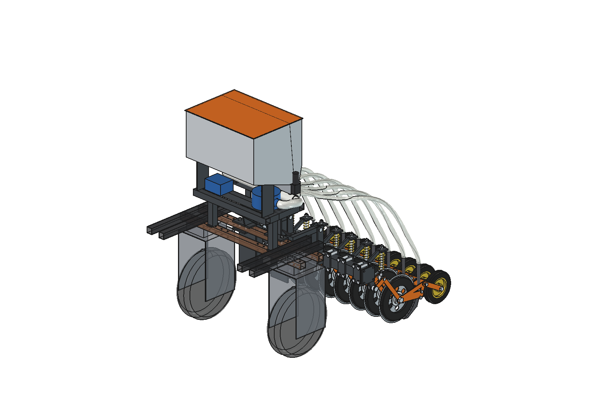
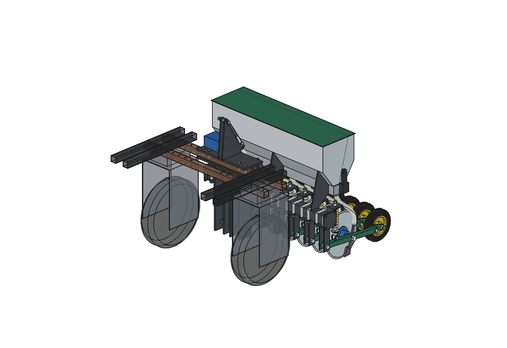

# Bruut Implements

Open-source implements (attachments) for the **[Bruut OpenAgbot](https://github.com/JacobsFarm/Bruut_OpenAgbot)**, an open-source agricultural field robot. Want to know more about the project? Go to **[openagbot.com](https://openagbot.com)**.

All designs are parametric. They are built in FreeCAD, mostly from Python scripts, and bolt onto the 50 mm hole grid of the robot's chassis beams.

  

## Gallery

<table>
  <tr>
    <td align="center" width="50%">
       
      <b>Overseeder (advanced)</b> 8-row slit seeder with an air seeder
    </td>
    <td align="center" width="50%">
       
      <b>Overseeder (simple)</b> Angled discs with a gravity hopper
    </td>
  </tr>
  <tr>
    <td align="center">
       
      <b>Liquid fertilizer applicator</b> Disc and knife units on spring arms
    </td>
    <td align="center">
       
      <b>Dockweed drill</b> Finds a dock plant and mills out its root
    </td>
  </tr>
  <tr>
    <td align="center">
       
      <b>Trencher</b> Wheel trencher for cutting narrow trenches
    </td>
    <td align="center">
       
      <b>Feed pusher auger</b> Pushes feed back to the feed fence
    </td>
  </tr>
</table>

   
  <i>Ground following of the liquid fertilizer applicator (advanced)</i>

## Implements

| Folder | Description |
|---|---|
| [`dockweed drill/`](dockweed%20drill/) | Dock (broad-leaved dock) removal drill/mill, with renders, animations, DXF and STEP files |
| [`liquid fertilezer applicator/`](liquid%20fertilezer%20applicator/) | Liquid fertilizer applicator in three variants, each with calculations, a parametric model, previews and a ground-following animation. `advanved/`: disc and knife units on spring arms, a ground-wheel-driven 5-channel peristaltic pump and a parallel linkage. `simple/`: fixed knives, two wheelbarrow gauge wheels, a single-pivot frame and a 12 V pump with orifice plates; about €600 in parts. `simple_v2/`: as `simple/`, with a cutting disc in front of each knife; about €900 in parts |
| [`overseeder/`](overseeder/) | Overseeder (grassland slit seeder) in two variants. Both are 1 m modules with 8 rows at 125 mm and coupling flanges. They cut a 15 mm slot, place seed about 12 mm deep and close the slot with a sprung press wheel. `simple/`: angled single disc with a seed boot and a two-compartment gravity hopper; about €1,675 in parts. `advanced/`: parallel linkage, straight disc with depth bands, curved seed coulter and an air seeder above the rear axle; about €2,280 in parts |
| [`trencher/`](trencher/) | Trencher attachment, with renders and STEP export |
| [`feed pusher auger/`](feed%20pusher%20auger/) | Feed pusher auger (simple and advanced variants) |
| `around_pole_mower/` | Mower for working around poles (notes only) |
| `mower unit/` | General mower unit (notes only) |

Each folder holds its own requirements and notes (`*_idee_en_eisen.md`, `README.md` or `info.txt`).

## Working with the designs

- Models are stored as `.FCStd` (FreeCAD) with `.step` exports where available.
- The `*.py` scripts generate the models parametrically. Change the parameter files (for example `*_params.py`) and rebuild in FreeCAD.
- Requires [FreeCAD](https://www.freecad.org/) 1.1.

## Related

- **Robot design:** [JacobsFarm/Bruut_OpenAgbot](https://github.com/JacobsFarm/Bruut_OpenAgbot): the base robot these implements mount on
- **Website:** [openagbot.com](https://openagbot.com)

## Notes

- `inspiration/` folders and `agbot design/` (the base robot model) are excluded from the repository via `.gitignore`.
- Some documentation is written in Dutch.
