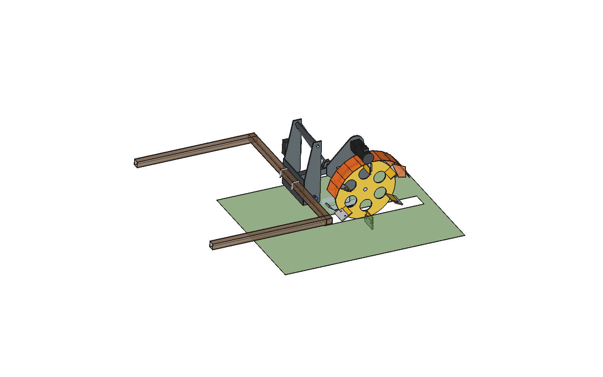

# Bruut Implements

Open-source implements (attachments) for the **[Bruut OpenAgbot](https://github.com/JacobsFarm/Bruut_OpenAgbot)**, an open-source agricultural field robot. Want to know more about the project? Go to **[openagbot.com](https://openagbot.com)**.

Every design is parametric: change a number, rebuild, and the whole model follows. They are built in FreeCAD from Python scripts, come with the calculations behind them and, for the advanced variants, an animation on the robot. Everything bolts onto the 50 mm hole grid of the robot's chassis beams.

   
  <i>Dockweed drill: finds a dock plant and mills out its root</i>

**Jump to:** [Gallery](#gallery) · [Animations](#animations) · [Implements](#implements) · [Build it yourself](#build-it-yourself) · [Related](#related)

## Gallery

<table>
  <tr>
    <td align="center" width="50%">
       
      <b><a href="overseeder/advanced/">Overseeder (advanced)</a></b> 8-row slit seeder with an air seeder
    </td>
    <td align="center" width="50%">
       
      <b><a href="overseeder/simple/">Overseeder (simple)</a></b> Angled discs with a gravity hopper
    </td>
  </tr>
  <tr>
    <td align="center">
       
      <b><a href="liquid%20fertilizer%20applicator/">Liquid fertilizer applicator</a></b> Disc and knife units on spring arms
    </td>
    <td align="center">
       
      <b><a href="dockweed%20drill/">Dockweed drill</a></b> Finds a dock plant and mills out its root
    </td>
  </tr>
  <tr>
    <td align="center">
       
      <b><a href="trencher/">Trencher</a></b> Wheel trencher for cutting narrow trenches
    </td>
    <td align="center">
       
      <b><a href="feed%20pusher%20auger/advanced/">Feed pusher auger</a></b> Pushes feed back to the feed fence
    </td>
  </tr>
</table>

## Animations

The advanced designs are animated on the real robot model, with the loads and forces calculated per frame.

   
  <i><a href="liquid%20fertilizer%20applicator/advanced/">Liquid fertilizer applicator</a>: every element follows the bumpy ground on its own arm</i>

   
  <i><a href="feed%20pusher%20auger/advanced/">Feed pusher auger</a>: pushing feed back to the fence, with the forces on the auger and the robot's reaction</i>

## Implements

| Implement | Variants | What it does |
|---|---|---|
| [**Overseeder**](overseeder/) | [simple](overseeder/simple/) · [advanced](overseeder/advanced/) | Grassland slit seeder. 1 m modules with 8 rows at 125 mm and coupling flanges. Cuts a 15 mm slot, places seed about 12 mm deep and closes the slot with a sprung press wheel. Simple: angled single disc, gravity hopper, about €1,675 in parts. Advanced: parallel linkage, depth bands, curved seed coulter and an air seeder, about €2,280 |
| [**Liquid fertilizer applicator**](liquid%20fertilizer%20applicator/) | [simple](liquid%20fertilizer%20applicator/simple/) · [simple v2](liquid%20fertilizer%20applicator/simple_v2/) · [advanced](liquid%20fertilizer%20applicator/advanced/) | Injects liquid fertilizer into the soil. Simple: fixed knives, two gauge wheels and a 12 V pump, about €600 in parts. Simple v2: adds a cutting disc in front of each knife, about €900. Advanced: disc and knife units on spring arms, a ground-wheel-driven 5-channel peristaltic pump and a parallel linkage |
| [**Feed pusher auger**](feed%20pusher%20auger/) | [simple](feed%20pusher%20auger/simple/) · [advanced](feed%20pusher%20auger/advanced/) | Pushes feed back to the feed fence. Simple: cheap version from flat plate and sectional flights. Advanced: Ø320 auger under a folded 2 mm hood, 24 V gearmotor with chain drive, open discharge end. Includes a feed-transport model and a force animation |
| [**Dockweed drill**](dockweed%20drill/) | one design | Dock (broad-leaved dock) removal mill on a CNC gantry. Renders, animations, DXF and STEP files |
| [**Trencher**](trencher/) | one design | Wheel trencher for narrow trenches. Renders and STEP export |
| [Around-pole mower](around_pole_mower/) | notes only | Mower for working around poles |
| [Mower unit](mower%20unit/) | notes only | General mower unit |

Each folder holds its own requirements and notes (`*_requirements.md`, `README.md`, `RATIONALE.md` or `info.txt`). `RATIONALE.md` explains why the dimensions and choices are what they are.

## Build it yourself

1. Install [FreeCAD](https://www.freecad.org/) 1.1.
2. Open a variant folder, for example `feed pusher auger/advanced/`, and run `run_in_freecad.py` in FreeCAD. It rebuilds the model and prints the key numbers.
3. Change a dimension in the `*_params.py` file and run it again. Never edit the `.FCStd` by hand: it is generated.

What is in a variant folder:

| File | Contents |
|---|---|
| `*_params.py` | all dimensions, including the interface to the robot |
| `*_parts.py` | one function per part |
| `build_*.py` | model tree, colors, interference check, mass, renders, STEP export |
| `*_calc.py` | the calculations (capacity, forces, torque, springs, axle loads) |
| `animate_*.py`, `make_gif_*.py` | animation on the robot and the GIF |
| `previews/` | renders and animations |

The robot model itself lives in the [Bruut_OpenAgbot](https://github.com/JacobsFarm/Bruut_OpenAgbot) project. AI agents: see [AGENTS.md](AGENTS.md) for the workflow.

## Related

- **Robot design:** [JacobsFarm/Bruut_OpenAgbot](https://github.com/JacobsFarm/Bruut_OpenAgbot), the base robot these implements mount on
- **Website:** [openagbot.com](https://openagbot.com)

## Notes

- Models are stored as `.FCStd` (FreeCAD) with `.step` exports where available.
- `inspiration/` folders and `agbots/` (the base robot models and their comparison) are excluded from the repository via `.gitignore`.
- Code comments, docstrings and the older dockweed drill and trencher scripts are still partly in Dutch.
- Licensed under the terms in [LICENSE](LICENSE).
