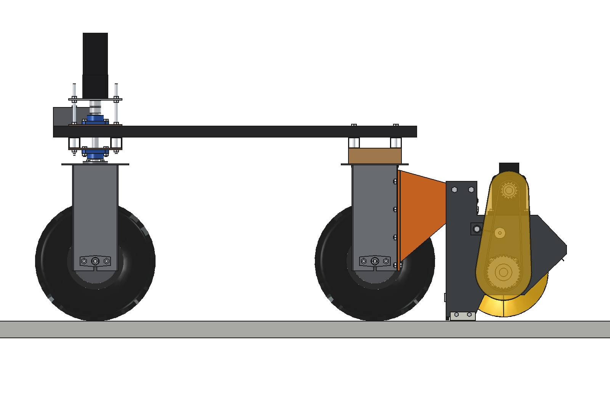
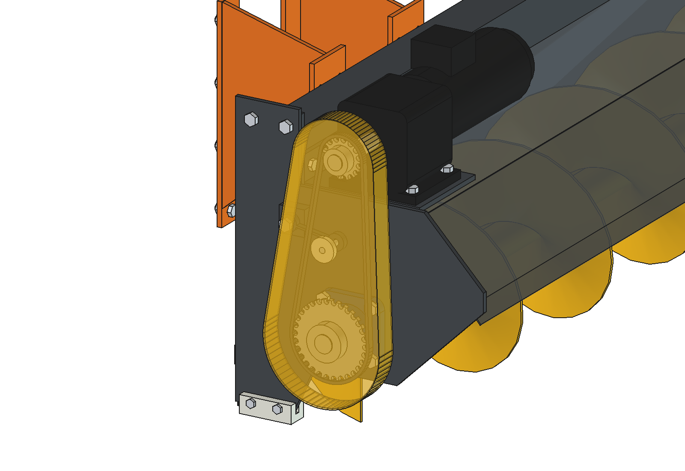
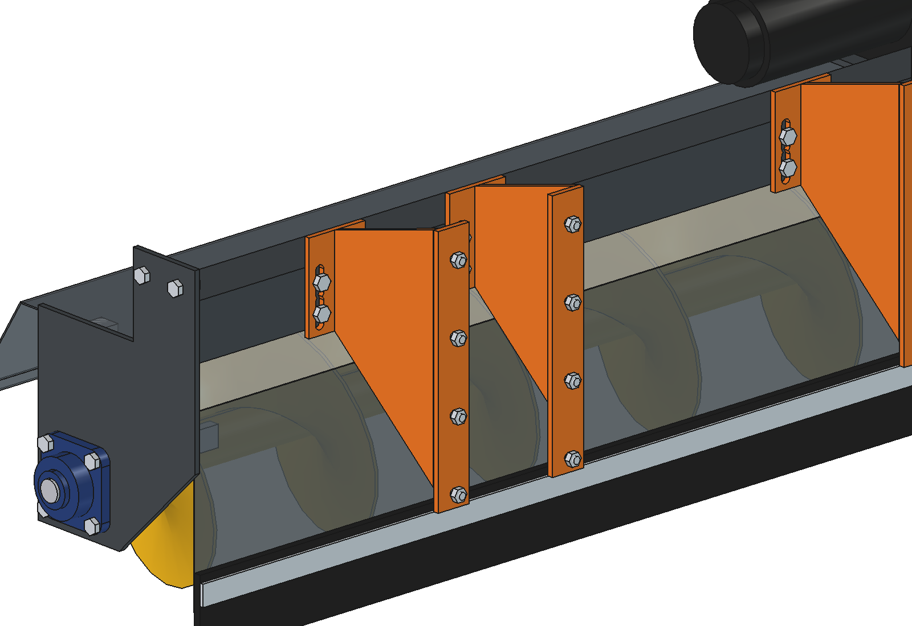
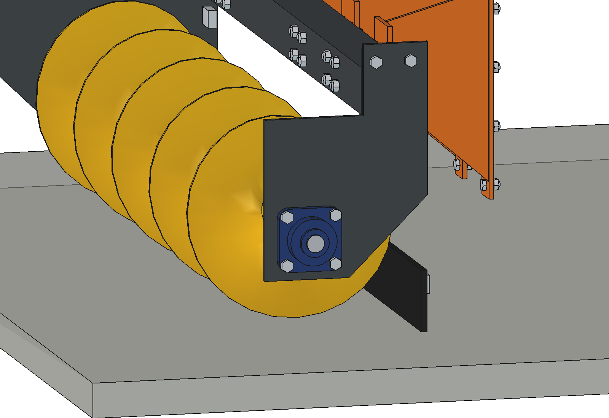

# Voerschuifvijzel (advanced): onderbouwing van het ontwerp

5 oktober 2026. Model: `Feed_Pusher_Auger.FCStd` (FreeCAD 1.1, gegenereerd met `build_fpa.py`).
De getallen komen uit het model, uit `fpa_calc.py` en uit de animatie (`animate_fpa.summary()`).
Waar iets aangenomen of geschat is, staat dat erbij.

---

## 1. Opdracht

- Het advanced ontwerp verder uitwerken.
- De ronde, gewalste bak vervangen door vierkant gezet plaatwerk, zoals bij de simpele versie.
- De bevestiging zo maken dat hij op de wielmodules past, via de vier gaten.
- De motor met pootjes op de vierkante plaat zetten.
- De voerschuif op de agbot zetten, aan de kant van de vaste motoren. De draaiende stuurmechanismen zitten dan aan
  de achterkant.
- Het voerschuiven animeren: het voer opzij schuiven, de krachten op de vijzel en de reactie van de robot.

## 2. Wat er veranderd is ten opzichte van het eerste advanced ontwerp

| Was | Nu | Waarom |
| --- | --- | --- |
| Ronde kap (gewalst, 3 mm) | **Eén plaat van 2 mm met 4 zetten** (kantbank), uitslag 1440 × 774 mm | Geen walswerk. De zetten maken de plaat stijf genoeg. Dunner kan, omdat de kap niets meer draagt (§ 4.2) |
| Losse motortoren op de zijplaat | **Tandwielmotor met voeten (B3)** op een motorplaat van 8 mm bovenop de kap, met een opstaande rand tegen de ligger | De kettingtrek gaat via de ligger in het frame. De motor zit hoog en droog, uit het voer |
| Armen met een montageplaat op een aangenomen dwarsbalk | **4 armen op de wielmodules**, elk met **4 × M10 door de 4 gaten** in de achterste flens van de zijplaat van de wielbeugel | Die gaten zitten al in elke wielbeugel. Er hoeft niets geboord te worden in het robotframe |
| Doorgaande as Ø30 | **Twee asstompen** Ø30, 70 mm in de kernbuis, op 2 ingelaste schijven per kant | 6,5 kg lichter. De kernbuis 60,3 × 4 is stijf genoeg (§ 5.4) |
| Twee gelijke zijplaten | **Rechts een lagerplaat met open uitworp** | Het voer moet er aan de hekkant uit kunnen |
| Pennen M10 | **Links een breekbout M6 4.6**, rechts M10 8.8 | Beveiliging tegen vastlopen (§ 5.3) |
| Geen | **Kettingspanner** (arm + nylon wiel op een rubber torsie-element) | De hartafstand ligt vast door de voetmotor |
| Geen | **Contragewicht 2 × 20 kg** voorop | Zonder contragewicht blijft er te weinig last op de stuurwielen (§ 4.7) |

## 3. Het ontwerp in het kort

1. **Vijzel:** blad Ø320, spoed 260, 5 mm, op een kernbuis 60,3 × 4.
   - Rechtsgangig.
   - Draait met 150 omw/min, met de voorkant omhoog. Het voer wordt opgetild in plaats van onder het blad gedrukt, en gaat naar +x (het voerhek).
2. **Lagers:** UCF206 buiten op een zijplaat van 8 mm (links) en een lagerplaat van 8 mm (rechts).
3. **Kap:** 2 mm, 4 zetten.
   - Aan de robotkant hangt een rubber afstrijkflap van 10 mm tot 5 mm boven de vloer.
   - Links zit een PE-glijslof als beschermer.
4. **Ligger:** koker 80 × 80 × 3 op de kap. Gelaste kopplaten met 2 × M12 in de zijplaat en de lagerplaat; de moeren zijn bereikbaar boven de ligger.
5. **Aandrijving:** tandwielmotor 24 V DC, 550 W, 300 omw/min, met voeten.
   - De motor staat met 4 × M10 op een motorplaat van 8 mm bovenop de kap. Die plaat zit met 2 × M10 aan de ligger vast.
   - Ketting 08B-1, 15T → 30T, met spanner.
   - Kettingkast van 2 mm.
6. **Bevestiging:** 4 armen van 8 mm, oranje in de afbeeldingen. Elke arm heeft:
   - een adapterplaat met 4 × M10 op de achterste flens van een wielbeugel;
   - een schot;
   - een eindplaat met 4 × M12 door de ligger, in langgaten van 30 mm. Daarmee stel je de hoogte ±15 mm bij als de glijslof en de flap slijten.
7. **Contragewicht:** 2 blokken van 20 kg op de voorste onderbalk, met M10 door het gatenraster.

| Kenmerk | Waarde |
| --- | --- |
| Werkbreedte | 1440 mm tussen de platen, blad 1420 mm |
| Afmetingen voerschuif | 1600 × 619 × 598 mm (b × l × h), achter de robot: y −566 tot −1185 |
| Vrije ruimte | kap 48 mm, flap 59 mm en armen 17 mm tot de achterbanden; blad 15 mm boven de vloer |
| Massa (model) | 118 kg voerschuif (rotor 28 kg) + 40 kg contragewicht |
| Vijzel | 150 omw/min, voer 0,42 m/s langs de vijzel (theoretisch 0,65 m/s) |
| Capaciteit | 13 kg per m vijzel, 5,5 kg/s (20 t/h). Bij 0,30 m/s rijden is dat tot 18 kg voer per m voergang |
| Koppel vijzel | 34 Nm nominaal, 85 Nm piek bij het aanlopen. De breekbout breekt bij 145 Nm |
| Vermogen | 160 W elektrisch bij 5 kg voer in de vijzel, 520 W bij 20 kg. Maximaal 25 A in de animatie |

## 4. Ontwerpkeuzes

### 4.1 Aan de kant van de vaste wielmotoren

De achterwielen staan vast en hebben geen stuurstapel. Achter de wielbeugels is daarom ruimte, en de beugels hebben
daar een flens met gaten. De voorwielen hebben een stuurkop met stappenmotor, lagers en draadstangen op (±50, ±75).
Die kop en de stuurzwaai van ~30° moeten vrij blijven (AGENTS.md).

Bij het voerschuiven rijdt de robot met de vijzel voorop (naar −y) en sturen de voorwielen van achteren, zoals een
heftruck. Het voordeel van sturen achter is dat de vijzel dicht bij het hek blijft. Een kleine stuuruitslag
achter verdraait de vijzel bijna niet ten opzichte van het hek.

### 4.2 Gezette kap in plaats van een ronde bak

- **Plaat:** één plaat van 1440 × 774 mm, 2 mm dik, met 4 zetten. De hartlijn loopt van de achterwand (robotzijde,
  60 tot 315 mm hoog) via een schuine zet naar de bovenplaat op 370 mm. Daarna gaat hij schuin omlaag naar een lip op
  217 mm, voor de vijzel.
- **Spelingen:** tussen blad en kap zit overal 33 mm of meer. De schuine voorzet ligt 200 mm uit het hart; daar
  rolt het voer tegenaan en weer terug in de vijzel.
- **Waarom 2 mm volstaat:** de kap draagt niets. De ligger draagt de vijzel via de kopplaten. De motorplaat steunt
  met een opstaande rand tegen de ligger. De kap houdt alleen het voer tegen en zit met zethoekjes aan de platen.
  Dat scheelt 9 kg ten opzichte van 3 mm.

### 4.3 Bevestiging op de wielmodules, via de vier gaten

Elke zijplaat van een wielbeugel heeft aan voor- en achterkant een naar buiten gezette flens van 40 × 4 mm. In die
flens zitten **4 gaten M10 (Ø10,4) op 100 mm steek**, op 200, 300, 400 en 500 mm boven de grond. De achterste
flenzen van de twee achterste wielmodules liggen op y = −582. Dat zijn er 4: binnen en buiten elk achterwiel, op
x = ±283 en ±467.

Op elke flens komt één arm:
- **Adapterplaat:** 50 × 360 × 8 mm, met de 4 bouten M10 × 35 en de moeren aan de binnenkant van de flens.
- **Schot:** 8 mm, aan de kant van de plaat die van de band af ligt. Van de band blijft 17 mm vrij.
- **Eindplaat:** 90 × 129 × 8 mm, met 4 × M12 door de ligger, in langgaten.

Waarom zo:
- **Niets boren of lassen aan de robot:** dezelfde gaten zitten in elke wielbeugel. Er komen geen extra bouten door
  de balken, en de stuurkoppen blijven vrij.
- **Vier armen in plaats van twee:** de last gaat via beide zijplaten van elke wielbeugel in de beugel. Er komt geen
  wringing op één flens.
- **Krachten (`fpa_calc.mount_check`):** bij 2 × het eigen gewicht (stoten) is het moment op de flenzen samen
  690 Nm. De bovenste bout krijgt 516 N trek. De stuikspanning in de flens van 4 mm is 3,5 MPa. Dit is ruim
  voldoende.

### 4.4 Motor met voeten op de kap

- **Motor:** een coaxiale tandwielmotor met voeten (B3), 24 V DC, 550 W, 300 omw/min. Hij staat op de linkerhelft van
  de kap, met de uitgaande as naar buiten boven de zijplaat langs. De zijplaat is daar maar 380 mm hoog, dus de
  zijplaat hoeft geen gat voor de as. Tussen motor en vijzel zit een ketting 15T → 30T (i = 2).
- **Motorplaat:** 8 mm, met langgaten van 20 mm voor het uitlijnen van de kettingwielen. De opstaande rand zit met
  2 × M10 vast aan de ligger. De kettingtrek (tot 1,4 kN piek) gaat zo niet via de dunne kap.
- **Kettingspanner:** de hartafstand (300 mm) ligt vast. Een spanner aan de slappe kant neemt de rek op: een
  arm op de zijplaat met een nylon wiel Ø40 binnen de lus en een rubber torsie-element.
- **Kettingkast:** van 2 mm, om de kettingwielen en de ketting heen, aan de buitenkant van de linker zijplaat.

### 4.5 Rotor met asstompen

- **Opbouw:** de kernbuis 60,3 × 4 is aan elk eind dicht gelast met 2 schijven. Daarin steekt een asstomp Ø30 van
  70 mm, vast met één pen dwars door buis en stomp.
  - **Links (aandrijving):** een breekbout M6 4.6 in een geharde bus, en een spiebaan voor het kettingwiel.
  - **Rechts:** M10 8.8.
- **Lager wisselen:** pen eruit, asstomp eruit trekken. De rotor hoeft niet uit de kap.

### 4.6 Open uitworp aan de hekkant

- **Uitworp:** rechts zit geen volle zijplaat, maar een lagerplaat. Die vult alleen het stuk achter en boven de as,
  tot onder de ligger. Voor de as en onder 105 mm hoogte is het eind open. Het blad loopt door tot 5 mm van de
  plaat, zodat het voer er aan de hekkant uitvalt.
- **Voerhek:** de vijzel staat in de animatie 230 mm van de opstand van het voerhek. Het voer valt tussen het
  blad-einde en het hek op de vloer, en vormt daar een nieuwe rand binnen bereik van de koeien.
- **Andere kant van de voergang:** bij een kering aan het eind van de voergang ligt het andere hek weer aan de
  rechterkant van de robot. Eén draairichting is dus genoeg.

### 4.7 Gewicht, aslasten en contragewicht

De voerschuif weegt 118 kg en hangt met zijn zwaartepunt 378 mm achter de achteras (y = −878). De motor zit links,
dus het zwaartepunt ligt ook 120 mm links van het midden.

| Aslast (kg) | achter | voor |
| --- | --- | --- |
| robot alleen (aanname 150 kg, midden) | 75,0 | 75,0 |
| met voerschuif | 238,2 | **30,2** |
| met voerschuif + 2 × 20 kg contragewicht | 235,1 | 73,5 |

Zonder contragewicht houden de voorwielen 15 kg per wiel over. Daarmee kunnen ze bij een grip van 0,6 hooguit 90 N
zijkracht per wiel opnemen. Dat is te weinig om betrouwbaar te sturen op een natte, vuile voergang. Met het
contragewicht van 40 kg op de voorste onderbalk (y = 575) komt de vooras terug op 74 kg.

Mogelijke verbetering: zet de accu of andere zware delen van de robot voorop, dan zijn de blokken niet nodig.
De rechtse/linkse lastverdeling (RL 132, RR 103 kg) komt door de motor links. Dat is acceptabel.

### 4.8 Snelheidsregeling op de motorstroom

- **Probleem:** de capaciteit is 5,5 kg/s. Bij 24 kg/m en 0,30 m/s komt er 7,2 kg/s binnen. Dat gaat goed, behalve
  waar het voer zwaar ligt: dan loopt de vijzel vol en schuift hij voer voor zich uit.
- **Regeling:** de robot meet de stroom van de vijzelmotor (gefilterd, 0,3 s).
  - Onder 18 A rijdt hij 0,30 m/s.
  - Daarboven gaat hij langzamer rijden, lineair tot 25 % van de rijsnelheid bij 30 A.
- **In de animatie** zakt de snelheid bij de klont en het dikke deel van de strook naar 0,18 m/s. De stroom komt
  dan niet boven 25 A, onder de nominale 33 A van de motor.

## 5. Berekeningen (`fpa_calc.py`)

### 5.1 Capaciteit

- **Vrije doorsnede:** π/4 · (0,320² − 0,060²) = 0,078 m².
- **Inhoud per meter vijzel:** 0,078 m² × 280 kg/m³ × vulgraad 0,6 = **13,0 kg per m vijzel**.
- **Snelheid langs de vijzel:** spoed × toerental × transportrendement = 0,26 × 2,5 × 0,65 = **0,42 m/s**. Een open
  vijzel op de vloer haalt niet de theoretische 0,65 m/s, omdat het voer meedraait.
- **Capaciteit:** 13,0 × 0,42 = 5,5 kg/s, of 20 t/h.
- **Per meter voergang:** bij 0,30 m/s rijden is dat **18 kg/m**. Meer voer per meter betekent langzamer rijden (§ 4.8).

### 5.2 Koppel en vermogen

Het voer in de vijzel (massa m) glijdt over de vloer met snelheid (v_ax, −v_robot) ten opzichte van de vloer.

- **Wrijving met de vloer:** μ·m·g = 0,5·m·g. Die wrijving verdeelt zich over twee richtingen:
  - **F_ax:** de zijkracht op de vijzel, van het hek af. F_ax = μ·m·g · v_ax / |v|.
  - **F_push:** de duwkracht tegen de rijrichting in. F_push = μ·m·g · v_robot / |v|.
- **Askoppel:** het vermogen voor het transport volgt uit de CEMA-formule P = λ·m·g·v_ax, met λ = 4 voor vezelig
  materiaal. Daaruit volgt T = T₀ + P / ω.
  - T₀ = 2 Nm voor de lagers en de ketting.
  - Controle: de schroefformule F_ax · r_m · tan(α + ρ) geeft minder. De spoedhoek op de gemiddelde straal is α = 23,5°.
- **Elektrisch vermogen:** η = 0,9 (tandwielkast) × 0,97 (ketting) × 0,8 (motor) = 0,70.

| voer in de vijzel | F_ax | F_push | koppel | P_el | stroom 24 V |
| --- | --- | --- | --- | --- | --- |
| 5 kg | 20 N | 14 N | 7,3 Nm | 164 W | 6,8 A |
| 10 kg | 40 N | 28 N | 12,6 Nm | 282 W | 11,8 A |
| 20 kg | 80 N | 57 N | 23,1 Nm | 520 W | 21,7 A |
| 30 kg | 120 N | 85 N | 33,7 Nm | 757 W | 31,5 A |

De nominale motor (550 W, 17,5 Nm op 300 omw/min) geeft 34 Nm op de vijzel. Dat is genoeg voor ca. 30 kg voer in
de vijzel.

### 5.3 Beveiliging

- **Aanloopkoppel:** 2,5 × nominaal = 85 Nm. De torsiespanning in de asstomp Ø30 is dan 20 MPa (met een factor 1,25
  voor de spiebaan). C45 laat ca. 100 MPa toe.
- **Breekbout M6 4.6:** zit in dubbele afschuiving op de asstomp (straal 15 mm) en breekt bij 2 × 0,6 × 400 × 20,1 ×
  0,015 = **145 Nm**. Dat is boven het aanloopkoppel en ver onder wat de ketting en de as aankunnen.
  - Een M10 8.8 zou pas bij 835 Nm breken. Daarom zit die alleen rechts, waar geen koppel doorheen gaat.
- **Ketting 08B-1:** breeklast 18,2 kN. Bij het aanloopkoppel is dat 13 × veilig, bij het breekkoppel 7,6 ×.
- **Software (aanbevolen, nog niet gebouwd):** de besturing stopt de motor als de stroom langer dan 2 s boven 35 A blijft.

### 5.4 Doorbuiging rotor

De kernbuis 60,3 × 4 (I = 2,8·10⁵ mm⁴) overspant 1,5 m tussen de lagers. De belasting is het eigen gewicht plus de
helft van de omtrekskracht bij het aanloopkoppel. Bij een scharnierende opleg geeft dat een doorbuiging van
**0,9 mm** en een buigspanning van 23 MPa. Een doorgaande as is dus niet nodig.

### 5.5 Krachten op de robot en de reactie (`robot_reaction`)

Uitgangspunt is statisch evenwicht van robot + voerschuif (+ contragewicht).

- **Wiellasten:** uit de momenten om de x-as (lengte) en de y-as (dwars), met het gewicht van alle delen.
  - F_push grijpt 60 mm boven de vloer aan. Dat duwt de neus iets omlaag.
  - F_ax geeft een kleine dwarsverschuiving van last.
  - Die dwarsverschuiving is per as verdeeld naar rato van de aslast.
- **Zijkrachten:** de zijkrachten van de vloer heffen samen F_ax op. Hun moment om de verticale as heft het moment
  op van F_ax (op 1,1 m achter het robotmidden) en van F_push.
  - De vijzel zit ver achter de achteras. De achteras moet daardoor **meer** zijkracht leveren dan F_ax.
  - De vooras duwt de andere kant op: ongeveer F_achter ≈ 1,45 · F_ax en F_voor ≈ −0,45 · F_ax.
- **Scheefstand en sturen:** banden leveren zijkracht door een kleine slip-hoek. De bandstijfheid is 0,12 per graad
  per N wiellast.
  - De achterwielen staan vast. De robot loopt daarom onder een kleine hoek ψ = F_achter / C_achter.
  - De voorwielen sturen tegen met δ = F_voor / C_voor − ψ.
- **Aandrijfkracht per wiel:** F_push naar rato van de wiellast, plus 3 % rolweerstand.

**Resultaat van de animatie** (24 kg/m voer, 4 m voergang):

| | bereik tijdens het voerschuiven |
| --- | --- |
| voer in de vijzel | 1 – 23 kg, waarvan tot 15 kg boven de capaciteit (voor de vijzel uit geschoven) |
| askoppel, stroom | 3 – 27 Nm, 3 – 25 A (max. 598 W) |
| kracht voer op vijzel | tot 105 N opzij (van het hek af), tot 52 N tegen de rijrichting |
| zijkracht vloer | achteras tot 152 N, vooras tot −46 N |
| scheefstand robot / stuurcorrectie | tot 0,53° / tot −1,05° |
| gripbenutting (max. over alle wielen) | 13 % |
| rijsnelheid | 0,30 m/s, bij de klont automatisch terug naar 0,18 m/s |
| opgepakt en tegen het hek gelegd | 92 kg |

Wat dit betekent:
- **Krachten:** de krachten op de robot zijn klein. De grip wordt voor hooguit 13 % gebruikt. Het voer zelf is licht; wat
  telt is de **hefboom**: 105 N op 1,1 m achter het midden vraagt 150 N van de achterwielen.
- **Scheefloop:** de robot loopt ca. een halve graad scheef en de voorwielen sturen een graad tegen. Een GNSS- of
  lijnvolger die de koers vasthoudt, doet dat vanzelf.
- **Stroom:** de vijzelmotor is de beperkende factor, niet de grip. Daarom is de snelheid geregeld op de motorstroom
  (§ 4.8).

## 6. Aannames (niet gemeten)

| Aanname | Waarde | Invloed |
| --- | --- | --- |
| Robot | 150 kg, zwaartepunt in het midden, 450 mm hoog | aslasten, contragewicht |
| Stortdichtheid voer | 280 kg/m³ | capaciteit, hoogte van de strook |
| Wrijving voer–beton | 0,5 | F_ax, F_push |
| Weerstandsgetal vijzel λ | 4 | koppel, stroom |
| Transportrendement / vulgraad | 0,65 / 0,6 | capaciteit |
| Bandstijfheid, grip | 0,12 /° per N, 0,6 | scheefstand, stuurcorrectie, gripbenutting |
| Rolweerstand | 3 % | aandrijfkracht |
| Tandwielmotor | 14 kg, B3, coaxiaal, 300 omw/min | massa, plaats |
| Voer in de voergang | 24 ± 6 kg/m, 600–950 mm van het hek | animatie |

## 7. Open punten

- **Meten:** robotgewicht en zwaartepunt meten. Daarna het contragewicht opnieuw bepalen met `fpa_calc.axle_loads()`,
  of de accu naar voren verplaatsen.
- **Ijken:** λ en het transportrendement ijken aan de stroom bij een bekende hoeveelheid voer (weegschaal en een
  stroomtang).
- **Hoogte:** de juiste vloerafstand van het blad bepalen (nu 15 mm) en de flap op een oneffen vloer. Bijstellen kan
  met de langgaten in de eindplaten.
- **Wielbeugel:** controleren of de achterste flens van de wielbeugel recht genoeg is voor een vlakke adapterplaat.
  Zo niet, een vulplaatje van 1 mm gebruiken.
- **Veiligheid:** een bumper of contactlijst op de kaplip overwegen (dieren, mensen). De vijzel loopt voorop.
