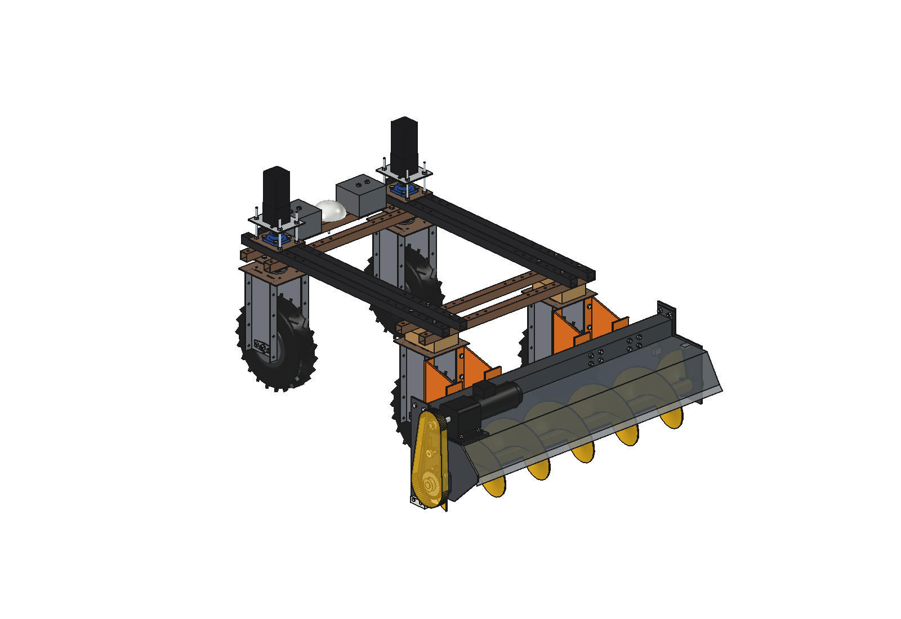
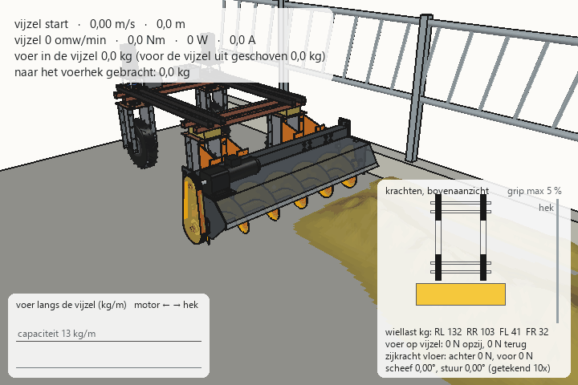

# Voerschuifvijzel (advanced): FreeCAD-model

Voerschuifvijzel voor de Bruut OpenAgbot. Hij zit aan de achterkant van de robot, de kant van de vaste wielmotoren.
Bij het voerschuiven rijdt de robot met de vijzel voorop; de stuurkoppen zitten dan achter.
De vijzel pakt het weggeduwde voer op en voert het zijwaarts naar het voerhek. Daar valt het via de open eindplaat
op de vloer.

- **Kap:** één gezette plaat van 2 mm met 4 zetten, net als bij de simpele versie. Er is geen gewalste ronde bak meer.
- **Aandrijving:** een tandwielmotor met voeten op een motorplaat bovenop de kap. Een ketting 08B-1 met spanner loopt
  langs de linker zijplaat naar de vijzel.
- **Bevestiging:** 4 armen, met elk 4 × M10 door de 4 gaten in de achterste flens van de zijplaten van de achterste
  wielmodules.

Waarom het zo ontworpen is, staat in [ONDERBOUWING.md](ONDERBOUWING.md).





## Bestanden

| Bestand | Inhoud |
| --- | --- |
| `Feed_Pusher_Auger.FCStd` | het model, met het robotmodel verborgen erbij. Gegenereerd, dus niet met de hand aanpassen |
| `Feed_Pusher_Auger.step` | alleen de voerschuif, in robotcoördinaten |
| `fpa_params.py` | alle maten, inclusief de robot-interface en de werkingsparameters |
| `fpa_parts.py` | één functie per onderdeel; elke functie geeft een `Part`-shape |
| `build_fpa.py` | boomstructuur, kleuren, botscontrole, speling tot de banden, massa, afbeeldingen, STEP |
| `fpa_calc.py` | capaciteit, koppel, vermogen, breekbout, ketting, doorbuiging, wiellasten, zijkrachten en scheefloop (puur Python) |
| `fpa_feed.py` | voermodel: hoogteveld in de voergang, opnemen, transport langs de vijzel en uitwerpen bij het hek (Python + numpy) |
| `animate_fpa.py` | animatie: robot + voerschuif langs het voerhek, met krachten per frame |
| `make_gif_fpa.py` | frames naar GIF met bijschrift, krachtenpaneel (bovenaanzicht) en de voerverdeling langs de vijzel |
| `run_in_freecad.py` | macro: in FreeCAD openen en uitvoeren (F6) bouwt het model opnieuw en drukt de kerngetallen af |
| `previews/` | afbeeldingen en de GIF |

## Assen

Gelijk aan het robotmodel: x = rechts, y = rijrichting van de robot (voor = +y), z = omhoog, grond = z 0, mm.
De oorsprong is het midden van de robot. Het werktuig staat dus direct in robotcoördinaten; er is geen verschuiving nodig.

- Vijzelas op y = −960 en z = 175. Het blad loopt tot 15 mm boven de vloer.
- Voerhek aan de +x-kant: de vijzel voert naar +x.
- De robot rijdt bij het voerschuiven naar −y.

## Opnieuw bouwen en gebruiken

In de Python-console van FreeCAD (map in `sys.path`, of via `run_in_freecad.py`):

```python
import build_fpa
build_fpa.build()                        # bouwt, slaat FCStd en STEP op (robot verborgen)
build_fpa.build(show_robot=True, save_path=None, step_path=None)
build_fpa.check_interference()           # overlap onderling en met de robot (moet leeg zijn)
build_fpa.clearance()                    # kleinste afstand kap / flap / armen tot de achterbanden
build_fpa.mass_properties()              # massa en zwaartepunt
build_fpa.render_all()                   # alle afbeeldingen in previews/, opslaan, STEP
```

```python
import fpa_calc
fpa_calc.report()                        # kerngetallen
fpa_calc.robot_reaction(-80, 40)         # wiellasten, zijkrachten, scheefstand bij 80 N opzij en 40 N terug
fpa_calc.axle_loads()                    # aslasten zonder/met voerschuif en contragewicht
```

## Animatie

Bouwt een apart document `FPA_on_robot_animation` met:

- het robotmodel uit `agbot design` (die bestanden worden niet aangepast);
- de voerschuif;
- een betonvloer en een voerhek met opstand;
- een strook voer die de koeien hebben weggeduwd.

Die strook ligt 600 tot 950 mm van het hek, met ca. 24 kg/m. Er zit een plek in waar al gevreten is en een klont van 10 kg.

Per frame (8 per seconde, met 5 deelstappen):
- **Voer:** het voermodel neemt voer op aan de voorkant van het blad en voert het per vak van 25 mm naar het hek,
  begrensd door de capaciteit. Wat meer is, wordt voor de vijzel uit geschoven. Bij het hek valt het op de vloer
  en zakt het uit tot een rand.
- **Vijzel:** uit de massa in de vijzel volgen het koppel, het vermogen en de motorstroom.
- **Krachten op de robot:** de zijkracht van het hek af (rood) en de duwkracht tegen de rijrichting in.
- **Robot:** volgens `fpa_calc.robot_reaction` verandert de wiellast per wiel. De zijkracht van de vloer verschilt per
  wiel (blauw). De robot loopt een fractie scheef, want de achterwielen staan vast, en de voorwielen sturen tegen.
- **Snelheidsregeling:** boven 18 A motorstroom rijdt de robot langzamer, tot minimaal 25 % van de rijsnelheid.

```python
import animate_fpa
animate_fpa.build()
animate_fpa.play()                       # live, animate_fpa.stop()
animate_fpa.summary()                    # bereik van massa, koppel, stroom, krachten, scheefstand, snelheid
animate_fpa.render_all(r"C:\temp\fpa_frames")
import make_gif_fpa
make_gif_fpa.main(r"C:\temp\fpa_frames", r"previews\animation_feed_pushing.gif")
make_gif_fpa.main(r"C:\temp\fpa_frames", r"previews\animation_feed_pushing_clean.gif", overlay=False)  # zonder tekst
```

Rijplan, regeling en camera staan bovenaan `animate_fpa.py` (`SPEED`, `I_SET`, `I_MAX`, `CAM_A/B/C`).
Het voer staat in `fpa_feed.FeedField._init_windrow`.

## Boomstructuur

```
Feed_pusher (feed_pusher_auger)
  Mount          4 armen (adapterplaat op de wielbeugelflens + schot + eindplaat met langgaten) en bouten
  Frame          kap 2 mm, ligger 80x80x3 met kopplaten, zijplaat links, lagerplaat rechts (open uitworp),
                 zethoekjes, rubber flap + klemstrip, PE-glijslof, motorplaat
  Bearings       UCF206 links en rechts
  Drive          tandwielmotor met voeten, uitgaande as, kettingwiel 15T, ketting 08B-1, spanner, kettingkast
  Auger_rotor    asstompen, kernbuis, blad Ø320 spoed 260, pennen (links breekbout M6), kettingwiel 30T (draait mee)
  Counterweight  2 blokken van 20 kg op de voorste onderbalk
Robot (in het FCStd verborgen; alleen ter controle)
```

## Geschat, niet gemeten

- Robot: 150 kg met het zwaartepunt in het midden (gelijk aan de vloeibare-mesttoediener).
- Voer: stortdichtheid 280 kg/m³, wrijving 0,5 op beton, weerstandsgetal vijzel λ = 4 (CEMA, vezelig).
- Vijzel: transportrendement 0,65 en maximale vulgraad 0,6.
- Banden: bandstijfheid 0,12 per graad per N wiellast en grip 0,6.
- Tandwielmotor: massa 14 kg en maten van een B3-voetmotor.
- Robotbeugel: de maten van de flensgaten komen uit `agbot_parts.side_plate`.

Zie ONDERBOUWING § 6.
