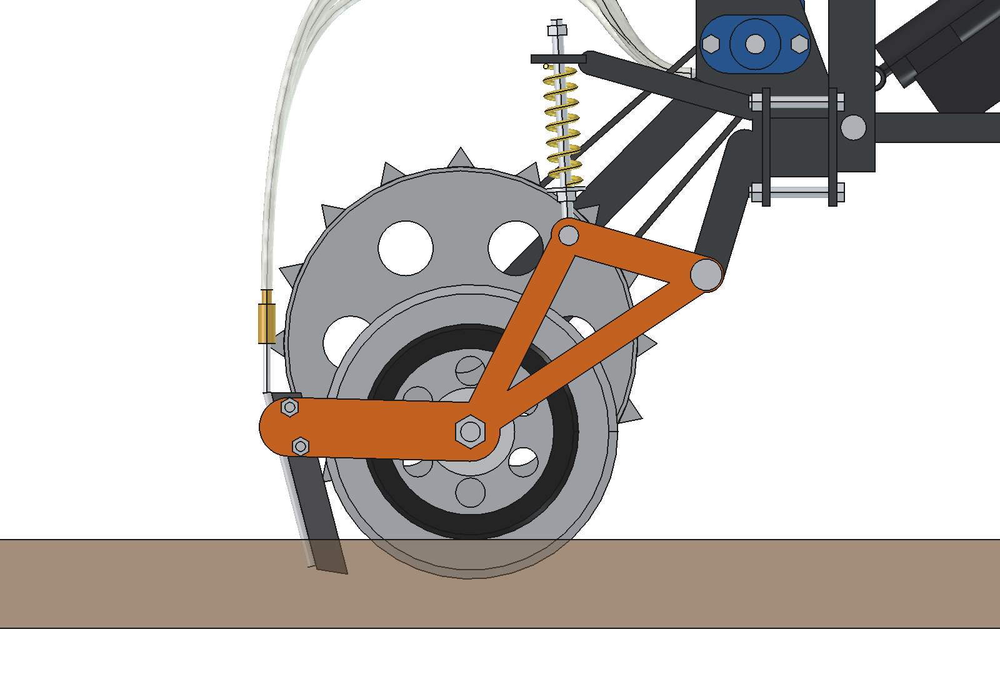
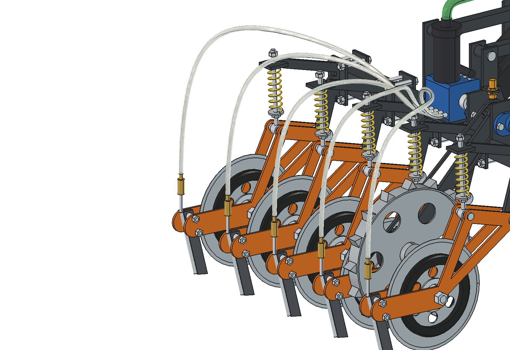
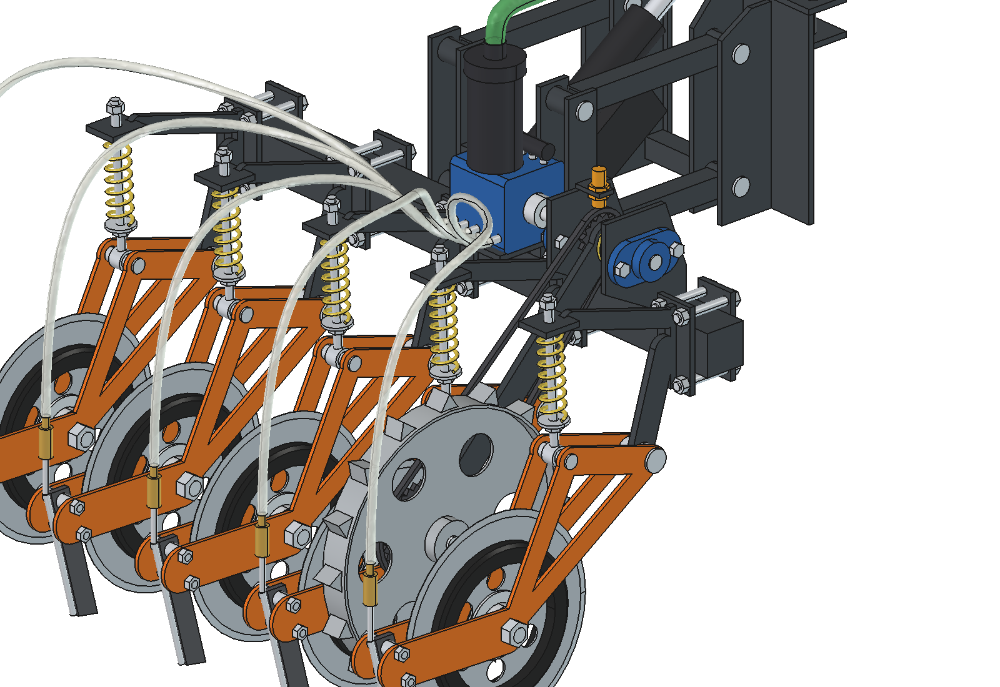
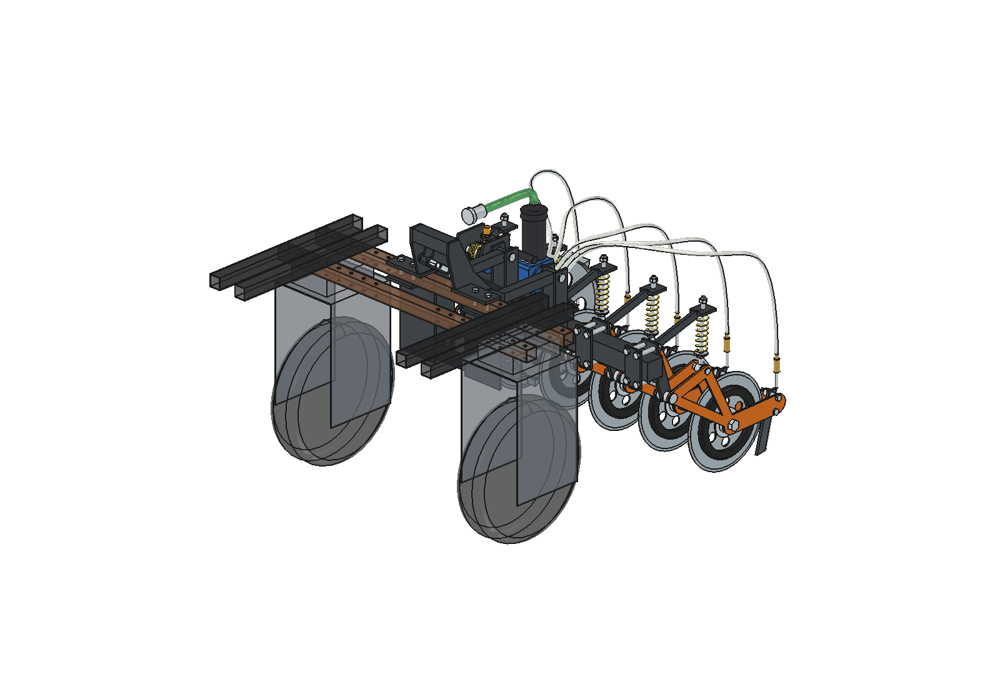

# Toediener voor vloeibare meststof (renure): onderbouwing van het ontwerp

4 oktober 2026. Model: `Liquid_Fertilizer_Applicator.FCStd` (FreeCAD 1.1, gegenereerd met `build_lfa.py`).
Getallen komen uit het model en uit `lfa_calc.py`. Waar iets aangenomen of geschat is, staat dat erbij.

**Herzien na de animatie (§ 4.11).** De animatie over een hobbelige strook liet zien dat een balk die vast aan de
actuator hangt te veel op en neer gaat: de robot stampt, en de elementen hangen ruim 1,3 m achter het robotmidden.
De balk werkt nu in **zweefstand**. Er zit een langgat in de bovenste ophanging van de actuator, de actuator ligt
vlakker en is omgedraaid, de veren zijn zachter, en de neerdruk komt uit het eigen gewicht van de balk.

---

## 1. Opdracht en uitgangspunten

- De vloeistof moet in de grond: eerst een geultje snijden, dan volgt een klein mes met een buisje erachter dat de vloeistof in de sleuf legt.
- Meerdere elementen over 1 meter.
- Eén loopwiel. Draait het wiel, dan loopt de vloeistof (pomp aangedreven door het wiel).
- Eerst als los werktuig, maar passend op de Bruut OpenAgbot: spoor 750 mm, wielbasis 1000 mm, kokerbalken 40 × 40 met M10-gaten op een raster van 50 mm, achteras op 215 mm hoogte.
- Anders opgezet dan de inspiratie, maar met de lessen eruit.

## 2. Wat ik uit de inspiratie haal

| Bron | Wat werkt | Wat hier anders is, en waarom |
| --- | --- | --- |
| **Lichte schijfbemester** (Bartlema / NCOK, demodag Zwartebroek) | De schijven drijven een rollenpomp aan, dus de dosering hangt aan de afgelegde weg. Licht en zonder elektronica. Op de foto's: twee schijven op een as met de pomp in het midden, twee messen met een slang, aan een schoffelparallellogram. | Bij het prototype moeten dezelfde schijven **snijden én de pomp aandrijven**. Slipt een schijf in de zode of loopt hij vol, dan verandert de dosering meteen, en elk element heeft een eigen pomp. Hier drijft **één apart loopwiel met spikes** (een meetwiel) **één centrale 5-kanaals pomp** aan voor de hele balk. De schijven hoeven alleen te snijden. |
| **Bemestingsrobot Fieldworkers** (Sterke Erven) | Element met een veer zoals een schoffelelement, 20 cm tussen de injectiepennen, licht voertuig dat dag en nacht werkt, pomp bepaalt de totale hoeveelheid, taakkaart, buffervat op de kopakker. | Overgenomen: **20 cm rijafstand**, **veerbelasting per element** en de lichte opzet. Anders: **schijf + mes in plaats van pennen**. In grasland scheurt een pen de zode open en kan gras om de pen draaien. Een schijf snijdt de wortels eerst door, zodat het mes met weinig kracht volgt. De pomp is **mechanisch aangedreven** in plaats van elektrisch: de dosering volgt vanzelf de afgelegde weg, zonder regelaar. Een taakkaart blijft mogelijk als uitbreiding (§ 4.7). |

Beide bronnen noemen zelf tanken via een dockingstation. Uit § 4.7 en § 6 blijkt dat dit ook voor dit werktuig de sleutel is.

## 3. Het ontwerp in het kort

1. **Aanbouwbok** (2 stuks): bovenplaat op de achterste onderbalk van de robot, M10 door de bestaande gaten.
2. **Parallellogram** (2 × 2 stangen) met een **elektrische lineaire actuator**. In het werk staat de actuator volledig uit en **zweeft de balk** via een langgat (−80 / +68 mm); op de kopakker trekt de actuator de balk 140 mm op.
3. **Gereedschapsbalk** 60 × 60 × 4, 900 mm lang.
4. **5 injectie-elementen** op 200 mm (x = −400, −200, 0, 200, 400). Elk element heeft een snijschijf Ø 300 met diepteringen, een mes van 8 mm met een RVS-buisje en terugslagklep, en een veerpoot.
5. **Loopwiel** Ø 400 met spikes tussen rij 4 en 5, met een ketting 30T → 15T naar de pompas.
6. **5-kanaals peristaltische pomp** (rollenpomp) op de balk, met filter, verdeelstuk en een zuigslang met camlock naar de tank op de robot.

| Kenmerk | Waarde |
| --- | --- |
| Werkbreedte | 1,0 m (5 rijen × 200 mm) |
| Werkdiepte | 40 mm (schijf), mespunt 35 mm, uitstroom ca. 27 mm onder maaiveld |
| Dosering | 89 tot 1316 l/ha in 18 standen (§ 4.7), standaard 505 l/ha |
| Capaciteit | 0,36 ha/h bij 1 m/s (theoretisch) |
| Neerdruk | ca. 133 N per element, uit het eigen gewicht van de balk (zweefstand) |
| Bodemvolging | balk zweeft −80 / +68 mm, elk element daarbinnen nog −32 / +66 mm |
| Hefhoogte | 140 mm: mes 57 mm, schijf 68 mm en loopwiel 88 mm vrij van de grond |
| Afmetingen | 906 × 1037 × 860 mm (b × l × h), binnen de robotbreedte van 978 mm |
| Massa (model) | 107 kg, waarvan 83 kg meebeweegt bij heffen |

**Werking.** De robot laat de balk zakken; de actuator gaat helemaal uit. De diepteringen komen op de grond, de schijven gaan 40 mm de zode in en het loopwiel raakt de grond. De balk rust dan op de elementen en het loopwiel en zweeft mee met het maaiveld, ook als de robot stampt of rolt. Bij het rijden draait het loopwiel de pomp aan. Elke rij krijgt een vaste hoeveelheid per meter, die via het mes en het buisje in de sleuf komt. Op de kopakker trekt de actuator de balk omhoog. Het loopwiel komt dan los, de pomp staat stil en de terugslagkleppen houden de slangen gevuld.

## 4. Ontwerpkeuzes

### 4.1 Werkbreedte en rijafstand

- **5 rijen op 200 mm** geeft precies 1 m werkbreedte, gelijk aan de 20 cm die Fieldworkers gebruikt. Bij grasland verdeelt de meststof zich dan over smalle stroken, zonder dat er onnodig veel elementen zijn (elk element vraagt neerdruk, zie § 6).
- Het werktuig is 906 mm breed en blijft **binnen de robotbreedte** (978 mm over de wielbeugels). De balk hoeft maar tot de buitenste klem te lopen; de werkbreedte blijft 1 m omdat elke rij een strook van 200 mm bedient.
- De klemmen schuiven langs de balk. Een andere rijafstand (bijvoorbeeld 4 × 250 mm) vraagt alleen andere waarden in `row_x`.

### 4.2 Snijden: dunne schijf met diepteringen

- **Schijf Ø 300 × 3 mm**, glad en geslepen, van boorstaal. Een kleine, dunne schijf heeft een kleiner contactvlak in de grond en dus minder neerdruk nodig. Dat is het belangrijkste punt voor een lichte robot (§ 6).
- **Diepteringen Ø 220** aan beide kanten van de schijf. Werkdiepte = (300 − 220) / 2 = **40 mm**. De ringen rollen op de grond, dus elk element volgt het maaiveld zelf, onafhankelijk van hoe de robot kantelt. Andere diepte: ringen wisselen (Ø 240 geeft 30 mm, Ø 200 geeft 50 mm).
- De ringen **drukken de zode naast de snede omlaag**, zodat die niet optilt en de snede schoon blijft. Neerdruk die over is, gaat via de ringen naar de grond.
- Zo is **geen apart dieptewiel per element** nodig. Het element is maar 55 mm breed; met 200 mm rijafstand en het loopwiel tussen de rijen is er voor een dieptewiel ook geen ruimte.

### 4.3 Mes en injectiebuisje

- Het mes zit **achter de schijf, in hetzelfde vlak**: 8 mm dik, 30 mm breed, Hardox 450.
- De **mespunt ligt 5 mm hoger dan de onderkant van de schijf** (35 mm diep). Het mes zet alleen de voorgesneden sleuf open en snijdt geen nieuwe wortels. Dat kost weinig trekkracht en weinig neerdruk.
- De voorkant **helt 14,5° naar voren** (punt voorop). Het mes trekt zich daardoor de sleuf in en neemt een deel van de benodigde neerdruk over. De diepteringen begrenzen de diepte.
- De **spleet tussen mes en schijf is minimaal 7 mm**, ca. 70 mm boven maaiveld. Die werkt als schraper voor de schijf en is te smal om wortels te laten vastklemmen (in de praktijk controleren, § 7).
- **RVS 316-buisje 8 × 1** direct achter het mes. Het ligt in de luwte van het mes, zodat er geen grond tegenaan schuurt, en de **uitstroom zit ca. 27 mm diep**, achter de mespunt waar de sleuf nog open is.
- **Terugslagklep (ca. 0,5 bar)** bovenop het buisje. De slangen blijven gevuld, dus doseren begint meteen na het zakken, en na het heffen druppelt er niets na.
- Het mes zit met 2 bouten tussen de vorkplaten en is snel te wisselen. Optie: één van de twee als breekbout.
- **De sleuf blijft open**: er is geen aandrukrol. Bij ammoniumhoudende producten kan een kleine aandrukrol per rij de emissie verlagen. Achter het mes is daar ruimte voor gehouden.

### 4.4 Ophanging van het element: één draaipunt en een veerpoot

- Elk element hangt aan **één draaipunt** (pen Ø 20) achter de balk. De arm bestaat uit twee lasergesneden vorkplaten van 6 mm. De schijf zit ertussen op een as die aan beide kanten gesteund is, zodat er geen scheve belasting op het lager komt.
- **Veerpoot**: drukveer Ø 35, draad 5 mm, vrije lengte 160 mm, **zacht: c ≈ 4 N/mm** (aangenomen veer).
  - In zweefstand bepaalt het gewicht van de balk de neerdruk: (813 N − 150 N loopwiel) / 5 ≈ **133 N per element**.
  - De veren verdelen dat gewicht over de elementen. Een zachte veer houdt de kracht per element gelijk, ook als het ene element op een bult staat en het andere in een kuil. In de animatie bleef de kracht tussen 107 en 169 N.
  - Met de onderste veerschotel (moer op de veerstang) stel je in **hoe hoog de balk zweeft**. Op vlakke grond staat de arm dan op 2,7°, met de balk 11 mm boven de ontwerphoogte.
- **Steenbeveiliging**: de arm kan 60 mm omhoog. De veer gaat dan naar 95 mm; blokvast is hij bij ongeveer 50 mm.
- De **stelmoer bovenop de veerstang is tegelijk de onderaanslag**. De arm kan 8° zakken (32 mm bij de schijf); bij heffen hangt hij aan de moer.
- **Waarom geen parallellogram per element**, zoals bij schoffelelementen en de Steketee-ophanging in de inspiratie? Dat zijn vier extra scharnieren per element, en het wordt zwaarder en langer. Het nadeel van één draaipunt is dat het mes om de schijf kantelt als de arm draait, en ook als de robot stampt (de balk blijft evenwijdig aan de robot).
  - In de animatie varieerde de **mesdiepte daardoor van 12 tot 64 mm** bij een vaste schijfdiepte van 40 mm.
  - Een parallellogram per element haalt het deel van de armhoek weg; het stampen van de robot blijft.
  - Of die spreiding erg is voor de plaatsing van de meststof, moet de veldproef uitwijzen (§ 7).

### 4.5 Aandrijving: één loopwiel, een ketting en de pomp op dezelfde as

- **Loopwiel Ø 400** over 16 spikes (velg Ø 360 × 40, verzinkt staal), op x = 312, tussen rij 4 en 5. Het loopt op grond tussen twee sleuven en dus niet in een sleuf. Het overlapt 7 mm met de binnenrand van het spoor van het rechter achterwiel; dat heeft weinig invloed.
- De **wielarm draait om dezelfde as als het aangedreven kettingwiel**. Beweegt het wiel op en neer, dan blijft de kettinglengte gelijk. Een kettingspanner is alleen nodig om van kettingwiel te wisselen.
- Een **torsieveer om de as** drukt het wiel op de grond; de spikes voorkomen slip.
- **Ketting 08B-1 (1/2")**, 30T op het wiel en 15T op de pompas, 90 schakels. De pomp draait daarmee 2 × zo snel als het wiel.
- Een **inductieve sensor M18** telt de tanden van het 15T-kettingwiel. Daarmee ziet de robot dat de pomp draait (kettingbreuk of vastgelopen wiel), kent hij snelheid en oppervlak, en kan hij stoppen als de pomp stilstaat terwijl hij rijdt.
- De arm kan 12° zakken (ca. 60 mm), zodat het wiel ook in een kuil op de grond blijft; in de animatie verloor het nooit contact.
- **Heffen is stoppen**: geheven hangt het loopwiel 88 mm boven de grond, dus de pomp staat stil zonder schakelaar of klep.
- Tussen de pompkoppeling en het linker lager is ca. 40 mm vrij gehouden voor een **elektromagnetische koppeling**, als je later plaatselijk aan/uit wilt schakelen zonder te heffen.

### 4.6 Pomp: 5-kanaals peristaltisch

- **Elke rij heeft een eigen slang in dezelfde pompkop**, dus de verdeling blijft gelijk, ook als één uitloop meer weerstand heeft. Bij één pomp met een verdeelblok gaat de vloeistof naar de weg van de minste weerstand en valt een verstopte rij niet op.
- **Verdringerpomp**: de hoeveelheid per omwenteling is vrijwel onafhankelijk van druk en viscositeit.
- **Alleen de slang raakt de vloeistof.** Daardoor is de pomp geschikt voor corrosieve producten (zure luchtwasservloeistof, ammoniumhoudend mineralenconcentraat). Er zijn geen kleppen of asafdichtingen, de pomp zuigt zelf aan en mag droog lopen.
- Bij stilstand is de slang dichtgedrukt, dus er hevelt niets uit de tank.
- Verschil met de inspiratie: daar zit een rollenpomp per element op de schijfas. Hier zit één pompkop voor alle rijen vast op de balk. De slangen bewegen niet mee met de elementen, behalve het laatste stuk naar de klep.
- **Opbrengst**: rollenbaan r = 35 mm, pompslang 6,4 × 1,6 mm, geeft **6,0 ml per omwenteling per kanaal** (vulgraad 0,85 aangenomen; ijken). Bij 1 m/s draait de pomp 101 omw/min, ruim binnen het bereik van slangenpompen.
- Nadeel: de pompslang slijt. Houd een reserveset aan en kies het slangmateriaal op het product.

### 4.7 Dosering instellen

Dosis [l/ha] = i · V · 10 000 / (O · a), met i = zwiel / zpompas, V = slagvolume per kanaal [l],
O = effectieve rolomtrek loopwiel (1,19 m aangenomen, ijken) en a = rijafstand (0,2 m).

| Pompslang (binnen-Ø) | 15/24T (i 0,62) | 20/18T (1,11) | 24/15T (1,60) | **30/15T (2,0)** | 36/15T (2,40) | 40/12T (3,33) |
| --- | --- | --- | --- | --- | --- | --- |
| 4,8 mm (3,4 ml/omw) | 89 | 158 | 227 | 284 | 341 | 474 |
| **6,4 mm (6,0 ml/omw)** | 158 | 281 | 404 | **505** | 606 | 842 |
| 8,0 mm (9,4 ml/omw) | 247 | 439 | 632 | 790 | 947 | 1316 |

- **De rijsnelheid verandert de dosering niet.** Ook bij afremmen voor bochten of obstakels blijft het aantal liters per hectare gelijk. Bij 505 l/ha en 1 m/s gaat er 0,61 l/min per rij door.
- **IJken**: met de balk geheven het loopwiel met de hand 20 slagen draaien (ca. 24 m) en de vijf uitlopen opvangen in maatbekers. Dat geeft de dosis en de verdeling per rij (doel ±5 %). Meet in het veld de rolomtrek over 50 m.
- **Wat dit betekent voor renure.** Ter indicatie, laat het product altijd analyseren: mineralenconcentraat bevat ca. 6 à 9 kg N/m³ en vloeibare kunstmest (UAN, 28 à 30 % N) ca. 360 à 390 kg N/m³. Luchtwasservloeistof wisselt sterk.
  - Bij 505 l/ha geeft mineralenconcentraat **3 à 5 kg N/ha per werkgang**; een normale gift vraagt dus meerdere m³ per ha.
  - UAN moet op de laagste stand (89 l/ha, ca. 32 à 35 kg N/ha).
  - De grens voor verdund renure ligt dus niet bij de toediener maar bij de **tankinhoud en het bijvullen**. Dat past bij het idee van kleine, frequente giften en een dockingstation.
- **Taakkaart als uitbreiding**: vervang de ketting naar de pompas door een kleine motor met vertraging en gebruik het loopwiel met de sensor als encoder. Pomp, slangen en elementen blijven gelijk.

### 4.8 Heffen en zweven: parallellogram, langgat en elektrische actuator

- **Parallellogram** met stangen van 260 mm (koker 30 × 30 × 3, pennen Ø 16). De balk blijft evenwijdig aan de robot.
- **Zweefstand.** De bovenste pen van de actuator zit in een **langgat van 85 mm** in de aanbouwbok, langs de as van de actuator.
  - In het werk staat de actuator **volledig uit (440 mm)**. De pen kan dan vrij in het langgat schuiven, zodat de balk tussen **−80 en +68 mm** rond de ontwerphoogte kan zweven.
  - De balk rust op de elementen en het loopwiel. Stampt of rolt de robot, dan volgt de balk de grond en niet de robot.
  - Voor het heffen trekt de actuator in. De pen komt onderin het langgat en neemt de balk mee tot 140 mm.
  - De besturing is eenvoudig: werkstand = actuator uit, heffen = actuator in. Er is geen kracht- of standregeling nodig.
- **Waarom zweven** (uit de animatie, § 4.11)? Een robot met 1 m wielbasis stampt op een golving van ±14 mm al 1,5 à 2,5°.
  - De elementen hangen ruim 1,3 m achter het robotmidden. Met een vaste balk gaan ze daardoor **±40 à 60 mm** op en neer ten opzichte van de grond.
  - Dat is meer dan de veerarmen aankunnen: in de eerste simulatie stonden ze in de helft van de tijd op hun aanslag en kwam het mes soms uit de grond.
- **Actuator**: 24 V, slag 150 mm, inbouwlengte ca. 290 mm, minimaal 1500 N (ontwerp 2500 N), IP66, eindschakelaars.
  - Hij is **omgedraaid**: het huis met de parallelle motor zit onderaan op het achterframe, en de dunne stang schuift bovenin door het langgat.
  - Zo blijft het motorhuis vrij van de langgatplaten. De platen staan 27 mm uit elkaar, zodat de stang (Ø 25) ertussen past.
  - Hij ligt **vlak, ca. 35°**: 0,58 mm slag per mm hefhoogte in werkstand en 0,91 in geheven stand. Alleen zo passen 140 mm heffen en ~60 mm zweven naar beneden samen binnen 150 mm slag.
  - Geheven staat hij op 298 mm. Hefkracht ca. **1170 N** inclusief 30 % marge.
  - Kies een snelle uitvoering (≥ 40 mm/s bij ~1200 N), zodat heffen ca. 3 s duurt.
- Waarom elektrisch: de robot is elektrisch en heeft geen hydrauliek.

### 4.9 Aanbouw aan de robot

- **Aanbouwbok**: bovenplaat van 8 mm op de achterste onderbalk (`chassis_beam_1` rear_outer), 2 × M10 per kant door de bestaande gaten op x = ±125 en ±175, met een klemplaat eronder. Een achterplaat tegen de balk neemt het kantelmoment op; de wangen dragen de pennen van het parallellogram.
- De binnenwangen **kragen boven de robotbalk uit**, tot een dwarsbuis op 800 mm hoogte. Die buis draagt de langgatplaten van de actuator.
- De bok ligt tussen |x| = 62 en 200 mm. Daarmee blijft hij vrij van de wielbeugels (vanaf |x| = 261), van de bovenste balken (|x| = 305 tot 445) en van de houten blokken. **De robot hoeft niet aangepast te worden.**
- Het model bevat een **verborgen referentie van de robotachterkant** (`Robot_reference`). In werkstand en geheven stand overlapt geen enkel onderdeel met de robot of met elkaar (controle `build_lfa.check_interference()`, 0 treffers).
- In het animatiedocument is ook het **echte robotmodel** uit `agbot design` gecontroleerd: 0 overlap (`animate_lfa.check_fit()`).
- Coördinaten: werktuig-y − 575 = robot-y. Verder zijn alle assen gelijk aan het robotmodel.
- **Waarom achteraan en niet tussen de assen?** Tussen de assen is de gewichtsverdeling het gunstigst (§ 6). Maar tussen de wielbeugels is maar 522 mm ruimte, en daar passen hooguit 2 rijen.

### 4.10 Materialen

- **Frame**: S355, gepoedercoat. Lasergesneden: aanbouwbok 8 mm, vorkplaten 6 mm, elementschild 10 mm. Balk: koker 60 × 60 × 4.
- **Mes**: Hardox 450, of staal met een hardmetalen punt.
- **Schijf**: geharde schijf van boorstaal (zoals bij zaai- en bodembewerkingsmachines).
- **Natte delen**: RVS 316 voor buisjes en kleppen, PP of PVDF voor de fittingen, PVC- of PE-slang. Pompslang van Norprene of PharMed; controleer de chemische bestendigheid voor het gekozen product.
- Na gebruik met water doorspoelen; dat kan bij het dockingstation.

### 4.11 Bodemvolging getest: animatie over een hobbelige strook

`animate_lfa.py` hangt de toediener achter het echte robotmodel en rijdt 6,3 m over een strook met:
- een lange golving (±14 mm, golflengte 2,6 m);
- een dwarshelling die wisselt;
- twee molshopen, twee kuilen en een dwarsrichel van 20 mm.

Per frame:
- de robot rust met zijn vier wielen op het maaiveld (stampen tot 2,5°, rollen tot 1,7°);
- de balk zakt tot de grond zijn gewicht draagt;
- elk element en het loopwiel zoeken hun eigen armhoek waarbij dieptering of wiel de grond raakt.

De cyclus: geheven starten, zakken tijdens het wegrijden, werken op 0,75 m/s, heffen en stoppen.

| Resultaat (werkstand, 78 frames) | Vaste balk (eerste ontwerp) | Zweefstand (nu) |
| --- | --- | --- |
| Balkhoogte t.o.v. ontwerp | vast | −58 tot +59 mm (bereik −80 / +68) |
| Veerweg elementen | −24 tot +68 mm | −32 tot +22 mm |
| Element op een aanslag | 78 keer | 2 keer |
| Mesdiepte | −28 tot 59 mm (mes soms uit de grond) | 12 tot 64 mm |
| Kracht per element | sterk wisselend | 107 tot 169 N |
| Loopwiel los van de grond | 11 frames | 0 frames |

## 5. Berekeningen (samenvatting)

Opnieuw te berekenen met `import lfa_calc; lfa_calc.report()`. Massa's uit `build_lfa.mass_properties()`.

| Grootheid | Waarde |
| --- | --- |
| Slagvolume pomp (6,4 mm slang) | 6,0 ml/omw per kanaal |
| Standaard overbrenging / dosis | 30/15T, i = 2,0, 505 l/ha |
| Debiet per rij bij 1 m/s | 0,61 l/min |
| Pomptoerental bij 1 m/s | 101 omw/min |
| Ketting | 08B-1, 90 schakels |
| Veer (c 4 N/mm): ontwerpstand / kracht | 127 mm / 133 N |
| Neerdruk per element (zweefstand) | ca. 133 N; armhoek 2,7°, balk 11 mm boven ontwerp |
| Zweefbereik balk / veerweg element | −80 / +68 mm; −32 / +66 mm |
| Veerlengte bij 60 mm steenuitwijking | 95 mm (blokvast ca. 50 mm) |
| Totale gronddruk (5 elementen + loopwiel) | 813 N (gewicht bewegend deel) |
| Actuator werk / geheven, langgat | 440 / 298 mm, langgat 85 mm |
| Overbrenging werk / geheven, hefkracht | 0,58 / 0,91 mm per mm, 1170 N |
| Massa werktuig / bewegend deel / één arm | 107 kg / 83 kg / 7,0 kg |

## 6. Gewichtsverdeling van de robot: het belangrijkste aandachtspunt

De elementen drukken 805 mm achter de achteras op de grond. Het zwaartepunt van het werktuig ligt 555 mm achter de achteras.

- **In het werk (zweefstand)** draagt de grond het bewegende deel (813 N). De robot draagt alleen de aanbouwbok en de horizontale trekkracht.
  - De achteras wordt dus **niet** ontlast.
  - Met een vaste balk en extra neerdruk via de actuator, zoals in het eerste ontwerp, tilde de neerdruk de achterkant van de robot juist op.
- **Geheven** hangt het hele werktuig achter de achteras, en dan wordt de **vooras licht**. De voorwielen sturen, dus dat is in bochten op de kopakker het kritieke moment. Dat is niet veranderd.

Aanname, want het robotgewicht is niet bekend: robot 150 kg met het zwaartepunt 500 mm voor de achteras, en een tank van 150 l (1,2 kg/l).

| Robot | Tank t.o.v. achteras | Achteras in het werk, tank vol / leeg | Max. gronddruk (achteras ≥ 600 N), vol / leeg | Vooras geheven, vol / leeg |
| --- | --- | --- | --- | --- |
| 150 kg | 300 mm | 2132 / 895 N | 1662 / 977 N | 718 / **188 N** |
| 150 kg | 450 mm | 1867 / 895 N | 1515 / 977 N | 983 / **188 N** |
| 200 kg | 450 mm | 2112 / 1141 N | 1651 / 1113 N | 1228 / 433 N |
| 250 kg | 450 mm | 2357 / 1386 N | 1787 / 1249 N | 1473 / 679 N |

Conclusies:

1. **Weeg de robot per as.** Dit is het eerste dat bevestigd moet worden; zet de waarden in `lfa_calc.ROBOT`.
2. **Zet de tank tussen de assen**, ca. 450 mm voor de achteras.
3. **De zweefstand (813 N) blijft in alle gevallen onder de grens.** Meer neerdruk kan met twee gasveren tussen bok en achterframe (constante kracht over de zweefslag) of met gewichten op de balk.
   - Houd dan de kolom "max. gronddruk" aan. Bij een robot van 150 kg en een lege tank is er nog maar ca. 160 N ruimte.
   - Zet bij extra neerdruk ook de veerschotels hoger, anders duwen de elementen tegen hun bovenaanslag.
4. Weegt de robot minder dan ca. 200 kg, dan wordt de vooras te licht als het werktuig geheven is. Oplossingen: **ca. 25 kg voorballast**, of 4 elementen op 250 mm (ca. 10 kg minder).

## 7. Risico's en testplan

| Risico | Maatregel / test |
| --- | --- |
| Benodigde neerdruk in de zode (droog voorjaar of zomer) onbekend; 133 N per element is mogelijk te weinig | **Eerst één element bouwen** en met een veerunster of gewichten de neerdruk meten bij 40 mm diepte, op nat en droog grasland. Te weinig: gasveren of gewichten op de balk, binnen de grens van § 6. Pas daarna vijf bouwen. |
| Mesdiepte wisselt door stampen van de robot (12–64 mm in de animatie) | In de veldproef de plaatsing nameten (kleurstof); zo nodig een parallellogram per element of het mes dichter bij de schijfas. |
| Robot te licht of verkeerd uitgebalanceerd | Asgewichten meten, tank en ballast plaatsen (§ 6). |
| Slijtage van pen en langgat | Gehard pennetje en een vervangbare slijtstrip in het langgat; het langgat beweegt bij elke hobbel. |
| Loopwiel slipt of zakt weg | Spikes, torsieveer; rolomtrek in het veld ijken; de sensor ziet stilstand. |
| Gras of wortels lopen vast tussen schijf en mes | Spleet van 7 mm in de proef beoordelen; zo nodig een schraper of een kleinere spleet. |
| Verstopping van buisje of klep | Filter 80 mesh vóór het verdeelstuk; elk kanaal heeft een eigen pompslang, dus een verstopte rij bouwt druk op en valt op bij het ijken. |
| Slijtage van de pompslang | Reserveset; vervangen volgens draaiuren (sensor telt omwentelingen). |
| Achteruitrijden of scherp sturen met de messen in de grond | Software-interlock: eerst heffen voor achteruit en voor scherpe bochten. |
| Stenen | Arm wijkt 60 mm uit; optioneel een breekbout in het mes. |
| Ammoniakemissie uit een open sleuf | Uitstroom op 27 mm diepte achter het mes; optioneel een aandrukrol per rij. |
| Corrosie | RVS 316 en kunststof voor natte delen; spoelen bij het dock. |

## 8. Stuklijst (hoofdgroepen)

| Groep | Inhoud | Massa (model) |
| --- | --- | --- |
| Aanbouwbok | 2 × boven-, klem- en achterplaat, 4 wangen (binnenwangen uitkragend), 2 dwarsbuizen, langgatplaten (85 mm), 4 × M10, 4 pennen Ø 16 | 15,5 kg |
| Parallellogram | 4 stangen 30 × 30 × 3 met bussen | 4,0 kg |
| Hefinrichting | lineaire actuator 24 V, 2500 N, slag 150, omgedraaid gemonteerd | 4,3 kg |
| Balk en achterframe | koker 60 × 60 × 4 × 900, 4 frameplaten, dwarsbuis met oog actuator, 4 pennen | 10,2 kg |
| Aandrijving en pomp | 5-kanaals rollenpomp, steun, filter, verdeelstuk, as Ø 20, 2 × UCFL204, 15T-kettingwiel, koppeling, torsieveer, sensor M18, zuigslang 25 mm met camlock | 13,5 kg |
| Loopwielarm | arm, wiel Ø 400 met spikes, as, 30T-kettingwiel, ketting 08B-1 | 8,4 kg |
| 5 × element | klemplaten met 4 × M12, schild, veerplaat, draaipen, 2 vorkplaten, schijf Ø 300 met naaf, 2 diepteringen Ø 220, mes 8 mm, RVS-buisje 8 × 1, terugslagklep, veerpoot | 5 × 10,1 kg |
| Slangen | 5 × PVC 8 × 12 mm | 0,3 kg |
| **Totaal** | | **107 kg** |

Koopdelen: pompkop (meerkanaals cassettepomp, of zelfbouw: rotor met 3 rollen op 2 lagers, 5 slangen naast elkaar), actuator, 2 × UCFL204, kettingwielen 08B-1 (standaard 15T/30T plus een wisselset 12/18/24T en 15/20/24/36/40T), ketting met spanner, 5 schijven met naaf, 10 diepteringen (plus wisselsets Ø 200/240), 5 drukveren Ø 35 × 5 × 160 (c ≈ 4 N/mm), 5 terugslagkleppen, filter 80 mesh, camlock 1". Optioneel: 2 gasveren voor extra neerdruk.

## 9. Model en bestanden

| Bestand | Inhoud |
| --- | --- |
| `Liquid_Fertilizer_Applicator.FCStd` | het model in werkstand (robotreferentie verborgen) |
| `lfa_params.py` | alle maten, inclusief de robot-interface |
| `lfa_parts.py` | één functie per onderdeel |
| `build_lfa.py` | boomstructuur, kleuren, heffen (`build(lift=140)`), botscontrole, massa, afbeeldingen |
| `lfa_calc.py` | dosering, veer, neerdruk, zweefstand, actuator, asbelasting |
| `animate_lfa.py` | animatie achter het robotmodel over een hobbelige strook (bodemvolging) |
| `make_gif_lfa.py` | frames naar GIF met bijschrift en paneel "bodemvolging" |
| `run_in_freecad.py` | macro: opnieuw bouwen in FreeCAD (F6) |
| `previews/` | afbeeldingen 1 t/m 11 en `animation_strip_ground_following.gif` |

Zie `README.md` voor het opnieuw genereren, heffen en controleren.
