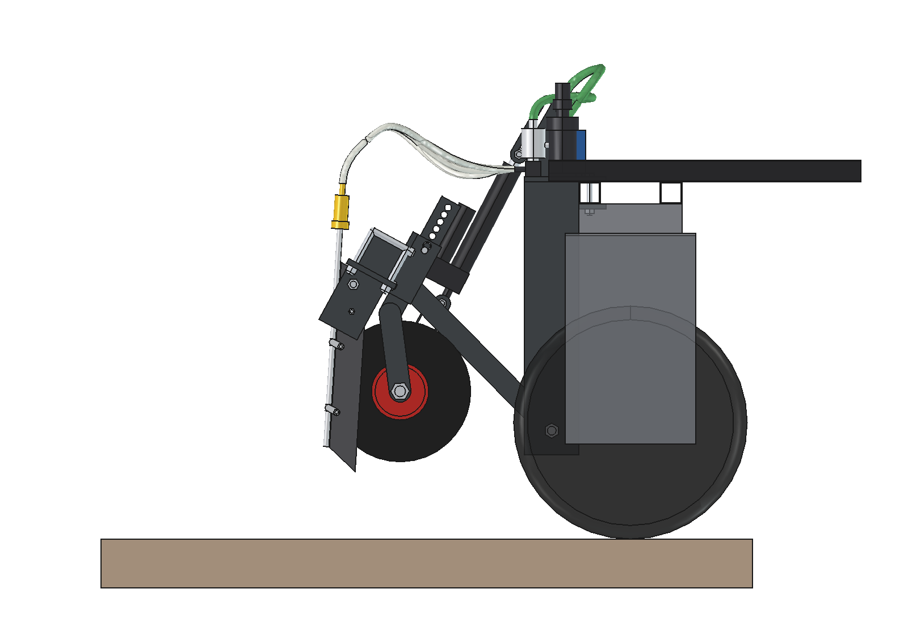
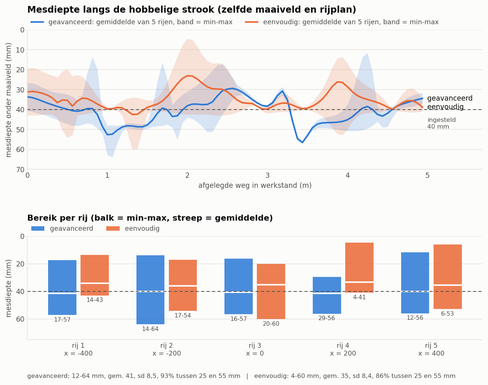

# Eenvoudige toediener voor vloeibare meststof: onderbouwing van het ontwerp

5 oktober 2026. Model: `Liquid_Fertilizer_Applicator_Simple.FCStd` (FreeCAD 1.1, gegenereerd met `build_lfs.py`).
Getallen komen uit het model, `lfs_calc.py` en `lfs_ground.py`. Waar iets aangenomen of geschat is, staat dat erbij.

Dit is de goedkope en robuuste tegenhanger van de toediener in [`../advanved`](../advanved/ONDERBOUWING.md).
De opdracht: simpeler en robuuster, met goedkope en makkelijk verkrijgbare onderdelen. Bodemvolging en
prestaties mogen minder worden. Robotaansluiting, rijafstand (5 × 200 mm) en werkdiepte (40 mm) zijn gelijk
gebleven, zodat de twee varianten direct te vergelijken zijn.

---

## 1. Wat er anders is dan de geavanceerde variant

| Functie | Geavanceerd | Eenvoudig | Wat je inlevert |
| --- | --- | --- | --- |
| Sleuf maken | schijf Ø 300 met diepteringen, daarachter een mes | één vast mes: strip 50 × 10 met een geslepen snijkant die 25° naar achteren helt | geen voorgesneden zode, meer kans op scheuren in droge zode |
| Diepte | elk element volgt zelf (diepteringen, veerarm, veerpoot) | 2 kruiwagenwielen op de balk, stelpen per 15 mm | een kuil of bult onder één rij komt volledig door |
| Ophanging | parallellogram: 4 stangen, 8 pennen | hefraam met 1 draaipunt: 2 bouten M16 | de meshoek varieert met de zweefstand (14–34°) |
| Steenbeveiliging | arm wijkt 60 mm uit en veert terug | breekbout M6: mes klapt naar achteren | na een steen moet er een nieuwe breekbout in |
| Heffen | snelle actuator (≥ 40 mm/s), heffen ca. 3 s | goedkope actuator 1000 N, slag 200, ca. 25 mm/s | heffen 8 s; de messen zijn na 3,6 s uit de grond |
| Pomp | loopwiel, ketting en 5-kanaals rollenpomp | 12 V-membraanpomp, vaste drukregelaar 2,0 bar en per rij een doseerplaatje | de dosis volgt de tijd en niet de afgelegde weg: de robot moet een vaste snelheid rijden |
| Antidruppel | terugslagklep op het buisje | spuitdophouder met membraanklep (standaard spuitonderdeel) | – |
| Massa (model) | 107 kg, waarvan 83 kg meebeweegt | **75 kg, waarvan 44 kg meebeweegt** | |
| Lengte achter de robot | 1037 mm, grondcontact 805 mm achter de achteras | **672 mm, messen 427 mm achter de achteras** | |
| Kosten | niet berekend | **ca. € 600** aan materiaal en koopdelen (§ 7) | |

Niets in deze variant hoeft gefreesd, gedraaid of gelaserd te worden.
- Al het staal is strip, koker of plaat uit de voorraad van een staalhandel. Het wordt recht afgezaagd en geboord.
- Het enige vormwerk is het langgat (2 gaten boren, uitzagen) en het slijpen van de snijkant van de messen.
- Lassen is beperkt tot 5 eenvoudige samenstellingen (§ 3.7).
- Alle koopdelen liggen bij een landbouw- of spuitonderdelenwinkel, een bouwmarkt of een webshop.

## 2. Het ontwerp in het kort

1. **Bok**: bovenplaat op de achterste onderbalk van de robot, 4 × M10 door de bestaande gaten, met een klemstrip eronder. Vier wangen hangen achter de balk tot 155 mm boven de grond. Daartussen zitten de draaibouten van het hefraam.
2. **Hefraam**: balk 60 × 60 × 4, twee armen 40 × 40 × 3 en een dwarsbuis, gelast. Het draait om **één as laag bij de grond** (z = 200).
3. **5 injectiemessen** op 200 mm. Elk mes is een strip 50 × 10 in een houder van drie platen, met een draaibout M12 en een breekbout M6. De houder zit met 2 beugelbouten op de balk.
4. Achter elk mes loopt een **RVS-buisje 10 × 1**, vastgezet met 2 P-clips. Het buisje laat de vloeistof 25 mm diep in de sleuf lopen. Bovenop zit een spuitdophouder met membraanklep en doseerplaatje.
5. **2 dieptewielen** (kruiwagenwiel 3.00-4) aan weerszijden van het midden, tussen rij 1-2 en rij 4-5. De steel schuift in een huls op de balk; een stelpen kiest de diepte.
6. **Lineaire actuator** (12 V, 1000–1500 N, slag 200). Het huis zit op de dwarsbuis, het stangoog in een langgat in de bok.
   - In het werk staat de actuator helemaal uit en zweeft het hefraam.
   - Heffen is helemaal in.
7. **Doseerunit op de bok** (vast aan de robot): zuigfilter met camlock naar de tank, 12 V-membraanpomp, drukregelaar 2,0 bar met manometer en een verdeelblok met 5 slangen naar de messen.

| Kenmerk | Waarde |
| --- | --- |
| Werkbreedte | 1,0 m (5 rijen × 200 mm) |
| Werkdiepte | 40 mm ingesteld (25 / 40 / 55 met de stelpen); uitstroom ca. 25 mm onder maaiveld |
| Dosering | 194 tot 1211 l/ha bij 0,75 m/s met doseerplaatjes 0,6–1,5 mm; 145 tot 1816 l/ha over 0,5–1,0 m/s (§ 3.5); standaard 1,0 mm: 538 l/ha |
| Capaciteit | 0,27 ha/h bij 0,75 m/s (theoretisch) |
| Bodemvolging | hefraam zweeft −9 / +11° (dieptewielen −43 / +55 mm); messen star aan de balk |
| Hefhoogte | messen 124 mm en dieptewielen 143 mm vrij van de grond |
| Afmetingen | 906 × 672 × 917 mm (b × l × h), binnen de robotbreedte van 978 mm |
| Massa (model) | 75 kg, waarvan 44 kg meebeweegt bij heffen |
| Stroom | pomp ca. 5 A, actuator ca. 3–5 A bij 12 V (niet tegelijk) |

**Werking.**
- De robot rijdt aan en de actuator gaat uit. Het hefraam zakt tot een dieptewiel de grond raakt en de messen staan op diepte.
- Is de robot op snelheid en zitten de messen in de grond, dan zet de robot de pomp aan (relais).
- Elke rij krijgt dan een vast debiet. Bij een vaste rijsnelheid is dat een vaste dosis per hectare.
- Aan het eind van de rij gaat de pomp uit en sluiten de membraankleppen; er druppelt niets na. De robot stopt en de actuator heft.

## 3. Ontwerpkeuzes

### 3.1 Eén vast mes in plaats van schijf + mes

- **Het mes is een strip 50 × 10**: S355, of Hardox als hij langer mee moet gaan. Het is 390 mm lang en de voorkant is geslepen.
  - Het mes staat **25° naar achteren**: de punt zit voor, de snijkant loopt naar achteren omhoog.
  - Wortels en gras glijden langs die kant omhoog en worden schuin doorgesneden. Het mes maakt zichzelf zo schoon, net als de vaste kouter van een ouderwetse ploeg.
  - De reactiekracht drukt het mes juist omlaag.
- **De onderkant loopt 15° op naar achteren.** De punt zit voorop en trekt het mes de grond in. In § 3.3 is aangenomen dat de neerwaartse kracht 30 % van de trekkracht is; meten in de veldproef.
- **De sleuf is 10 mm breed**, tegen 3 mm (schijf) en 8 mm (mes) bij de geavanceerde variant. Het buisje (Ø 10) loopt in de luwte achter het mes. De uitstroom zit ca. 25 mm diep, achter de onderhoek van het mes waar de sleuf nog open is.
- **Waarom geen veertand (S-tand)?** Een S-tand is goedkoop en veert terug na een steen.
  - Maar hij is 32 mm breed en trilt, dus de sleuf wordt breed en rafelig.
  - Een plat mes op zijn kant geeft een smalle, schone snede.
  - Steenbeveiliging komt van de breekbout (§ 3.4) en van het zwevende hefraam: bij een losse steen gaat het hele raam omhoog.
- **Wat je inlevert:**
  - Het mes moet de wortels zelf doorsnijden. In een droge, taaie zode kan het de zode optillen of scheuren, waar de schijf eerst sneed.
  - Gras kan om het mes draaien als de snijkant bot is. Houd de snijkant scherp.
  - Moet het toch beter: zet een schijf vóór elk mes. Dat is uitgewerkt in [versie 2](../simple_v2/ONDERBOUWING.md); of kies de geavanceerde variant.

### 3.2 Dieptewielen en een starre balk

- **De messen zitten vast aan de balk.** Twee kruiwagenwielen op x = ±300 houden de balk op hoogte. Ze staan naast de rijen en op dezelfde hoogte in de rijrichting als de mespunten, zodat stampen van het hefraam de diepte weinig verandert.
- **Diepte instellen**: de steel (koker 40 × 40 × 3) schuift in een huls (50 × 50 × 4) op de balk. Een stelpen Ø 12 met R-clip gaat door gaten om de 15 mm.
- Een kruiwagenwiel 3.00-4 (Ø 260, as 20 mm, kogellagers) is overal te koop. In het werk draagt het ca. 110 N, ver onder de draagkracht.
- **Wat je inlevert**:
  - Het hefraam draait alleen om de dwarsas en kan dus niet rollen. Het rust op het hoogste van de twee wielen.
  - Een kuil of bult onder één rij komt dus helemaal in de diepte van die rij terecht. Het gemiddelde ligt een paar mm ondieper dan de instelling (§ 4).
  - Stel de diepte daarom in het veld in.

### 3.3 Eén draaipunt, laag bij de grond: de belangrijkste ontwerpkeuze

Een hefraam met één draaipunt is veel eenvoudiger dan een parallellogram, maar het heeft een valkuil. **De
trekkracht van de messen wil het raam omhoog draaien.**
- De messen trekken naar achteren op 40 mm onder maaiveld.
- Ligt het draaipunt hoog, dan maakt die kracht een groot moment dat de achterkant van het raam optilt.

De eerste opzet had het draaipunt op 445 mm, net onder de robotbalk:
- Trekkracht 5 × 125 N op 485 mm hefboom = **303 Nm omhoog**.
- Gewicht van het hefraam: maar **ca. 170 Nm omlaag**.
- De messen zouden de grond uit drijven.

Daarom zit het draaipunt nu **op 200 mm hoogte**, 240 mm boven de mespunt. De wangen van de bok hangen daarvoor door tot
155 mm boven de grond. Bij de geschatte trekkracht van 125 N per mes (zie `lfs_calc.SOIL`):

| Momenten om het draaipunt | Normaal (125 N/mes) | Zware zode (250 N/mes) |
| --- | --- | --- |
| Gewicht hefraam (44 kg) + zuigkracht messen, omlaag | 213 Nm | 266 Nm |
| Trekkracht, omhoog | 150 Nm | 300 Nm |
| Kracht op de 2 dieptewielen samen | 225 N | 0 N: het raam drijft op |

- Tot **206 N per mes** blijven de dieptewielen op de grond.
- Voor 250 N per mes is **9 kg ballast** op de balk nodig, bijvoorbeeld een stalen strip.
- Of minder diep werken: de trekkracht neemt sterk af met de diepte.

Andere gevolgen van het lage draaipunt:
- Bij heffen gaan de mespunten bijna recht omhoog. Ze schuiven maar 80 mm naar achteren; met het hoge draaipunt was dat 200 mm.
- **De meshoek varieert**:
  - 25° in de ontwerpstand;
  - 14–34° over het hele zweefbereik;
  - 19–28° over de hobbelige strook (§ 4).
- Bij een parallellogram blijft de hoek constant. Dat is het belangrijkste dat een tweede stang zou opleveren.
- Het draaipunt zit 155 mm boven de grond, ongeveer zo laag als de wielbeugels van de robot zelf (175 mm). Met molshopen en ruggen tot 100 mm is dat geen probleem; bij hogere ruggen of stoepranden wel.

### 3.4 Heffen en zweven: één actuator met een langgat

- **Actuator**: 12 V (of 24 V), 1000–1500 N, slag 200 mm, inbouwlengte 310 mm, IP65 en interne eindschakelaars. Dit is een standaardmaat uit elke webshop.
- **Zweefstand**: het stangoog loopt in een langgat van 107 mm in twee platen op de bok.
  - In het werk staat de actuator helemaal uit (510 mm). Het hefraam zweeft dan vrij tussen −9 en +11°.
  - De besturing kent maar twee standen: werk = uit, heffen = in. Er is geen sensor of regeling nodig.
- **Kracht**: het hefraam weegt 432 N op 371 mm van het draaipunt en de hefboom van de actuator is 306 mm.
  - Met 1,5 × marge is dat **790 N** aan het begin van de slag en 690 N aan het eind.
  - Een actuator van 1000 N volstaat.
- **Snelheid**: goedkope actuatoren van 1000 N halen 10–25 mm/s. Gerekend met 25 mm/s:

| Stap | Slag | Tijd |
| --- | --- | --- |
| vrije slag in het langgat (nog niets heffen) | 48 mm | 1,9 s |
| messen uit de grond | 89 mm | 3,6 s |
| helemaal geheven (messen 124 mm, wielen 143 mm vrij) | 200 mm | 8,0 s |

  Bij de geavanceerde variant duurt heffen ca. 3 s. Hier stopt de robot aan het eind van de rij en wacht tot de
  messen uit de grond zijn. Zakken doet hij al rijdend, zodat de messen de grond in trekken.
- **Geheven** hangt het werktuig aan de robot. Er zijn twee slijtpunten: het langgat en de pen. De pen is een gewone bout M10 en dus snel te vervangen.

### 3.5 Dosering: membraanpomp, vaste drukregelaar en doseerplaatjes

Er zijn geen loopwiel, ketting, kettingwielen, lagers, torsieveer en meerkanaals rollenpomp meer. In plaats daarvan:

- **12 V-membraanpomp met interne bypass**, ca. 7 l/min en 4 bar. Dit is de standaardpomp van ATV- en kruiwagenspuiten.
  - De bypass voorkomt dat de pomp aan/uit pendelt bij een klein debiet.
  - De pomp is zelfaanzuigend en mag kort droog lopen.
- **Vaste drukregelaar 2,0 bar**, het soort dat in druppelirrigatie wordt gebruikt. Hij houdt de druk na de pomp constant, zonder retourleiding naar de tank en zonder instelknop. Een manometer erop is voor de controle.
- **Per rij een spuitdophouder met membraan-antidruppelklep (0,5 bar) en een doseerplaatje.** Dit zijn standaard spuitonderdelen.
  - Zolang de druk constant is, geeft elk plaatje hetzelfde debiet. De verdeling over de rijen is dus zo gelijk als bij een veldspuit.
  - Bij een verstopping valt alleen die rij weg, en dat is te zien bij het ijken.

Debiet per plaatje: Q = Cd · A · √(2 Δp / ρ), met Cd = 0,65 (aangenomen; ijken), Δp = 2,0 − 0,5 = 1,5 bar
en ρ = 1,2 kg/l. De dosis is dan Q / (v · 0,2 m).

| Doseerplaatje | Debiet per rij | 0,50 m/s | **0,75 m/s** | 1,00 m/s |
| --- | --- | --- | --- | --- |
| 0,6 mm | 0,17 l/min | 291 l/ha | 194 l/ha | 145 l/ha |
| 0,8 mm | 0,31 l/min | 517 l/ha | 344 l/ha | 258 l/ha |
| **1,0 mm** | **0,48 l/min** | 807 l/ha | **538 l/ha** | 404 l/ha |
| 1,2 mm | 0,70 l/min | 1162 l/ha | 775 l/ha | 581 l/ha |
| 1,5 mm | 1,09 l/min | 1816 l/ha | 1211 l/ha | 908 l/ha |

- **De dosis volgt de rijsnelheid**: 10 % sneller rijden geeft 9 % minder per hectare. Dat is de grootste prestatie die je inlevert.
  - De robot moet in het werk dus een vaste snelheid rijden. Een autonome robot doet dat goed.
  - Laat de robot de pomp pas aanzetten boven 80 % van de werksnelheid en uitzetten bij het afremmen.
  - Ter vergelijking: bij de geavanceerde variant draait de pomp met het loopwiel mee, dus afremmen verandert de dosis daar niet.
- **De druk telt minder zwaar**: 0,1 bar meer geeft 3,3 % meer dosis. De vaste regelaar houdt de druk binnen ca. 0,1 bar.
- **Lage giften zijn de grens.**
  - 500 l/ha bij 0,75 m/s vraagt een plaatje van 1,0 mm, en dat gaat goed.
  - UAN rond 100 l/ha zou 0,4 mm vragen. Zo'n klein gaatje verstopt makkelijk.
  - Verdun daarom met water, of rijd 1,0 m/s met plaatjes van 0,6 mm (145 l/ha).
  - Gebruik een zuigfilter van 50–80 mesh. Plaatjes kleiner dan 0,6 mm zijn niet aan te raden.
- **IJken**: zet de robot stil met de messen geheven en laat de pomp 1 minuut lopen. Vang per rij op in een maatbeker. Dat geeft het debiet en de verdeling (doel ±5 %).
- **Uitbreiding naar een taakkaart**: zet een drukopnemer in de leiding en stuur de pomp met PWM. Of laat de robot de rijsnelheid aanpassen aan de gewenste dosis. Messen, slangen en plaatjes blijven gelijk.

### 3.6 Doseerunit op de bok

- **Pomp, filter, regelaar en verdeelblok staan op de bovenplaat van de bok**, vast aan de robot.
  - De zuigslang van de tank klikt met een camlock 1" bovenop het filter en hoeft niet mee te bewegen.
  - Alleen de 5 dunne slangen (8 × 12 mm) naar de messen buigen mee met het zweven en heffen.
- Het hefraam wordt daardoor ca. 4 kg lichter en de onderdelen zitten op werkhoogte. Ze zijn te bereiken zonder onder het werktuig te kruipen.
- In de eerste opzet stond de doseerunit op de armen van het hefraam. Bij heffen draaide hij dan tegen de wangen van de bok aan.

### 3.7 Bouwen met standaardmaterialen

**Zaaglijst staal** (S355, recht zagen en boren):

| Deel | Materiaal | Aantal × lengte |
| --- | --- | --- |
| Bovenplaat bok | strip 150 × 10 | 1 × 400 |
| Klemstrip onder de robotbalk | strip 50 × 10 | 1 × 400 |
| Wangen bok | strip 100 × 10 | 4 × 504 |
| Langgatplaten bok | plaat 8 mm, ca. 60 × 170 | 2 (langgat 10,5 × 107 boren en uitzagen) |
| Balk | koker 60 × 60 × 4 | 1 × 900 + 2 kopplaatjes |
| Armen | koker 40 × 40 × 3 | 2 × ca. 420 (schuin aan de balk) |
| Draaibussen | buis Ø 30, binnen-Ø 16,5 | 2 × 60 |
| Dwarsbuis | koker 40 × 40 × 3 | 1 × 160, met 2 ogen strip 8 mm |
| Meshouder (5×) | strip 80 × 10 (bodem) + 2 × strip 80 × 8 (zijplaten) | 5 × 100 + 10 × 115 |
| Mes (5×) | strip 50 × 10 | 5 × 390, voorkant slijpen |
| Dieptewiel (2×) | strip 100 × 10, koker 50 × 50 × 4, koker 40 × 40 × 3, strip 40 × 8 | 2 × 125, 2 × 120, 2 × 230, 6 × ca. 185 |

**Lassen**, 5 samenstellingen:
1. bok: bovenplaat, wangen en langgatplaten;
2. hefraam: balk, armen, bussen, dwarsbuis en ogen;
3. meshouder (5×): bodemplaat en zijplaten;
4. klemplaat met huls (2×);
5. steel met vork (2×).

Al het andere wordt geschroefd. De messen en dieptewielen schuiven op de balk, dus een andere rijafstand vraagt
alleen andere gaten.

## 4. Bodemvolging vergeleken met de geavanceerde variant

`lfs_ground.py` rekent met **hetzelfde maaiveld en dezelfde robothouding** als `../advanved/animate_lfa.py`. Het maaiveld heeft:
- een golving van ±14 mm;
- een wisselende dwarshelling;
- molshopen, kuilen en een dwarsrichel van 20 mm.

De robot rust met vier wielen op het maaiveld. Daarna zakt het hefraam tot het eerste dieptewiel de grond raakt.
De geavanceerde variant komt uit zijn eigen animatiecode (`ground_advanced_reference.json`). Beide zijn
vergeleken op dezelfde 80 robotposities in werkstand.

| Werkstand, 80 posities | Geavanceerd | Eenvoudig |
| --- | --- | --- |
| Mesdiepte, bereik | 12 tot 64 mm | 4 tot 60 mm |
| Mesdiepte, gemiddeld / standaardafwijking | 41 / 8,5 mm | 35 / 8,4 mm |
| Aandeel tussen 25 en 55 mm | 93 % | 86 % |
| Mes uit de grond | 0 | 0 |
| Zweefbereik gebruikt | balk −58 / +59 mm | hefraam −5,0 / +5,8° (wielen ca. −24 / +28 mm) |
| Aanslag geraakt | 2 keer (element) | 0 keer (langgat) |
| Meshoek | vast t.o.v. de arm | 19 tot 28° |
| Wiel los van de grond | loopwiel: 0 keer | één van de twee dieptewielen hangt in 52 van de 80 posities (tot 39 mm) |

Wat dit laat zien:
- **De spreiding is vrijwel gelijk** (standaardafwijking 8,4 tegen 8,5 mm). Bij de geavanceerde variant komt de spreiding vooral van het stampen van de robot via de veerarmen. Hier volgt het hefraam de grond onder de twee dieptewielen.
- **Het gemiddelde ligt 6 mm ondieper.** De starre balk rust op het hoogste wiel. Stel de diepte in het veld daarom een gat dieper in als dat nodig is.
- **Plaatselijke oneffenheden onder één rij komen volledig door**:
  - de kuil van 26 mm onder rij 4 en 5: de messen gaan daar tot 4–6 mm ondiep;
  - de bult onder rij 3: het mes gaat tot 60 mm diep.
  - Bij de geavanceerde variant vangen de diepteringen dat per rij op.
- **De messen blijven altijd in de grond** en het hefraam raakte het langgat niet. Het zweefbereik is ruim genoeg voor deze strook.

In de animatie zakt het werktuig aan het begin al rijdend. De robot rijdt weg zodra de mespunten 25 mm boven de
grond hangen. Aan het eind stopt de robot en heft de trage actuator in 8 s. Het paneel rechtsonder geeft de
mesdiepte per rij en welk dieptewiel de grond raakt.

## 5. Berekeningen (samenvatting)

Opnieuw te berekenen met `python lfs_calc.py` (of `import lfs_calc; lfs_calc.report()`). Massa's komen uit
`build_lfs.mass_properties()`.

| Grootheid | Waarde |
| --- | --- |
| Debiet doseerplaatje 1,0 mm bij 2,0 bar | 0,48 l/min per rij, pomp 2,4 l/min |
| Dosis bij 0,75 m/s | 538 l/ha (500 l/ha: plaatje 0,96 mm) |
| Gevoeligheid dosis | snelheid +10 % geeft −9 %; druk +0,1 bar geeft +3,3 % |
| Momenten om het draaipunt (normaal) | 213 Nm omlaag tegen 150 Nm omhoog door trekkracht |
| Belasting dieptewielen | 2 × 112 N; rolweerstand 18 N |
| Maximale trekkracht per mes zonder opdrijven | 206 N (250 N: 9 kg ballast) |
| Kracht van het hefraam op de robot (werkstand) | 394 N omlaag en 625 N trekkracht in het draaipunt |
| Breekbout M6 (4.6), dubbelsnedig, 50 mm onder de draaibout | breekt bij 1,6 kN op de mespunt; buigspanning mes dan 116 MPa |
| Zweefbereik / meshoek | −9,1 / +11,0°, wielen −43 / +55 mm; meshoek 14–34° |
| Heffen | 28,6°: messen 124 mm en wielen 143 mm vrij; langgat 107 mm |
| Actuator | hefboom 306 / 287 mm, nodig 790 N (incl. 1,5 × marge), slag 200 mm, 8 s bij 25 mm/s |
| Trekkracht robot | nodig 643 N (normaal) / 1250 N (zware zode); grip met lege tank ca. 1090 N (μ = 0,5) |
| Massa werktuig / hefraam / één mes / één dieptewiel | 75 / 44 / 3,9 / 7,0 kg |

## 6. Gewichtsverdeling van de robot

Aannames gelijk aan de geavanceerde variant: robot 150 kg met het zwaartepunt 500 mm voor de achteras, en een tank van
150 l (1,2 kg/l).
- In het werk draagt de robot de bok, de doseerunit en de kracht in het draaipunt.
- De trekkracht grijpt aan op 200 mm hoogte en ontlast de vooras een beetje. Die is meegerekend.
- Geheven hangt alles aan de robot.

| Robot | Tank t.o.v. achteras | Achteras in het werk, vol / leeg | Vooras geheven, vol / leeg | Ter vergelijking: geavanceerd, vooras geheven vol / leeg |
| --- | --- | --- | --- | --- |
| 150 kg | 300 mm | 2904 / 1667 N | 1021 / **492 N** | 718 / 188 N |
| 150 kg | 450 mm | 2639 / 1667 N | 1286 / **492 N** | 983 / 188 N |
| 200 kg | 450 mm | 2884 / 1913 N | 1531 / 737 N | 1228 / 433 N |
| 250 kg | 450 mm | 3129 / 2158 N | 1777 / 982 N | 1473 / 679 N |

- **Geheven en met een lege tank draagt de vooras 2,6 keer zoveel als bij de geavanceerde variant** (492 tegen 188 N). Het werktuig is
  32 kg lichter en hangt bijna 400 mm dichter bij de achteras. Het kritieke punt van de geavanceerde variant
  (sturen op de kopakker met een lichte vooras) is daarmee grotendeels weg; voorballast is bij een robot van 150 kg
  waarschijnlijk niet nodig.
- **In het werk wordt de achteras zwaarder belast dan bij de geavanceerde variant.** Het hefraam steunt deels op het draaipunt, en de trekkracht trekt laag aan de robot. Dat helpt de grip van de achterwielen.
- **Weeg de robot per as.** Dat blijft het eerste dat bevestigd moet worden; vul de waarden in bij `lfs_calc.ROBOT`.

## 7. Stuklijst en kosten (indicatief)

Prijzen in euro, excl. btw, voor losse aankoop bij een staalhandel, landbouw- of spuitonderdelenwinkel of webshop
(prijsniveau 2026, niet geoffreerd). Eigen arbeid is niet meegerekend.

| Groep | Inhoud | ca. € |
| --- | --- | --- |
| Staal | strip, koker en plaat volgens de zaaglijst, ca. 45 kg | 115 |
| Beugelbouten | 10 × M12 en 4 × M10 voor koker 60 × 60 | 45 |
| Boutwerk | M10, M12, M16, M20, breekbouten M6 (met reserve) | 30 |
| Dieptewielen | 2 × kruiwagenwiel 3.00-4 met lagers | 35 |
| Actuator | 12 V, 1000–1500 N, slag 200, IP65 | 95 |
| Pomp | membraanpomp 12 V met interne bypass, ca. 7 l/min, 4 bar | 70 |
| Zuigkant | zuigfilter 50 mesh, camlock 1", zuigslang | 40 |
| Druk | vaste drukregelaar 2,0 bar, manometer | 25 |
| Verdeling | verdeelblok 5×, 5 spuitdophouders met membraanklep, set doseerplaatjes 0,6–1,5 mm | 75 |
| Slangen en buis | RVS-buis 10 × 1 (2 m), P-clips, PVC-slang 8 × 12 (10 m), slangklemmen | 45 |
| Elektra | relais, zekering, kabel naar de robot | 20 |
| **Totaal** | | **ca. 595** |

| Massa per groep (model) | kg |
| --- | --- |
| Bok (bovenplaat, klemstrip, 4 wangen, langgatplaten, bouten) | 23,9 |
| Doseerunit (pomp, filter, regelaar, verdeelblok, slangen) | 3,9 |
| Actuator met pennen | 3,2 |
| Hefraam (balk, armen, dwarsbuis) | 10,5 |
| 5 × mes met houder, buisje en spuitdophouder | 19,4 |
| 2 × dieptewiel met huls en steel | 14,0 |
| Slangen naar de messen | 0,3 |
| **Totaal** | **75,2** |

Reserve aanhouden: breekbouten M6, 1 mes, een set doseerplaatjes en de membranen van de spuitdophouders.

## 8. Risico's en testplan

| Risico | Maatregel / test |
| --- | --- |
| Het mes tilt of scheurt de zode, vooral in een droog voorjaar | **Eerst één mes bouwen** en op 30–40 mm trekken in nat en droog grasland. Beoordeel de sleuf en meet de trekkracht met een veerunster. Scheurt hij te veel: snijkant scherper, minder diep, of een schijfkouter vóór het mes (§ 3.1). |
| Gras of wortels draaien om het mes | Snijkant scherp houden, de helling van 25° niet steiler maken; in de proef beoordelen. |
| Trekkracht hoger dan geschat (125 N per mes): het hefraam drijft op | Boven 206 N per mes: ballast op de balk (9 kg voor 250 N), minder diep, of 4 messen. Let ook op de grip: met een lege tank is die ca. 1,1 kN. |
| De dosis hangt aan de rijsnelheid | Vaste werksnelheid; pomp alleen aan boven 80 % van die snelheid. Bij elke vulbeurt ijken (maatbekers, 1 minuut). |
| Doseerplaatjes verstoppen | Zuigfilter 50–80 mesh, geen plaatjes onder 0,6 mm. Na gebruik met water doorspoelen bij het dock. Een verstopte rij valt op bij het ijken. |
| Lage giften (UAN rond 100 l/ha) | Verdunnen, of 1,0 m/s rijden met plaatjes van 0,6 mm. |
| Een kuil of bult onder één rij gaat volledig door in de diepte (4–60 mm in de simulatie) | Accepteren of de diepte één gat dieper zetten. Bij veel microreliëf is de geavanceerde variant beter. |
| De breekbout breekt ongemerkt; het mes klapt achterover en de vloeistof komt bovenop | Zichtcontrole bij elke vulbeurt. Optioneel: een eenvoudige schakelaar of tiltsensor per mes. |
| Heffen duurt 8 s | De robot stopt aan het eind van de rij. Na 3,6 s zijn de messen uit de grond. Een snellere actuator kan, maar is duurder. |
| Achteruit rijden of scherp sturen met de messen in de grond | Software-interlock: eerst heffen. Dat geldt ook voor de geavanceerde variant. |
| Slijtage van langgat, pen en draaibussen | Pennen zijn gewone bouten; smeernippel op de draaibussen. |
| Slijtage van de messen | Strip 50 × 10 is goedkoop. Opnieuw slijpen, of Hardox gebruiken. |
| Corrosie | RVS-buisjes; pomp, verdeelblok en spuitdophouders zijn van kunststof. Doorspoelen. |
| Lage bodemvrijheid van de bok (155 mm) | Geen probleem op grasland. Op ruggen of bij transport over een stoeprand opletten. |

## 9. Model en bestanden

| Bestand | Inhoud |
| --- | --- |
| `Liquid_Fertilizer_Applicator_Simple.FCStd` | het model in werkstand (robotreferentie verborgen) |
| `lfs_params.py` | alle maten, inclusief de robotaansluiting |
| `lfs_kin.py` | kinematica: draaipunt, langgat, zweefbereik, hefhoek, mesgeometrie (puur Python) |
| `lfs_parts.py` | één functie per onderdeel |
| `build_lfs.py` | boomstructuur, kleuren, heffen (`build(psi=...)`), botscontrole, massa, afbeeldingen |
| `lfs_calc.py` | dosering, krachten op het hefraam, breekbout, heffen, asbelasting, kosten |
| `lfs_ground.py` | bodemvolging over de hobbelige strook (zelfde maaiveld als de geavanceerde variant) |
| `plot_ground.py` | vergelijkingsgrafiek bodemvolging (`previews/12_ground_following_comparison.png`) |
| `ground_advanced_reference.json` | mesdiepte per frame van de geavanceerde variant (uit `../advanved/animate_lfa.py`) |
| `animate_lfs.py` / `make_gif_lfs.py` | animatie achter het robotmodel en de GIF |
| `run_in_freecad.py` | macro: opnieuw bouwen in FreeCAD (F6) |

In alle standen geeft `build_lfs.check_interference()` 0 treffers: werkstand, beide grenzen van het zweefbereik
en geheven, met de robotreferentie erbij. In het animatiedocument geeft `animate_lfs.check_fit()` ook 0 treffers
tegen het echte robotmodel uit `agbot design`.
