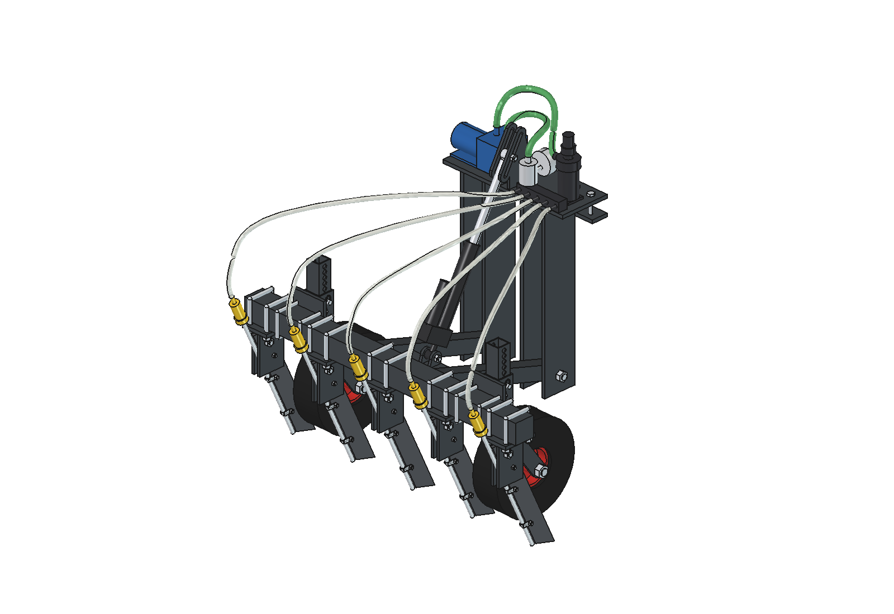
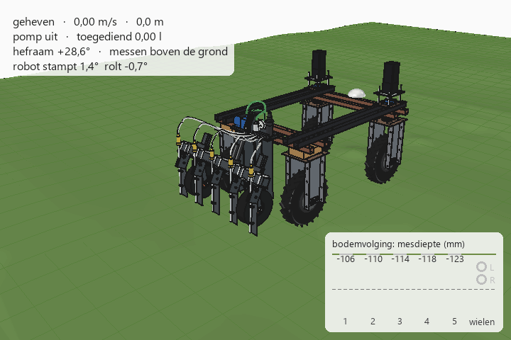

# Eenvoudige toediener voor vloeibare meststof (renure): FreeCAD-model

Goedkope, robuuste variant van de toediener in [`../advanved`](../advanved/README.md), voor de Bruut OpenAgbot.
- 5 vaste injectiemessen op 200 mm, elk met een RVS-buisje erachter.
- Twee kruiwagenwielen houden de diepte.
- Een hefraam met één laag draaipunt zweeft in het werk; één goedkope lineaire actuator heft het.
- Een 12 V-membraanpomp met vaste drukregelaar en doseerplaatjes doseert.
- Alleen strip, koker en standaard koopdelen; ca. € 600 aan materiaal.

De bodemvolging is iets minder dan bij de geavanceerde variant, en de dosis hangt aan de rijsnelheid. Waarom het zo
ontworpen is en wat je inlevert, staat in [ONDERBOUWING.md](ONDERBOUWING.md).

**Versie 2** zet per rij een snijschijf voor het mes: [`../simple_v2`](../simple_v2/README.md).





## Bestanden

| Bestand | Inhoud |
| --- | --- |
| `Liquid_Fertilizer_Applicator_Simple.FCStd` | het model in werkstand (gegenereerd, niet met de hand aanpassen) |
| `lfs_params.py` | alle maten, inclusief de robotaansluiting |
| `lfs_kin.py` | kinematica: draaipunt, langgat, zweefbereik, hefhoek, mes (puur Python) |
| `lfs_parts.py` | één functie per onderdeel, geeft een `Part`-shape |
| `build_lfs.py` | boomstructuur, kleuren, heffen, botscontrole, massa, afbeeldingen |
| `lfs_calc.py` | dosering, krachten op het hefraam, breekbout, heffen, asbelasting, kosten (puur Python) |
| `lfs_ground.py` | bodemvolging over de hobbelige strook, zelfde maaiveld als de geavanceerde variant (puur Python) |
| `plot_ground.py` | vergelijkingsgrafiek bodemvolging eenvoudig vs geavanceerd (matplotlib) |
| `ground_advanced_reference.json` | mesdiepte per frame van de geavanceerde variant (uit `../advanved/animate_lfa.py`) |
| `animate_lfs.py` | animatie: robot + toediener over de strook |
| `make_gif_lfs.py` | frames naar GIF met bijschrift en paneel "mesdiepte per rij" (Pillow, zit in FreeCAD) |
| `run_in_freecad.py` | macro: openen in FreeCAD en uitvoeren (F6) bouwt het model opnieuw |
| `previews/` | afbeeldingen, de vergelijkingsgrafiek en de GIF |

Alle modulenamen beginnen met `lfs_`, zodat ze in dezelfde FreeCAD-sessie niet botsen met de `lfa_`-modules van de
geavanceerde variant.

## Assen

Gelijk aan het robotmodel: x = rechts, y = rijrichting (voor = +y), z = omhoog, grond = z 0, mm.
- y = 0 is het hart van de achterste onderbalk van de robot, dus robot-y = werktuig-y − 575.
- Rijen op x = −400, −200, 0, 200, 400; dieptewielen op x = ±300.
- Draaipunt van het hefraam op (y, z) = (−70, 200).
- Hefhoek `psi` in graden; + = achterkant omhoog.

## Opnieuw bouwen en gebruiken

In de Python-console van FreeCAD (map in `sys.path`, of via `run_in_freecad.py`):

```python
import build_lfs, lfs_kin
build_lfs.build()                                   # werkstand, slaat het FCStd op
build_lfs.build(psi=lfs_kin.lift_angle(), save_path=None, show_robot=True)   # geheven, met robotreferentie
build_lfs.check_interference()                      # lijst met overlappende onderdelen (moet leeg zijn)
build_lfs.mass_properties()                         # massa en zwaartepunten
build_lfs.render_all()                              # afbeeldingen 1 t/m 11 in previews/ en opslaan in werkstand
```

Zonder FreeCAD (elke Python 3; `plot_ground.py` heeft matplotlib nodig):

```bash
python lfs_calc.py
```

```bash
python lfs_ground.py
```

```bash
python plot_ground.py
```

- `lfs_calc.py` geeft de kerngetallen en de doseertabel.
- `lfs_ground.py` geeft het bereik van de mesdiepte, de zweefhoek en de aanslagen.
- `plot_ground.py` maakt `previews/12_ground_following_comparison.png`.

## Animatie

Bouwt een apart document `LFS_on_robot_animation` met:
- het robotmodel uit `agbot design` (die bestanden worden niet aangepast);
- de toediener erachter;
- hetzelfde golvende maaiveld als de geavanceerde animatie.

```python
import animate_lfs
animate_lfs.build()                     # document opbouwen
animate_lfs.play()                      # live afspelen, animate_lfs.stop()
animate_lfs.check_fit()                 # overlap met het echte robotmodel (moet leeg zijn)
animate_lfs.render_frames(r"C:\temp\lfs_frames", 0, 60)   # in stukken van ~60 frames renderen
import make_gif_lfs
make_gif_lfs.main(r"C:\temp\lfs_frames", r"previews\animation_strip_ground_following.gif")
```

Rijplan, actuatorsnelheid en maaiveld staan bovenaan `lfs_ground.py`: `SPEED`, `ACT_SPEED`, `BUMPS`, `RIDGES`.

## Boomstructuur

```
liquid_fertilizer_applicator_simple
  headstock_robot_mount          bok (vast): bovenplaat, klemstrip, 4 wangen, langgatplaten, bouten
  dosing_unit_on_headstock       pomp, filter + camlock, drukregelaar + manometer, verdeelblok, verbindingsslangen
  lift_actuator                  huis (pen op het hefraam) + stang (oog in het langgat) + 2 pennen
  outlet_hoses_flex_with_lift    5 slangen van het verdeelblok naar de spuitdophouders
  swing_frame_moves_with_lift    (Placement = rotatie om de draaibouten)
    toolbar, frame_arms, cross_tube_with_actuator_lugs
    injection_knife_1..5         houder, beugelbouten, mes, draai- en breekbout, buisje, P-clips, spuitdophouder
    gauge_wheel_left / right     klemplaat, beugelbouten, huls, steel, stelpen, vork, as, wiel
robot_reference_NOT_PART_OF_DESIGN   (verborgen; achterbalken, bovenbalken, achterwielen)
```

## Geschat, niet gemeten

- **Trekkracht per mes**: 125 N, zware zode 250 N.
- **Neerwaartse kracht van de mespunt**: 30 % van de trekkracht.
- **Uitstroomcoëfficiënt van de doseerplaatjes**: 0,65 (ijken).
- **Robotgewicht en zwaartepunt**: `lfs_calc.ROBOT`, gelijk aan de geavanceerde variant.
- **Grip van de robot**: μ = 0,5.
- **Actuatorsnelheid en prijzen**: typische waarden uit datasheets en webshops.

Zie ONDERBOUWING § 5 tot en met § 8.

De bodemvolging is quasi-statisch gerekend:
- de robot rust star op vier wielen;
- het hefraam rust op het hoogste dieptewiel;
- dynamica, slip en het opdrijven door trekkracht zitten niet in de animatie. Opdrijven staat wel in `lfs_calc`.
