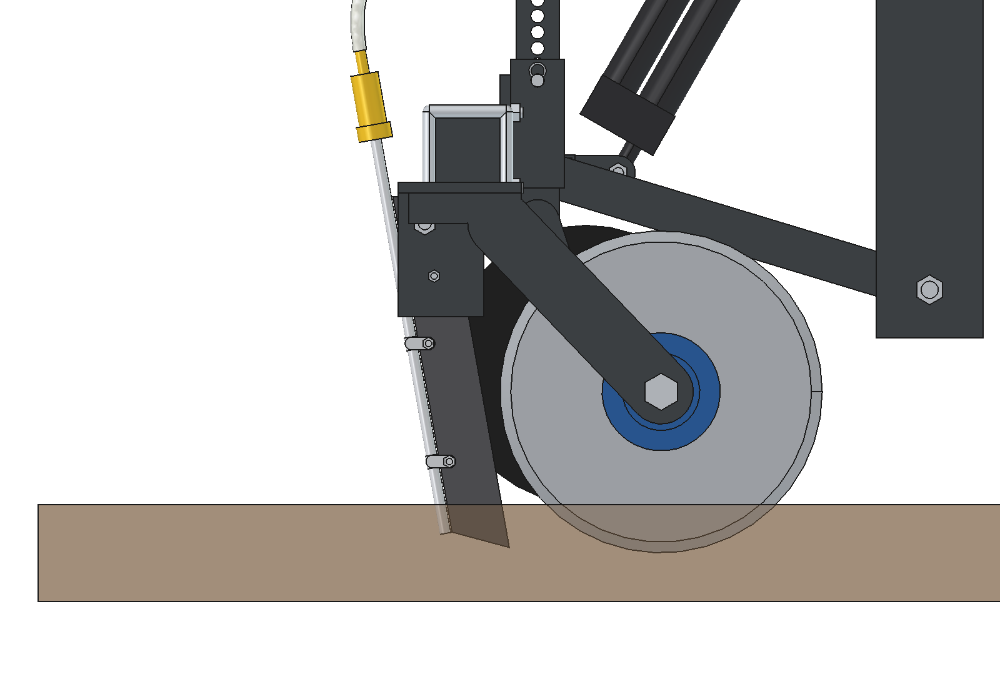
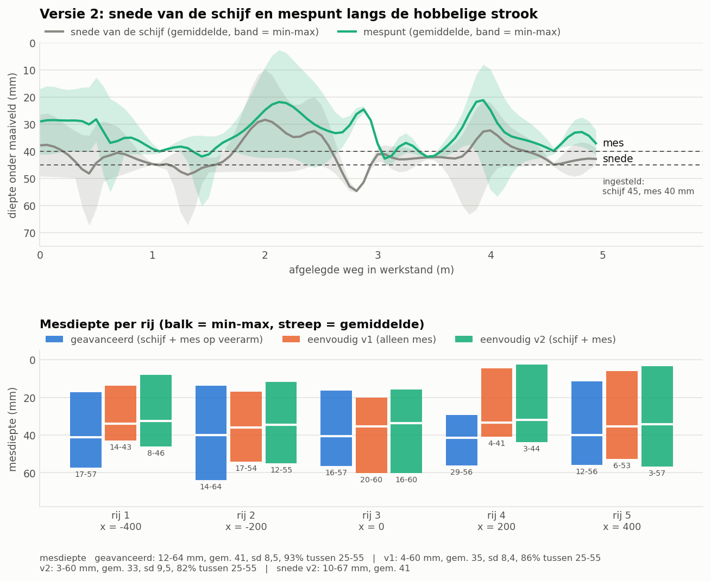
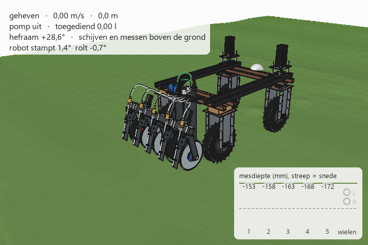

# Eenvoudige toediener versie 2 (schijf + mes): onderbouwing

5 oktober 2026. Model: `Liquid_Fertilizer_Applicator_Simple_v2.FCStd` (FreeCAD 1.1, gegenereerd met `build_lfs2.py`).
Getallen komen uit het model, `lfs2_calc.py` en `lfs2_ground.py`. Waar iets aangenomen of geschat is, staat dat erbij.

Versie 2 is [versie 1](../simple/ONDERBOUWING.md) met **per rij een snijschijf voor het mes**. Het mes alleen kan in
droge, taaie zode de wortels niet goed doorsnijden: het tilt of scheurt de zode. In v2 snijdt een vlakke schijf
eerst de zode door. Het mes loopt daar vlak achter in hetzelfde vlak en zet de snede alleen open. Dat is hetzelfde
principe als de [geavanceerde variant](../advanved/ONDERBOUWING.md), maar dan star aan een zwevende balk, met
standaardonderdelen.

Al het andere is gelijk aan v1:
- de bok met het lage draaipunt;
- het hefraam met dwarsbuis, balk en armen;
- de actuator met langgat;
- de dieptewielen;
- de doseerunit op de bok (membraanpomp, drukregelaar 2,0 bar, doseerplaatjes).

De onderbouwing daarvan staat in v1 en wordt hier niet herhaald.

---

## 1. Wat er verandert ten opzichte van versie 1

| | Versie 1 (alleen mes) | **Versie 2 (schijf + mes)** |
| --- | --- | --- |
| Sleuf maken | mes snijdt zelf, snijkant 25° naar achteren | **schijf Ø 300 × 4** snijdt 45 mm diep, mes 10° volgt 40 mm diep in de snede |
| Spleet mes – schijf | – | 14 mm; het mes gaat 41 mm achter het punt waar de schijf uit de grond komt de snede in |
| Uitstroom | ca. 25 mm diep | ca. 27 mm diep |
| Element | 3,9 kg | 9,1 kg (schijf 2,1 kg, lagernaaf 1,4 kg, schijfarm 1,3 kg) |
| Massa werktuig / hefraam | 75 / 44 kg | 101 / 70 kg |
| Neerdruk | niet nodig: het mes trekt zich de grond in | **de schijven hebben neerdruk nodig** (geschat 100 N per schijf); die komt van het gewicht van het hefraam (§ 3) |
| Actuator | 1000 N, ca. 25 mm/s: 8 s heffen | **1500 N**, ca. 20 mm/s: 10 s heffen; na 5,1 s zijn schijven en messen uit de grond |
| Geheven vrij van de grond | messen 124 mm | schijven 86 mm, messen 177 mm |
| Vooras geheven, lege tank (robot 150 kg) | 492 N | 377 N; met 40 kg ballast 200 N |
| Afmetingen (b × l × h) | 906 × 672 × 917 mm | 938 × 639 × 922 mm: de naven van de buitenste rijen steken 16 mm buiten de balk, nog ruim binnen de robotbreedte van 978 mm |
| Kosten (indicatief) | ca. € 595 | **ca. € 915** |

## 2. Het element: schijf, naaf en mes

- **Snijschijf**: een vlakke, geharde kouterschijf Ø 300 × 4 met 4-gats bevestiging. Dit is een gangbaar onderdeel voor zaaimachines en schijvenbemesters.
  - Het hart ligt 105 mm boven de grond, dus de schijf snijdt **45 mm** diep.
  - Hij snijdt de wortels en de zode door voordat het mes komt.
- **Lagernaaf**: een naaf met flens en twee lagers (6204-2RS) op een **asbout M20**.
  - De naaf zit aan één kant van de schijf, de schijf hangt er vrij aan.
  - Dat is minder werk dan een vork aan twee kanten. Bovendien past een vork niet naast de dieptewielen.
- **Schijfarm**: een strip 60 × 10, schuin gelast onder de bodemplaat van de meshouder.
  - Het voetstuk loopt over de hele lengte van de bodemplaat, zodat er een lange las is.
  - De bodemplaat is aan die kant 20 mm breder (strip 100 × 10).
- **Naaf weg van het dieptewiel**: de naaf en de arm zitten aan de kant waar het dieptewiel niet staat (`disc_side` in `lfs2_params.py`).
  - Rij 2 en 4 hebben de naaf aan de binnenkant, rij 1 en 5 aan de buitenkant, rij 3 rechts.
  - Zo blijft er tussen schijven, naven en dieptewielen overal ruimte.
- **Mes**: dezelfde strip 50 × 10 met draaibout M12 en breekbout M6 als in v1.
  - Het mes staat nu **10° naar achteren in plaats van 25°**. De schijf heeft de wortels al gesneden, dus het mes hoeft niet meer schuin te snijden; het zet de snede alleen open.
  - Een steiler mes kan dichter achter de schijf staan. Op het smalste punt is de spleet 14 mm; naar boven wordt hij breder.
  - De mespunt zit **5 mm minder diep** dan de schijf (40 tegen 45 mm), net als in de geavanceerde variant. Zo loopt het mes in de voorgesneden snede.
  - Het buisje zit achter het mes; de uitstroom is ca. 27 mm diep.
- **Dieptewielen**: staan nu tussen schijf en mespunt (as op y = −390). Een stelpen kiest de diepte, zoals in v1.
  - De wielpositie maakt voor de bodemvolging weinig uit: verschuiven tussen y = −350 en −450 verandert de standaardafwijking van de mesdiepte maar van 10,1 naar 9,2 mm.
  - De spreiding komt vooral van de starre balk.
- **Dwarsbuis**: 55 mm naar achteren (y = −420) en hart op hart met de armen.
  - De schijf en de schijfarm van rij 3 lopen eronder door.
  - De ogen voor het actuatorhuis steken naar voren tot de oude pen. De kinematica van het heffen is daardoor gelijk aan v1.

## 3. Neerdruk: de schijven moeten erin

Een mes trekt zich met zijn punt de grond in. **Een schijf moet er met gewicht in gedrukt worden.** Dat is de
belangrijkste prijs van versie 2.

De momenten om het draaipunt van het hefraam (z = 200) zijn geschat, zie `lfs2_calc.LOADS`:

| Per element | Normaal | Zware zode |
| --- | --- | --- |
| Neerdruk die de schijf nodig heeft voor 45 mm | 100 N | 200 N |
| Trekkracht schijf (rollen + snijden) | 30 N | 50 N |
| Trekkracht mes in de voorgesneden snede | 60 N | 125 N |

| Momenten om het draaipunt (5 elementen) | Normaal | Zware zode |
| --- | --- | --- |
| Gewicht hefraam (70 kg) + zuigkracht messen, omlaag | 276 Nm | 314 Nm |
| Schijven omhoog gedrukt | 125 Nm | 250 Nm |
| Trekkracht messen en schijven | 105 Nm | 206 Nm |
| **Kracht op de 2 dieptewielen samen** | **143 N** | **0 N**: het hefraam drijft op en de schijven komen niet op diepte |

- **Normaal kan het hefraam zelf tot 137 N per schijf leveren.** Zonder ballast komen de schijven dan op diepte en houden de dieptewielen grondcontact.
- **Bij harde zode is ca. 40–50 kg ballast nodig.**
  - Gebruik stalen platen op de balk, bevestigd met dezelfde beugelbouten.
  - 20 kg ballast geeft 192 N per schijf, 40 kg geeft 246 N.
- **Ballast heeft een keerzijde.** Geheven hangt hij aan de robot.
  - Met 40 kg ballast en een lege tank zakt de vooras van een robot van 150 kg naar 200 N. Dat is net zo licht als bij de geavanceerde variant (188 N).
  - Zet de ballast dus alleen op de balk als de zode erom vraagt, en weeg de robot per as.
- **Alternatief voor ballast: twee gasveren** tussen de bok en de dwarsbuis.
  - Ze drukken in het werk het hefraam omlaag en gebruiken zo het gewicht van de robot.
  - Geheven is hun kracht inwendig, dus de vooras wordt niet lichter.
  - Nadeel: de actuator moet de gasveren ook overwinnen en moet daarvoor zwaarder zijn. Dit is niet uitgewerkt; eerst meten of het nodig is.
- **Trekkracht voor de robot**:
  - normaal 461 N, zwaar 875 N;
  - grip met een lege tank ca. 950 N (μ = 0,5).
  - Bij zware zode zit de robot dus dicht bij zijn grens.

## 4. Heffen

Heffen gaat net als in v1: werk = actuator helemaal uit, heffen = helemaal in, met een langgat voor het zweven.
- Het hefraam is 26 kg zwaarder geworden. Met 1,5 × marge is **1180 N** nodig, dus een actuator van **1500 N** (slag 200).
- Goedkope actuatoren van 1500 N halen 10–20 mm/s. Gerekend met 20 mm/s:

| Stap | Slag | Tijd |
| --- | --- | --- |
| vrije slag in het langgat | 48 mm | 2,4 s |
| schijven en messen uit de grond | 102 mm | 5,1 s |
| helemaal geheven (schijven 86 mm, messen 177 mm, wielen 162 mm vrij) | 200 mm | 10 s |

De robot stopt aan het eind van de rij en wacht tot de schijven en messen uit de grond zijn. Zakken doet hij al
rijdend.

## 5. Bodemvolging vergeleken

Dezelfde strook, dezelfde robothouding en dezelfde 80 robotposities als bij v1 en de geavanceerde variant.
Ingesteld zijn: v1 mes 40 mm; v2 schijf 45 en mes 40 mm; geavanceerd schijf 40 en mes 35 mm.

| Werkstand, 80 posities | Geavanceerd | Versie 1 | **Versie 2** |
| --- | --- | --- | --- |
| Mesdiepte, bereik | 12–64 mm | 4–60 mm | 3–60 mm |
| Mesdiepte, gemiddeld / standaardafwijking | 41 / 8,5 mm | 35 / 8,4 mm | 33 / 9,5 mm |
| Mesdiepte tussen 25 en 55 mm | 93 % | 86 % | 82 % |
| Snede van de schijf, bereik / gemiddeld | – | – | 10–67 mm / 41 mm |
| Snede tussen 25 en 55 mm | – | – | 92 % |
| Mes uit de grond | 0 | 0 | 0 |
| Mes dieper dan de snede | – | – | 22 van de 400 rijposities, hooguit 12 mm |
| Meshoek | vast t.o.v. de arm | 19–28° | 4–13° |

Wat dit laat zien:
- **De snede volgt het maaiveld net zo goed als het mes in v1.** Gemiddeld is hij 41 mm diep bij een instelling van 45 mm. De balk rust op het hoogste dieptewiel, dus alles komt een paar mm ondieper uit dan ingesteld.
- **Het mes zit 72 mm achter de dieptewielen.** Stampen van het hefraam (−5 tot +6°) telt daar iets meer door, en daardoor is de spreiding van de mesdiepte wat groter dan in v1.
- **Soms gaat het mes dieper dan de snede.** Dat gebeurt in 5 % van de rijposities, met maximaal 12 mm. Op die plekken snijdt het mes een paar mm in onaangeroerde grond. Dat kost wat extra trekkracht, maar het mes kan dat met zijn snijkant.
- **Een kuil of bult onder één rij komt nog steeds volledig door**, net als in v1: de messen van rij 4 en 5 gaan bij de kuil tot 3–4 mm ondiep. Dat is de prijs van de starre balk. De geavanceerde variant vangt dat per rij op met diepteringen.

In de animatie geeft het paneel rechtsonder per rij de mesdiepte (balk) en de snede van de schijf (streep).

## 6. Berekeningen (samenvatting)

Opnieuw te berekenen met `python lfs2_calc.py`.

| Grootheid | Waarde |
| --- | --- |
| Dosering | gelijk aan v1: plaatje 1,0 mm bij 2,0 bar geeft 538 l/ha bij 0,75 m/s |
| Hefbomen om het draaipunt | gewicht 350 mm, schijf 250 mm, mespunt 391 mm (horizontaal) / 240 mm (verticaal), dieptewiel 320 mm |
| Dieptewielen (normaal) | 2 × 72 N; kracht in het draaipunt 135 N omlaag en 450 N trekkracht |
| Maximale neerdruk per schijf zonder ballast | 137 N (met 20 kg ballast 192 N, met 40 kg 246 N) |
| Ballast voor zware zode | 41 kg (wielen net op de grond), 50 kg (wielen 100 N) |
| Breekbout M6 (4.6) | breekt bij 1,6 kN op de mespunt; buigspanning in het mes dan 116 MPa |
| Zweefbereik | −9,1 / +11,0° (dieptewielen −50 / +62 mm) |
| Heffen | 28,6°; actuator 1180 N (incl. 1,5 × marge), 10 s bij 20 mm/s |
| Asbelasting robot 150 kg, tank 150 l | werkstand achteras vol/leeg 2836 / 1335 N; geheven vooras vol/leeg 641 / 377 N |
| Massa werktuig / hefraam / element / dieptewiel | 101 / 70 / 9,1 / 7,0 kg |

| Robot | Tank t.o.v. achteras | Vooras geheven, vol / leeg | Leeg, met 40 kg ballast | v1, leeg | Geavanceerd, leeg |
| --- | --- | --- | --- | --- | --- |
| 150 kg | 300 mm | 906 / 377 N | 200 N | 492 N | 188 N |
| 150 kg | 450 mm | 1171 / 377 N | 200 N | 492 N | 188 N |
| 200 kg | 450 mm | 1416 / 622 N | 445 N | 737 N | 433 N |
| 250 kg | 450 mm | 1662 / 867 N | 690 N | 982 N | 679 N |

## 7. Stuklijst en kosten (indicatief)

Prijzen in euro excl. btw, losse aankoop (prijsniveau 2026, niet geoffreerd). Ten opzichte van v1 komen erbij:

| Groep | Inhoud | ca. € |
| --- | --- | --- |
| Schijven | 5 vlakke kouterschijven Ø 300 × 4, gehard, 4-gats | 125 |
| Naven | 5 lagernaven met 4-gats flens (2 × 6204-2RS), asbouten M20, ringen | 160 |
| Staal extra | 5 schijfarmen strip 60 × 10 (ca. 330 mm), bredere bodemplaten (ca. 7 kg) | 20 |
| Actuator | 1500 N in plaats van 1000 N | 15 |
| **Totaal v2** | v1 (€ 595) + bovenstaande | **ca. € 915** |

De rest van de stuklijst en de zaaglijst staan in [v1 § 3.7 en § 7](../simple/ONDERBOUWING.md). Wijzigingen in de zaaglijst:
- bodemplaat meshouder: strip 100 × 10 × 115 in plaats van 80 × 10 × 100;
- schijfarm: 5 × strip 60 × 10, ca. 330 mm (schuin deel + voet);
- dwarsbuis: op y = −420, de ogen 60 mm langer.

Reserve aanhouden: zoals in v1, plus 1 schijf en 2 lagers 6204-2RS.

## 8. Risico's en testplan (aanvullend op v1)

| Risico | Maatregel / test |
| --- | --- |
| De schijven komen niet op diepte (te weinig neerdruk) | **Eerst één element bouwen** en de neerdruk meten bij 45 mm diepte, op nat en droog grasland, met gewichten of een veerunster. Daarna de ballast kiezen (0–50 kg) en controleren dat de vooras geheven niet te licht wordt. |
| De vooras wordt te licht met ballast | Ballast alleen bij harde zode; de robot per as wegen. Alternatief: gasveren (§ 3). |
| Gras of wortels lopen vast tussen schijf en mes | De spleet is 14 mm: smal genoeg als schraper, maar beoordelen in de proef. Zo nodig het mes 5 mm naar voren (`knife_pivot`) of een schraper op de schijfarm. |
| Het mes loopt naast de snede bij zijdelingse belasting | De schijf hangt aan één kant op de naaf. Speling in de naaf of een verbogen arm verschuift de snede. Bij elke vulbeurt controleren dat mes en schijf in één lijn staan. |
| Lagerslijtage in de naven | Lagers 6204-2RS met stofkap; vervangen als de schijf speling heeft. |
| De schijf verstopt met modder | Een vlakke, scherpe schijf houdt zich meestal schoon. Bij plakkerige grond een schraper op de schijfarm. |
| Heffen duurt 10 s | Robot stopt aan het eind van de rij; na 5 s is alles uit de grond. |

De overige risico's zijn gelijk aan [v1 § 8](../simple/ONDERBOUWING.md): dosis volgt de snelheid, verstopping van de
plaatjes, breekbout, interlock achteruit/scherp sturen, lage bodemvrijheid van de bok.

## 9. Model en bestanden

| Bestand | Inhoud |
| --- | --- |
| `Liquid_Fertilizer_Applicator_Simple_v2.FCStd` | het model in werkstand (robotreferentie verborgen) |
| `lfs2_params.py` | alle maten; nieuw: schijf, naaf, schijfarm, `disc_side`, `knife_depth` |
| `lfs2_kin.py` | kinematica, plus de spleet tussen mes en schijf (`disc_knife_gap`) |
| `lfs2_parts.py` | één functie per onderdeel; nieuw: `disc`, `disc_hub`, `disc_stub`, `disc_arm` |
| `build_lfs2.py` | boomstructuur, heffen (`build(psi=...)`), botscontrole, massa, afbeeldingen |
| `lfs2_calc.py` | dosering, krachten op het hefraam met schijven (`LOADS`), ballast, heffen, asbelasting, kosten |
| `lfs2_ground.py` | bodemvolging: snede van de schijf, mesdiepte, mes dieper dan de snede |
| `plot_ground2.py` | vergelijkingsgrafiek (`previews/12_ground_following_comparison.png`) |
| `ground_advanced_reference.json`, `ground_simple_v1_reference.json` | mesdiepte van de geavanceerde variant en van v1 op dezelfde posities |
| `animate_lfs2.py` / `make_gif_lfs2.py` | animatie achter het robotmodel en de GIF |
| `run_in_freecad.py` | macro: opnieuw bouwen in FreeCAD (F6) |

`build_lfs2.check_interference()` geeft in alle standen 0 treffers: werkstand, beide grenzen van het zweefbereik en
geheven, met de robotreferentie erbij. `animate_lfs2.check_fit()` geeft 0 treffers tegen het echte robotmodel.
