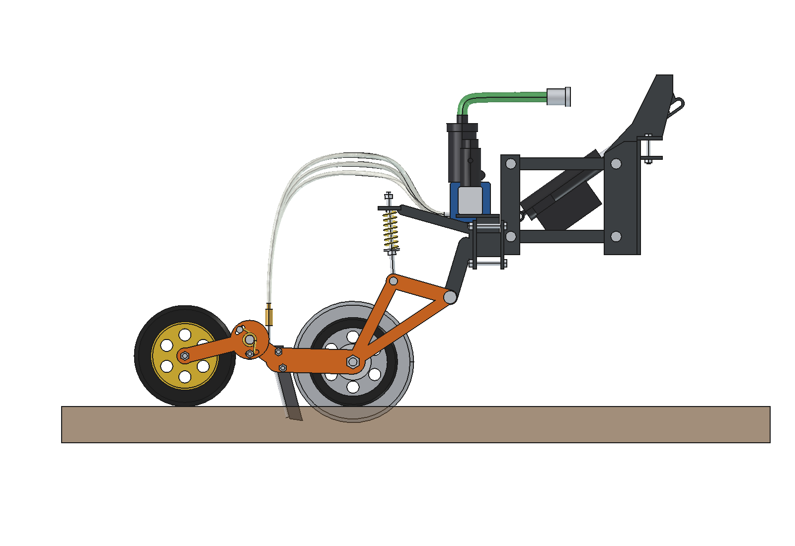
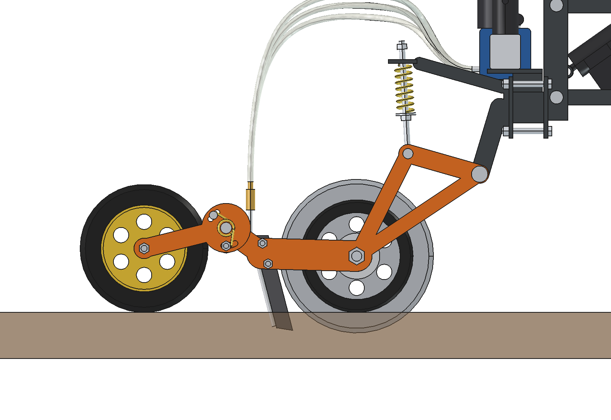
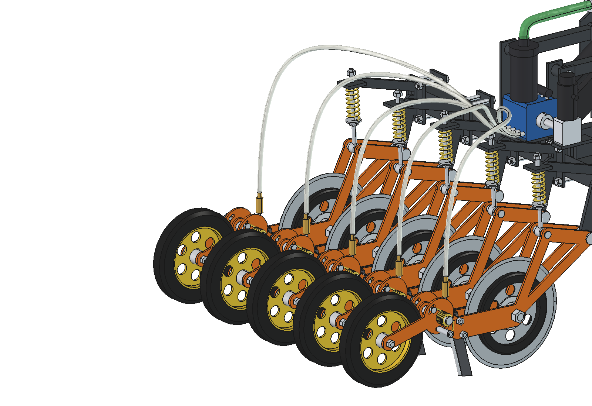
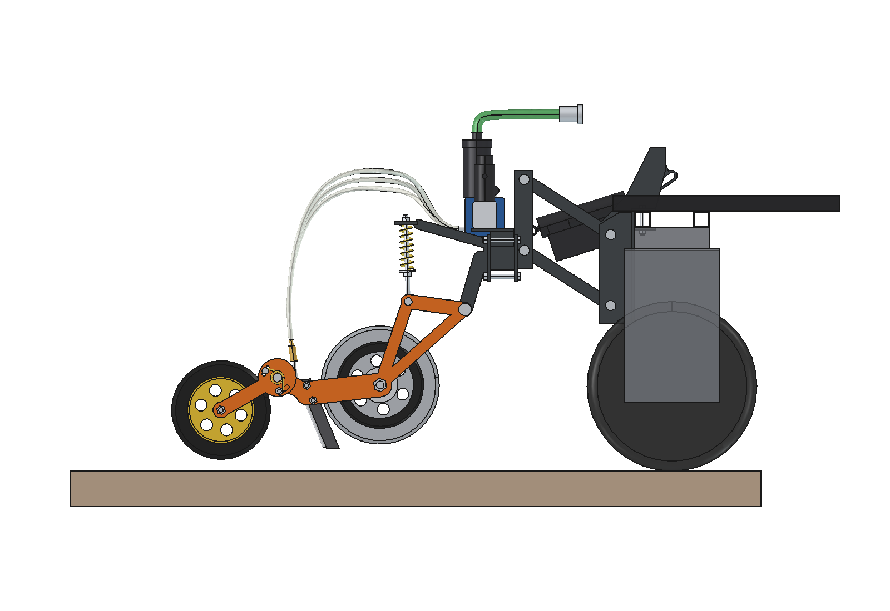
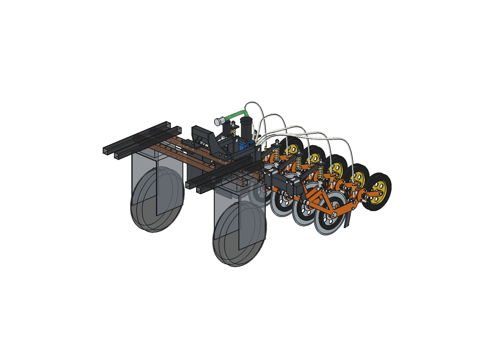

# Liquid fertilizer applicator (renure): design rationale

4 October 2026. Model: `Liquid_Fertilizer_Applicator.FCStd` (FreeCAD 1.1, generated with `build_lfa.py`).
Figures come from the model and from `lfa_calc.py`. Where something is assumed or estimated, this is stated.

**Revised after the animation (§ 4.11).** The animation over a bumpy strip showed that a toolbar hanging rigidly from the
actuator moves up and down too much: the robot pitches, and the elements hang well over 1.3 m behind the robot centre.
The toolbar now works in **floating position**. There is a slotted hole in the upper suspension of the actuator, the actuator lies
flatter and is turned around, the springs are softer, and the down force comes from the toolbar's own weight.

**Extended 7 October 2026: press wheel per row (§ 4.12).** Behind each knife a narrow press wheel on a spring-loaded
trailing arm closes the slot again. It hangs on the element arm, so it runs exactly on the slot. Its force works
against the element spring with a long lever; the spring seats are therefore higher. The implement is 18 kg
heavier and 320 mm longer, which makes the front axle of a light robot even lighter when lifted (§ 6).

**Changed 7 October 2026: no ground wheel (§ 4.5, § 4.7).** The pump is now driven by an electric worm gear motor with
encoder directly on the pump shaft. The robot sets the pump speed from its driving speed, so the dose per hectare
stays constant. Ground wheel, chain, jackshaft bearings, torsion spring and sensor are gone (−9.4 kg). The elements
now carry the whole floating weight: more down force on the discs (117 N instead of 106 N).

---

## 1. Assignment and starting points

- The liquid has to go into the soil: first cut a small groove, then a small knife follows with a tube behind it that places the liquid in the slot.
- Several elements over 1 metre.
- Originally: one ground wheel that drives the pump. Later decision: **the ground wheel goes**; the pump gets an electric drive that follows the driving speed.
- First as a stand-alone implement, but fitting the Bruut OpenAgbot: track 750 mm, wheelbase 1000 mm, 40 × 40 box beams with M10 holes on a 50 mm grid, rear axle at 215 mm height.
- Set up differently from the inspiration, but with the lessons from it.
- Added later: a press roller behind the knife that closes the slot neatly again.

## 2. What I take from the inspiration

| Source | What works | What is different here, and why |
| --- | --- | --- |
| **Light disc fertilizer applicator** (Bartlema / NCOK, demo day Zwartebroek) | The discs drive a roller pump, so the dosing depends on the distance travelled. Light and without electronics. In the photos: two discs on one axle with the pump in the middle, two knives with a hose, on a hoe parallelogram. | In the prototype the same discs have to **cut and drive the pump**. If a disc slips in the sward or clogs up, the dosing changes immediately, and every element has its own pump. Here **one central 5-channel pump** for the whole toolbar, driven by an **electric motor that follows the driving speed of the robot**. The discs only have to cut, and nothing that can slip in the sward determines the dose. |
| **Fertilizing robot Fieldworkers** (Sterke Erven) | Element with a spring like a hoe element, 20 cm between the injection tines, light vehicle that works day and night, pump determines the total quantity, task map, buffer tank on the headland. | Taken over: **20 cm row spacing**, **spring load per element** and the light set-up. Different: **disc + knife instead of tines**. In grassland a tine tears the sward open and grass can wind around the tine. A disc cuts the roots first, so the knife follows with little force. Also taken over: the **electrically driven pump** with the dose set in software. The speed comes from the robot (RTK), which makes a task map possible directly (§ 4.7). |

Both sources themselves mention refilling via a docking station. § 4.7 and § 6 show that this is also the key for this implement.

## 3. The design in brief

1. **Mounting headstock** (2 pieces): top plate on the robot's rear lower beam, M10 through the existing holes.
2. **Parallel linkage** (2 × 2 rods) with an **electric linear actuator**. While working the actuator is fully extended and the **toolbar floats** via a slotted hole (−80 / +68 mm); on the headland the actuator pulls the toolbar up 140 mm.
3. **Toolbar** 60 × 60 × 4, 900 mm long.
4. **5 injection elements** at 200 mm (x = −400, −200, 0, 200, 400). Each element has a Ø 300 cutting disc with depth rings, an 8 mm knife with a stainless steel tube and check valve, a spring leg and a Ø 250 × 40 **press wheel** on a trailing arm with torsion springs.
5. **5-channel peristaltic pump** (roller pump) on the toolbar, with filter, manifold and a suction hose with camlock to the tank on the robot.
6. **Electric pump drive**: 24 V worm gear motor with encoder on the pump shaft, between rows 4 and 5. The speed follows the driving speed of the robot.

| Characteristic | Value |
| --- | --- |
| Working width | 1.0 m (5 rows × 200 mm) |
| Working depth | 40 mm (disc), knife tip 35 mm, outflow approx. 27 mm below ground level |
| Dosing | continuously adjustable in software; with the 6.4 mm hose 50 to 1000 l/ha at 1 m/s (§ 4.7), standard 505 l/ha |
| Capacity | 0.36 ha/h at 1 m/s (theoretical) |
| Down force | approx. 180 N per element from the toolbar's own weight (floating position): 117 N on the depth rings, 63 N on the press wheel |
| Ground following | toolbar floats −80 / +68 mm, each element within that still −32 / +66 mm, press wheel 30° up / 8° down |
| Lift height | 140 mm: knife 57 mm, disc 68 mm and press wheel 30 mm clear of the ground |
| Dimensions | 974 × 1358 × 860 mm (w × l × h), within the robot width of 978 mm |
| Mass (model) | 116 kg, of which 92 kg moves along when lifting |

**Operation.** The robot lowers the toolbar; the actuator goes fully out. The depth rings come onto the ground and the discs go 40 mm into the sward. The toolbar then rests on the elements and floats along with the ground level, even when the robot pitches or rolls. As soon as the actuator is out and the robot drives, the controller runs the pump at a speed proportional to the driving speed. Each row gets a fixed quantity per metre, which enters the slot via the knife and the tube; 290 mm further back the press wheel closes the slot. On the headland the controller first stops the pump and then the actuator pulls the toolbar up; the check valves keep the hoses filled.

## 4. Design choices

### 4.1 Working width and row spacing

- **5 rows at 200 mm** gives exactly 1 m working width, equal to the 20 cm that Fieldworkers uses. In grassland the fertilizer is then spread over narrow strips, without having more elements than necessary (each element needs down force, see § 6).
- The implement is 974 mm wide (906 mm at the toolbar; the torsion springs of the outer press wheels stick out further) and stays **within the robot width** (978 mm over the wheel brackets). The toolbar only has to run to the outer clamp; the working width stays 1 m because each row serves a 200 mm strip.
- The clamps slide along the toolbar. A different row spacing (for example 4 × 250 mm) only needs different values in `row_x`.

### 4.2 Cutting: thin disc with depth rings

- **Disc Ø 300 × 3 mm**, smooth and ground, made of drill steel. A small, thin disc has a smaller contact area in the soil and therefore needs less down force. That is the most important point for a light robot (§ 6).
- **Depth rings Ø 220** on both sides of the disc. Working depth = (300 − 220) / 2 = **40 mm**. The rings roll on the ground, so each element follows the ground level by itself, independent of how the robot tilts. Other depth: change the rings (Ø 240 gives 30 mm, Ø 200 gives 50 mm).
- The rings **press the sward next to the cut downwards**, so that it does not lift and the cut stays clean. Down force that is left over goes via the rings to the ground.
- This means **no separate depth wheel per element** is needed. The element is only 55 mm wide; with 200 mm row spacing there is little room for a depth wheel next to the disc anyway.

### 4.3 Knife and injection tube

- The knife sits **behind the disc, in the same plane**: 8 mm thick, 30 mm wide, Hardox 450.
- The **knife tip is 5 mm higher than the bottom of the disc** (35 mm deep). The knife only opens the pre-cut slot and does not cut new roots. That costs little draft force and little down force.
- The front edge **slopes 14.5° forward** (tip first). The knife therefore pulls itself into the slot and takes over part of the required down force. The depth rings limit the depth.
- The **gap between knife and disc is at least 7 mm**, approx. 70 mm above ground level. It works as a scraper for the disc and is too narrow for roots to jam in (check this in practice, § 7).
- **Stainless steel 316 tube 8 × 1** directly behind the knife. It lies in the lee of the knife, so that no soil rubs against it, and the **outflow is approx. 27 mm deep**, behind the knife tip where the slot is still open.
- **Check valve (approx. 0.5 bar)** on top of the tube. The hoses stay filled, so dosing starts immediately after lowering, and nothing drips after lifting.
- The knife is held with 2 bolts between the fork plates and is quick to replace. Option: make one of the two a shear bolt.
- **A press wheel closes the slot** behind the tube (§ 4.12). With ammonium-containing products that lowers the emissions, and the sward recovers faster.

### 4.4 Suspension of the element: one pivot and a spring leg

- Each element hangs from **one pivot** (Ø 20 pin) behind the toolbar. The arm consists of two laser-cut 6 mm fork plates. The disc sits between them on an axle supported on both sides, so there is no skewed load on the bearing.
- **Spring leg**: compression spring Ø 35, wire 5 mm, free length 160 mm, **soft: c ≈ 4 N/mm** (assumed spring).
  - In floating position the toolbar's weight determines the down force: 900 N / 5 ≈ **180 N per element**, of which 117 N on the depth rings and 63 N on the press wheel (§ 4.12). The first design had a ground wheel that carried 150 N: (813 − 150) / 5 = 133 N, all on the rings.
  - The springs distribute that weight over the elements. A soft spring keeps the force per element equal, even if one element is on a bump and another in a pit. In the animation the disc force stayed between 57 and 317 N (5–95 %: 83–156 N); in the first floating design (ground wheel, no press wheels) it was 107–169 N.
  - With the lower spring seat (nut on the spring rod) you set **how high the toolbar floats**. Because of the press wheels and the missing ground wheel the seat is 30 mm higher than in the first design (spring 97 mm long at design, 253 N). On flat ground the arm is then at 2.7°, with the toolbar 11 mm above the design height, the same as before.
- **Stone protection**: the arm can go up 60 mm. The spring then goes to 65 mm (95 mm before the higher seat); it is solid at about 50 mm.
- The **adjusting nut on top of the spring rod is also the lower stop**. The arm can drop 8° (32 mm at the disc); when lifting it hangs from the nut.
- **Why no parallelogram per element**, as with hoe elements and the Steketee suspension in the inspiration? That is four extra hinges per element, and it gets heavier and longer. The disadvantage of one pivot is that the knife tilts about the disc when the arm turns, and also when the robot pitches (the toolbar stays parallel to the robot).
  - In the animation the **knife depth therefore varied from 12 to 64 mm** at a fixed disc depth of 40 mm.
  - A parallelogram per element removes the part caused by the arm angle; the pitching of the robot remains.
  - Whether that spread matters for the placement of the fertilizer has to be shown by the field trial (§ 7).

### 4.5 Drive: electric gear motor on the pump shaft

- **No ground wheel.** First design: a Ø 400 ground wheel with spikes between rows 4 and 5 drove the pump via a 30T → 15T chain, so the dose followed the distance travelled without electronics. It has been removed:
  - the robot already knows its speed (RTK GNSS and wheel encoders), so a measuring wheel is double work;
  - a ground wheel can slip or sink in a wet sward, and then the dose is too low without anyone noticing;
  - it carried 150 N of the floating weight that the discs can use better (§ 4.4), and it took 8.4 kg plus chain, jackshaft bearings, torsion spring and sensor (−9.4 kg in total);
  - with a motor the dose is adjustable while driving, so a task map works directly.
- **Worm gear motor** 24 V DC with hollow output shaft, directly on the pump shaft, coupled to the pump with a flexible coupling. Output speed up to approx. 200 rpm, torque at least 5 Nm (assumed: the pump needs approx. 3 Nm with five hoses; measure it). Power at 1 m/s and 505 l/ha: approx. **32 W** from the robot battery.
- The gearbox sits on a plate on two blocks on the toolbar, **between the clamps of rows 4 and 5**; the motor stands on top. The worm gear is self-locking.
- **Encoder on the motor**: the controller counts the pump revolutions and controls them to the setpoint. If the pump does not turn while the robot drives in working position (hose blocked, motor fault), the robot stops.
- **Switching**: the pump only runs when the actuator is fully out (working position) and the robot drives forward. Before lifting on the headland the controller stops the pump. Without a ground wheel "lifting is stopping" no longer happens by itself; it is now a software interlock (§ 7).

### 4.6 Pump: 5-channel peristaltic

- **Each row has its own hose in the same pump head**, so the distribution stays equal, even if one outlet has more resistance. With one pump and a manifold block the liquid goes the way of least resistance and a blocked row goes unnoticed.
- **Positive displacement pump**: the quantity per revolution is practically independent of pressure and viscosity.
- **Only the hose touches the liquid.** That makes the pump suitable for corrosive products (acidic air scrubber liquid, ammonium-containing mineral concentrate). There are no valves or shaft seals, the pump is self-priming and may run dry.
- At standstill the hose is pinched shut, so nothing siphons out of the tank.
- Difference from the inspiration: there a roller pump per element sits on the disc axle. Here one pump head for all rows is fixed on the toolbar. The hoses do not move along with the elements, except the last piece to the valve.
- **Output**: roller track r = 35 mm, pump hose 6.4 × 1.6 mm, gives **6.0 ml per revolution per channel** (fill factor 0.85 assumed; to be calibrated). At 505 l/ha and 1 m/s the pump turns at 101 rpm, well within the range of hose pumps.
- Disadvantage: the pump hose wears. Keep a spare set and choose the hose material for the product.

### 4.7 Setting the dosing

The controller sets the pump speed n [rpm] = 6 · D · a · v / V, with D = dose [l/ha], a = row spacing (0.2 m),
v = driving speed [m/s] and V = stroke volume per channel [ml/rev]. The dose per hectare therefore stays the same when
the robot slows down for turns or obstacles. Range of the motor assumed 10 to 200 rpm:

| Pump hose (inner Ø) | 0.5 m/s | **1.0 m/s** | 1.5 m/s |
| --- | --- | --- | --- |
| 4.8 mm (3.4 ml/rev) | 56 – 1128 l/ha | 28 – 564 l/ha | 19 – 376 l/ha |
| **6.4 mm (6.0 ml/rev)** | 100 – 2004 l/ha | **50 – 1002 l/ha** | 33 – 668 l/ha |
| 8.0 mm (9.4 ml/rev) | 157 – 3132 l/ha | 78 – 1566 l/ha | 52 – 1044 l/ha |

- At the standard 505 l/ha the pump reaches its maximum of 200 rpm at **2.0 m/s**; above that the robot has to drive slower or the dose drops. At 505 l/ha and 1 m/s, 0.61 l/min goes through each row.
- **Calibrating**: with the toolbar lifted, let the pump make 100 revolutions (encoder) and catch the five outlets in measuring cups. That gives the stroke volume per channel and the distribution per row (target ±5 %). There is no rolling circumference to calibrate any more.
- **What this means for renure.** As an indication, always have the product analysed: mineral concentrate contains approx. 6 to 9 kg N/m³ and liquid fertilizer (UAN, 28 to 30 % N) approx. 360 to 390 kg N/m³. Air scrubber liquid varies strongly.
  - At 505 l/ha mineral concentrate gives **3 to 5 kg N/ha per pass**; a normal application therefore needs several m³ per ha.
  - UAN needs a low dose: approx. 90 l/ha (32 to 35 kg N/ha) is possible with the 4.8 mm hose (28–564 l/ha at 1 m/s).
  - The limit for diluted renure is therefore not the applicator but the **tank capacity and refilling**. That fits the idea of small, frequent applications and a docking station.
- **Task map**: the controller can change the dose per position directly (RTK). Per-row switching is not possible: all five rows share one pump head.

### 4.8 Lifting and floating: parallelogram, slotted hole and electric actuator

- **Parallelogram** with 260 mm rods (30 × 30 × 3 tube, Ø 16 pins). The toolbar stays parallel to the robot.
- **Floating position.** The upper pin of the actuator sits in an **85 mm slotted hole** in the mounting headstock, along the axis of the actuator.
  - While working the actuator is **fully extended (440 mm)**. The pin can then slide freely in the slotted hole, so that the toolbar can float between **−80 and +68 mm** around the design height.
  - The toolbar rests on the elements. If the robot pitches or rolls, the toolbar follows the ground and not the robot.
  - Before lifting the actuator retracts. The pin comes to the bottom of the slotted hole and takes the toolbar along up to 140 mm.
  - The control is simple: working position = actuator out, lifting = actuator in. No force or position control is needed.
- **Why float** (from the animation, § 4.11)? A robot with a 1 m wheelbase already pitches 1.5 to 2.5° on an undulation of ±14 mm.
  - The elements hang well over 1.3 m behind the robot centre. With a fixed toolbar they therefore move **±40 to 60 mm** up and down relative to the ground.
  - That is more than the spring arms can cope with: in the first simulation they were on their stop half of the time and the knife sometimes came out of the ground.
- **Actuator**: 24 V, stroke 150 mm, installed length approx. 290 mm, at least 1500 N (design 2500 N), IP66, limit switches.
  - It is **turned around**: the housing with the parallel motor is at the bottom on the rear frame, and the thin rod slides through the slotted hole at the top.
  - This keeps the motor housing clear of the slotted-hole plates. The plates are 27 mm apart, so that the rod (Ø 25) fits between them.
  - It lies **flat, approx. 35°**: 0.58 mm stroke per mm lift height in working position and 0.91 in lifted position. Only this way do 140 mm of lift and ~60 mm of downward floating fit together within 150 mm of stroke.
  - Lifted it is at 298 mm. Lifting force approx. **1290 N** including a 30 % margin.
  - Choose a fast version (≥ 40 mm/s at ~1200 N), so that lifting takes approx. 3 s.
- Why electric: the robot is electric and has no hydraulics.

### 4.9 Mounting on the robot

- **Mounting headstock**: 8 mm top plate on the rear lower beam (`chassis_beam_1` rear_outer), 2 × M10 per side through the existing holes at x = ±125 and ±175, with a clamp plate underneath. A back plate against the beam takes the tilting moment; the cheeks carry the pins of the parallelogram.
- The inner cheeks **extend above the robot beam**, to a cross tube at 800 mm height. That tube carries the slotted-hole plates of the actuator.
- The headstock lies between |x| = 62 and 200 mm. That keeps it clear of the wheel brackets (from |x| = 261), of the upper beams (|x| = 305 to 445) and of the wooden blocks. **The robot does not have to be modified.**
- The model contains a **hidden reference of the robot rear** (`Robot_reference`). In working position and lifted position no part overlaps with the robot or with each other (check `build_lfa.check_interference()`, 0 hits).
- In the animation document the **real robot model** from `agbot design` was also checked: 0 overlap (`animate_lfa.check_fit()`).
- Coordinates: implement y − 575 = robot y. Otherwise all axes are the same as the robot model.
- **Why at the rear and not between the axles?** Between the axles the weight distribution is most favourable (§ 6). But between the wheel brackets there is only 522 mm of room, and at most 2 rows fit there.

### 4.10 Materials

- **Frame**: S355, powder coated. Laser cut: mounting headstock 8 mm, fork plates 6 mm, element shield 10 mm. Toolbar: 60 × 60 × 4 tube.
- **Knife**: Hardox 450, or steel with a carbide tip.
- **Disc**: hardened drill steel disc (as on seeding and tillage machines).
- **Wet parts**: stainless steel 316 for tubes and valves, PP or PVDF for the fittings, PVC or PE hose. Pump hose of Norprene or PharMed; check the chemical resistance for the chosen product.
- Flush with water after use; this can be done at the docking station.

### 4.11 Ground following tested: animation over a bumpy strip

`animate_lfa.py` hangs the applicator behind the real robot model and drives 6.3 m over a strip with:
- a long undulation (±14 mm, wavelength 2.6 m);
- a cross slope that alternates;
- two molehills, two pits and a 20 mm cross ridge.

Per frame:
- the robot rests with its four wheels on the ground level (pitching up to 2.5°, rolling up to 1.7°);
- the toolbar drops until the ground carries its weight;
- each element finds its arm angle at which the depth ring touches the ground, and each press wheel its trailing-arm angle;
- the pump runs in working position at a speed that follows the driving speed.

The cycle: start lifted, lower while driving away, work at 0.75 m/s, lift and stop.

| Result (working position, 78–80 frames) | Fixed toolbar (first design) | Floating, ground wheel | Floating, press wheels, no ground wheel (now) |
| --- | --- | --- | --- |
| Toolbar height relative to design | fixed | −58 to +59 mm (range −80 / +68) | −48 to +63 mm |
| Spring travel of elements | −24 to +68 mm | −32 to +22 mm | −32 to +18 mm |
| Element on a stop (disc off the ground) | 78 times | 2 times | 10 of 400 |
| Knife depth | −28 to 59 mm (knife sometimes out of the ground) | 12 to 64 mm | 14 to 62 mm |
| Force on the depth rings | strongly varying | 107 to 169 N | 57 to 317 N (5–95 %: 83–156 N) |
| Press wheel force / off the ground | – | – | 53 to 75 N / 18 of 400 |
| Slot closed behind the press wheel | – | – | 97 % of the slot length |
| Ground wheel off the ground | 11 frames | 0 frames | no ground wheel |

With press wheels the elements hang slightly more often on their lower stop in the pit under rows 4 and 5: the press
wheel behind it on higher ground pushes the arm up via its spring. The press wheel leaves the ground mainly when the
disc runs over a molehill (the arm rotates up, and the wheel 400 mm behind is lifted by 2.7 times as much).

### 4.12 Press wheel: closing the slot

**Layout**
- **One press wheel per row, on the element arm.** The wheel hangs on a trailing arm that pivots on an ear of the fork plates, 495 mm behind the element pivot. It therefore always runs exactly on the slot of its own disc, also when the elements float independently.
- Why not one roller over the full width behind the toolbar? A rigid roller cannot follow five floating elements, and it would take a large share of the toolbar weight away from the discs.
- **Wheel Ø 250 × 40 mm**, half-solid rubber tire on a PA rim (as on seed drills). The contact point is **290 mm behind the knife tip**: the liquid is already in the slot (outflow approx. 27 mm deep) before the wheel presses the slot edges together.
- **Narrow (40 mm)**: the wheel presses on the sod right next to the 8 mm slot and not on the whole strip. It is narrower than the inside of the fork plates (43 mm), so it can swing past the ear without touching.
- **Trailing arm**: two 6 mm laser-cut straps outside the fork plates, 165 mm from pivot to wheel axle (M12). The ear with the pivot hole is part of the fork plates; the press-wheel kit (straps, wheel, springs, pin, stop bolt) bolts on. `press_wheel = False` leaves it off.
- **Travel**: 30° up (approx. 80 mm at the wheel) and 8° down (approx. 25 mm). A stop bolt (M10 with sleeve) through the fork plates runs in an arc slot in the straps and limits both directions.

**Spring**
- **Two torsion springs** on the pivot pin, outside the straps: wire 4.0 mm, mean diameter 30 mm, 8 coils, together **120 Nmm per degree**. The fixed leg rests on the sleeve of the stop bolt, the moving leg on a peg in the strap.
- **Three holes for the peg** give 40 / 55 / 70° preload. In floating position on flat ground that gives:

| Peg hole | Press wheel | Depth rings (disc) | Element arm |
| --- | --- | --- | --- |
| 1 | 56 N | 124 N | 5.1° |
| **2 (standard)** | **63 N** | **117 N** | **2.7°** |
| 3 | 70 N | 110 N | 0.0° |

- **Soft spring with a lot of preload.** Over the travel the force only varies from 55 to 72 N.
  - A first version with stiffer springs (wire 4.5, 6 coils) gave a press force of 45 to 88 N, and in the animation the disc force fell to 15 N when there was a bump behind the disc.
  - With the soft spring the lowest disc force is 46 N (57 N now that the ground wheel is gone).
- Bending stress in the wire at most **1059 MPa** (hole 3, arm on its upper stop, with curvature factor). Spring wire EN 10270-1 DH has Rm ≈ 1800 MPa at 4 mm; allowed approx. 0.7 Rm.

**Interaction with the element** (`lfa_calc.unit_forces()`)
- The ground force on the press wheel acts on the element arm with a lever of **655 mm** to the element pivot; the disc has 240 mm. Each newton on the press wheel therefore lifts the disc with 2.7 N, and the element spring has to deliver more moment.
- Without adjustment the toolbar then sinks until the arm turns up and the press wheel comes off the ground. That is why the **spring seat of the spring leg is higher** (`press_seat_shift`): 25 mm with the ground wheel, 30 mm now that the elements also carry its 150 N. The arm is then at 2.7° in floating position, the toolbar 11 mm above the design height, and the press arm in the middle of its travel (−6.9°).
- The total ground force per element is 180 N: 133 N in the first design, plus 3.7 kg press-wheel kit per row, plus the share of the ground wheel, minus its mass. Of that, **117 N** is left on the depth rings. Whether that is enough to cut in a dry sward has to be measured anyway (§ 7); more down force: gas springs or weights on the toolbar (§ 6).
- When the elements hang on their stop (toolbar high), the press wheel can reach its upper stop. It then carries the element arm and the disc comes out of the ground. The animation includes that; with the floating toolbar it did not happen.

**Lifting and mass**
- Lifted, the element arm hangs 8° down; at the press wheel pivot that is 70 mm. The press wheel then hangs on its lower stop **30 mm above the ground**. On the headland it may touch; it is a wheel, so that does little harm (do not reverse with the toolbar down, § 7).
- The kit adds **3.7 kg per row** (18 kg in total), 1.2 m behind the rear axle. That makes the front axle lighter when lifted (§ 6).

## 5. Calculations (summary)

Recalculate with `import lfa_calc; lfa_calc.report()`. Masses from `build_lfa.mass_properties()`.

| Quantity | Value |
| --- | --- |
| Pump stroke volume (6.4 mm hose) | 6.0 ml/rev per channel |
| Standard dose / flow per row at 1 m/s | 505 l/ha / 0.61 l/min |
| Pump speed / motor power at 1 m/s and 505 l/ha | 101 rpm / approx. 32 W (pump torque 3 Nm assumed) |
| Dose range at 1 m/s (10–200 rpm) / max. speed at 505 l/ha | 50–1002 l/ha / 2.0 m/s |
| Spring (c 4 N/mm, seat +30 mm): design position / force | 97 mm / 253 N |
| Force per element (floating position) | 180 N: 117 N depth rings + 63 N press wheel; arm angle 2.7°, toolbar 11 mm above design |
| Press wheel: torsion springs / force per peg hole | 120 Nmm/°; 56 / 63 / 70 N (disc 124 / 117 / 110 N) |
| Press wheel: force over the travel / max. wire stress / clearance lifted | 55–72 N / 1059 MPa / 30 mm |
| Floating range of toolbar / spring travel of element | −80 / +68 mm; −32 / +66 mm |
| Spring length at 60 mm stone deflection | 65 mm (solid approx. 50 mm) |
| Total ground pressure (5 elements) | 900 N (weight of the moving part) |
| Actuator working / lifted, slotted hole | 440 / 298 mm, slotted hole 85 mm |
| Ratio working / lifted, lifting force | 0.58 / 0.91 mm per mm, 1290 N |
| Mass implement / moving part / one arm / press-wheel arm | 116 kg / 92 kg / 8.1 kg / 2.5 kg |

## 6. Weight distribution of the robot: the main point of attention

The elements press on the ground 805 mm behind the rear axle, the press wheels 1220 mm. The centre of gravity of the implement is 630 mm behind the rear axle (555 mm in the first design).

- **While working (floating position)** the ground carries the moving part (900 N). The robot only carries the mounting headstock and the horizontal draft force.
  - The rear axle is therefore **not** relieved.
  - With a fixed toolbar and extra down force via the actuator, as in the first design, the down force actually lifted the rear of the robot.
- **Lifted** the whole implement hangs behind the rear axle, and then the **front axle becomes light**. The front wheels steer, so on the headland in turns that is the critical moment. The press wheels make this worse (18 kg, 1.2 m behind the rear axle); removing the ground wheel helps a little (−9.4 kg, 1.1 m behind the rear axle).

Assumption, because the robot weight is not known: robot 150 kg with the centre of gravity 500 mm in front of the rear axle, and a tank of 150 l (1.2 kg/l). Values now (press wheels, no ground wheel); between brackets the front axle of the first design (ground wheel, no press wheels).

| Robot | Tank relative to rear axle | Rear axle while working, tank full / empty | Max. ground pressure (rear axle ≥ 600 N), full / empty | Front axle lifted, full / empty |
| --- | --- | --- | --- | --- |
| 150 kg | 300 mm | 2195 / 959 N | 1783 / 1098 N | 588 / **59 N** (718 / 188) |
| 150 kg | 450 mm | 1930 / 959 N | 1636 / 1098 N | 853 / **59 N** (983 / 188) |
| 200 kg | 450 mm | 2175 / 1204 N | 1772 / 1234 N | 1099 / 304 N (1228 / 433) |
| 250 kg | 450 mm | 2421 / 1449 N | 1908 / 1370 N | 1344 / 549 N (1473 / 679) |

Conclusions:

1. **Weigh the robot per axle.** This is the first thing to confirm; enter the values in `lfa_calc.ROBOT`.
2. **Put the tank between the axles**, approx. 450 mm in front of the rear axle.
3. **The floating position (900 N) stays below the limit in all cases.** More down force is possible with two gas springs between headstock and rear frame (constant force over the floating stroke) or with weights on the toolbar.
   - Then stick to the "max. ground pressure" column. With a 150 kg robot and an empty tank there is only approx. 200 N of room left.
   - With extra down force also raise the spring seats, otherwise the elements push against their upper stop.
4. **With a 150 kg robot and an empty tank the front axle almost comes off the ground when the implement is lifted** (59 N). Below approx. 250 kg robot weight the front axle becomes too light. Solutions: **approx. 40 kg of front ballast** (25 kg in the first design), only lift with liquid in the tank, or 4 elements at 250 mm (approx. 13 kg less).

## 7. Risks and test plan

| Risk | Measure / test |
| --- | --- |
| Required down force in the sward (dry spring or summer) unknown; 117 N on the depth rings may be too little | **Build one element with press wheel first** and measure the down force at 40 mm depth with a spring scale or weights, on wet and dry grassland. Too little: gas springs or weights on the toolbar, within the limit of § 6, or the peg in hole 1. Only then build five. |
| Press wheel does not close the slot (dry clay, thick sward) or closes it too hard | Assess the slot behind the wheel with dye in the trial; peg holes 56–70 N; other tire profile (V-shaped or with a rib). Too much force costs disc force. |
| Press wheel lifts the disc out of the ground over bumps behind the element | Animation: disc force at least 57 N with the soft torsion springs. Check in the field; if needed a softer spring with more preload. |
| Wet soil sticks to the press wheel | Half-solid rubber cleans itself reasonably; if needed a scraper on the stop bolt. |
| Knife depth varies due to robot pitching (12–64 mm in the animation) | In the field trial measure the placement (dye); if necessary a parallelogram per element or the knife closer to the disc axis. |
| Robot too light or wrongly balanced | Measure axle weights, place tank and ballast (§ 6). |
| Wear of pin and slotted hole | Hardened pin and a replaceable wear strip in the slotted hole; the slotted hole moves at every bump. |
| Speed signal wrong or missing (RTK float, wheel slip of the robot) | Use RTK speed, with the wheel encoders as a check; stop the pump and the robot without a valid speed. |
| Pump keeps running when lifted or at standstill (software fault) | Interlock: pump only with actuator fully out and v > 0; stop the pump before lifting. The check valves (0.5 bar) prevent dripping, not running. |
| Pump motor too weak or worm gear wear | Measure the pump torque with five new hoses; choose the motor with ≥ 5 Nm at 200 rpm; the encoder sees a stall. |
| Grass or roots jam between disc and knife | Assess the 7 mm gap in the trial; if necessary a scraper or a smaller gap. |
| Blockage of tube or valve | 80 mesh filter before the manifold; each channel has its own pump hose, so a blocked row builds up pressure and shows up when calibrating. |
| Wear of the pump hose | Spare set; replace according to running hours (the encoder counts revolutions). |
| Reversing or sharp steering with the knives in the ground | Software interlock: lift first before reversing and before sharp turns. The trailing press wheels cannot be pushed backwards. |
| Stones | Arm deflects 60 mm; optionally a shear bolt in the knife. |
| Ammonia emission from an open slot | Outflow at 27 mm depth behind the knife; press wheel per row closes the slot (97 % of the slot length in the animation). |
| Corrosion | Stainless steel 316 and plastic for wet parts; flush at the dock. |

## 8. Bill of materials (main groups)

| Group | Contents | Mass (model) |
| --- | --- | --- |
| Mounting headstock | 2 × top, clamp and back plate, 4 cheeks (inner cheeks extending), 2 cross tubes, slotted-hole plates (85 mm), 4 × M10, 4 pins Ø 16 | 15.5 kg |
| Parallelogram | 4 rods 30 × 30 × 3 with bushings | 4.0 kg |
| Lifting device | linear actuator 24 V, 2500 N, stroke 150, mounted turned around | 4.3 kg |
| Toolbar and rear frame | tube 60 × 60 × 4 × 900, 4 frame plates, cross tube with actuator eye, 4 pins | 10.2 kg |
| Pump and drive | 5-channel roller pump, support, filter, manifold, pump shaft Ø 20, coupling, 24 V worm gear motor with encoder and support, 25 mm suction hose with camlock | 12.5 kg |
| 5 × element | clamp plates with 4 × M12, shield, spring plate, pivot pin, 2 fork plates (with ear for the press wheel), disc Ø 300 with hub, 2 depth rings Ø 220, knife 8 mm, stainless steel tube 8 × 1, check valve, spring leg | 5 × 10.1 kg |
| 5 × press-wheel kit | 2 straps 6 mm, wheel Ø 250 × 40 (half-solid rubber, PA rim, 2 bearings), M12 axle, pivot pin Ø 16 with spacer, M10 stop bolt with sleeves, 2 torsion springs 4.0 × Ø 30 × 8 coils, peg | 5 × 3.7 kg |
| Hoses | 5 × PVC 8 × 12 mm | 0.3 kg |
| **Total** | | **116 kg** |

Purchased parts: pump head (multi-channel cassette pump, or self-built: rotor with 3 rollers on 2 bearings, 5 hoses side by side), actuator, worm gear motor 24 V with hollow shaft and encoder (≥ 5 Nm, approx. 200 rpm) plus motor controller, 5 discs with hub, 10 depth rings (plus change sets Ø 200/240), 5 compression springs Ø 35 × 5 × 160 (c ≈ 4 N/mm), 5 check valves, 80 mesh filter, 1" camlock, 5 press wheels Ø 250 × 40 (seed-drill type), 10 torsion springs (left and right hand). Optional: 2 gas springs for extra down force.

## 9. Model and files

| File | Contents |
| --- | --- |
| `Liquid_Fertilizer_Applicator.FCStd` | the model in working position (robot reference hidden) |
| `lfa_params.py` | all dimensions, including the robot interface |
| `lfa_parts.py` | one function per part |
| `build_lfa.py` | model tree, colors, lifting (`build(lift=140)`), interference check, mass, images |
| `lfa_calc.py` | dosing (pump speed), spring, down force, press wheel, floating position, actuator, axle load |
| `animate_lfa.py` | animation behind the robot model over a bumpy strip (ground following) |
| `make_gif_lfa.py` | frames to GIF with a caption and a "ground following" panel |
| `run_in_freecad.py` | macro: rebuild in FreeCAD (F6) |
| `previews/` | images 1 to 12 and `animation_strip_ground_following.gif` |

See `README.md` for regenerating, lifting and checking.
