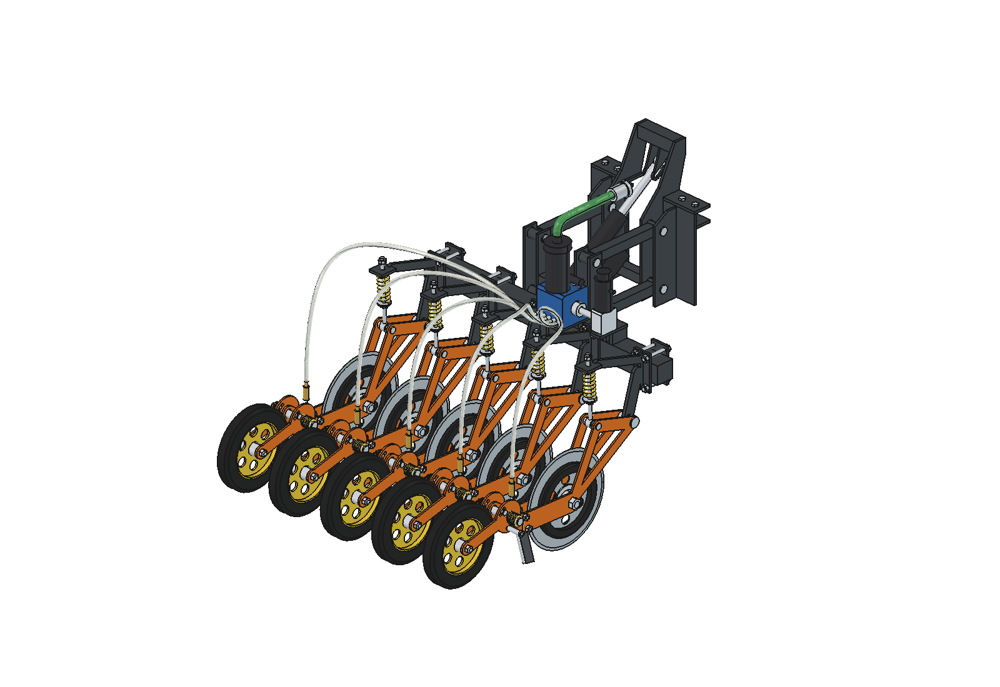
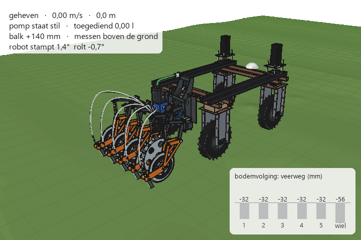
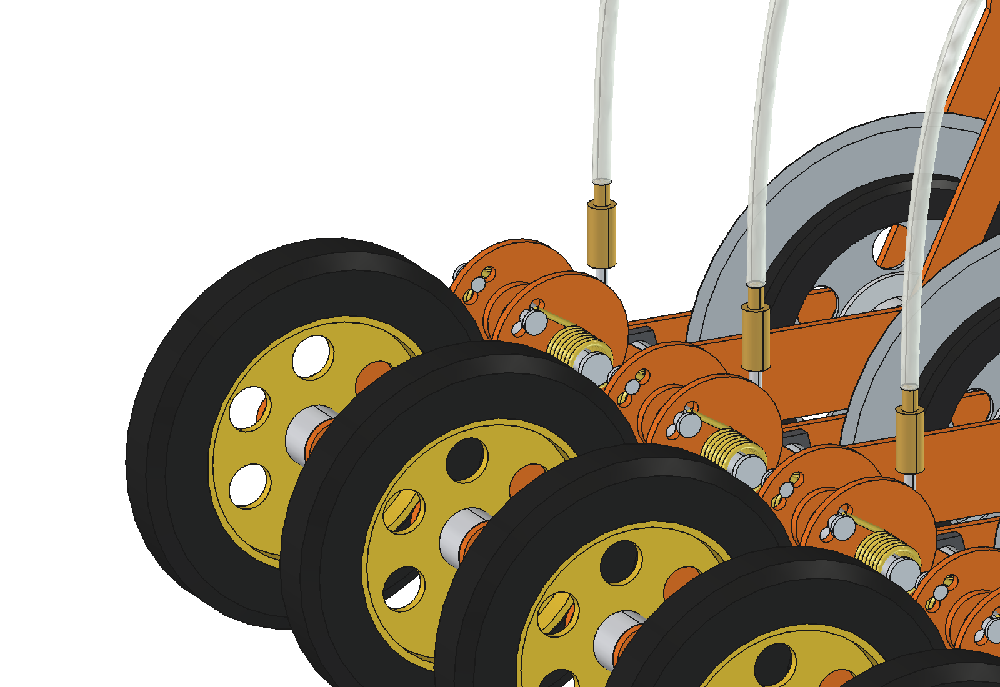

# Liquid fertilizer applicator (renure): FreeCAD model

Stand-alone implement for the Bruut OpenAgbot: 5 injection elements (disc + knife + tube + press wheel) at 200 mm, a
5-channel peristaltic pump driven by an electric worm gear motor whose speed follows the driving speed of the robot,
and an electrically lifted parallel linkage that floats while working (slotted hole). Behind each knife a narrow press
wheel on a spring-loaded trailing arm closes the slot again. There is no ground wheel.
Why it is designed this way is explained in [RATIONALE.md](RATIONALE.md).





## Files

| File | Contents |
| --- | --- |
| `Liquid_Fertilizer_Applicator.FCStd` | the model in working position (generated, do not edit by hand) |
| `lfa_params.py` | all dimensions, including the robot interface |
| `lfa_parts.py` | one function per part, returns a `Part` shape |
| `build_lfa.py` | model tree, colors, lifting, interference check, mass, images |
| `lfa_calc.py` | dosing (pump speed), spring, down force, press wheel force, floating position, actuator, axle load (pure Python) |
| `animate_lfa.py` | animation: robot + applicator over a bumpy strip, ground following and slot closing per frame |
| `make_gif_lfa.py` | frames to GIF with a caption and a "ground following" panel (Pillow, included with FreeCAD) |
| `run_in_freecad.py` | macro: open in FreeCAD and run (F6) to rebuild the model |
| `previews/` | images and the GIF |

## Axes

Same as the robot model: x = right, y = driving direction (front = +y), z = up, ground = z 0, mm.
y = 0 is the centre of the robot's rear lower beam, so robot y = implement y − 575.
Rows at x = −400, −200, 0, 200, 400; pump motor between rows 4 and 5 (x 240–280).

## Pump drive and dosing


24 V worm gear motor with encoder directly on the pump shaft. The robot controller sets the pump speed
n = 6 · dose [l/ha] · row spacing [m] · v [m/s] / stroke volume [ml/rev]; at 505 l/ha and 1 m/s that is 101 rpm
(approx. 32 W). The pump only runs in working position (actuator fully out) while the robot drives. Standard dose,
motor range and assumed pump torque: `dose_l_ha`, `pm_rpm_min`, `pm_rpm_max`, `pm_torque` in `lfa_params.py`.
See RATIONALE § 4.5 and § 4.7.

## Press wheel (slot closing)



Each element has a Ø 250 × 40 press wheel on a trailing arm that pivots on an ear of the fork plates, 290 mm behind
the knife tip. Two torsion springs on the pivot press it down; the spring peg in one of three holes sets the force
(56 / 63 / 70 N, standard the middle hole). A stop bolt in an arc slot limits the travel (30° up, 8° down).
The ear is always on the fork plates; `press_wheel = False` in `lfa_params.py` leaves the kit out.
The press force works against the element spring with a long lever, so the spring seat sits 30 mm higher
(`press_seat_shift`). See RATIONALE § 4.12.

```python
import lfa_calc
lfa_calc.unit_forces()                  # disc, press wheel and total force of one element
lfa_calc.float_equilibrium(setting=2)   # floating position with the peg in the third hole
```

## Rebuilding and using

In FreeCAD's Python console (folder in `sys.path`, or via `run_in_freecad.py`):

```python
import build_lfa
build_lfa.build()                       # working position, saves the FCStd
build_lfa.build(lift=140, save_path=None, show_robot=True)   # lifted, with the robot reference
build_lfa.check_interference()          # list of overlapping parts (must be empty)
build_lfa.mass_properties()             # mass and centres of gravity
build_lfa.render_all()                  # all images in previews/ and save in working position
```

```python
import lfa_calc
lfa_calc.report()                       # key figures
lfa_calc.dose_table()                   # dose range per pump hose and driving speed
lfa_calc.pump_rpm(505, 1.0)             # pump speed for a dose (l/ha) at a speed (m/s)
```

## Animation

Builds a separate document `LFA_on_robot_animation`: the robot model from `agbot design` (those files are not
modified), the applicator behind it and a wavy ground with bumps, pits and a ridge.

Per frame:
- the robot rests on its four wheels;
- the toolbar floats until the ground carries its weight;
- each element finds its arm angle;
- the pump runs in working position at a speed that follows the driving speed;
- each press wheel finds its trailing-arm angle; on its upper stop it carries the element arm;
- spring legs, hoses and slots move along: open slot behind the knife, closed seam behind the press wheel.

The robot model is loaded from `agbots/agbot design` (`AGBOT_FOLDER`). Other robots use the same module names
(`build_agbot`, ...); `build()` removes those from `sys.modules` first, so a FreeCAD session with the slim robot
open still gets the standard robot.

```python
import animate_lfa
animate_lfa.build()                     # build the document
animate_lfa.play()                      # play live, animate_lfa.stop()
animate_lfa.summary()                   # range of toolbar, spring travel, knife depth, stops, press wheel, closed slot %
animate_lfa.render_frames(r"C:\temp\lfa_frames", 0, 30)   # render in chunks of ~30 frames
import make_gif_lfa
make_gif_lfa.main(r"C:\temp\lfa_frames", r"previews\animation_strip_ground_following.gif")
```

Driving plan, terrain and camera are at the top of `animate_lfa.py` (`SPEED`, `BUMPS`, `RIDGES`, `CAM_HIGH`, `CAM_LOW`).

## Model tree

```
liquid_fertilizer_applicator
  headstock_robot_mount        mounting headstock (fixed to the robot)
  parallel_linkage             4 rods (rotate about the front pins)
  lift_actuator                housing (on the rear frame) + rod (pin in the slotted hole of the headstock)
  toolbar_assembly_moves_with_lift   (Placement = lift movement)
    toolbar, rear frame
    electric_pump_drive        pump, filter, pump shaft, worm gear motor with encoder
    injection_unit_1..5
      unit_n_swing_arm         (rotates about the pivot)
        unit_n_press_wheel_arm (rotates about pw_pivot on the fork plates)
    outlet_hoses
robot_reference_NOT_PART_OF_DESIGN   (hidden; rear beam, upper beams, rear wheels)
```

## Estimated, not measured

Robot weight and centre of gravity (`lfa_calc.ROBOT`), spring rate 4 N/mm, pump volumetric efficiency 0.85, pump
torque 3 Nm, motor range 10–200 rpm and mass 2.5 kg, required down force in the sward. Press wheel: the
force needed to close the slot (50 to 75 N assumed), the free leg angle of the torsion springs (sets the preload
40 / 55 / 70°), mass of tire (half-solid rubber) and PA rim. See RATIONALE § 4.12, § 6 and § 7.
In the animation the robot rests rigidly on four wheels (a plane through the wheel contact points) and the toolbar is in
force equilibrium (weight = ground forces); dynamics and slip are not included.
