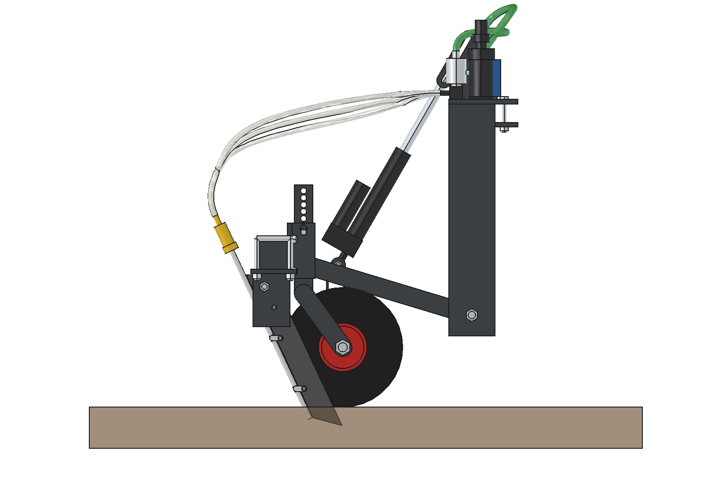
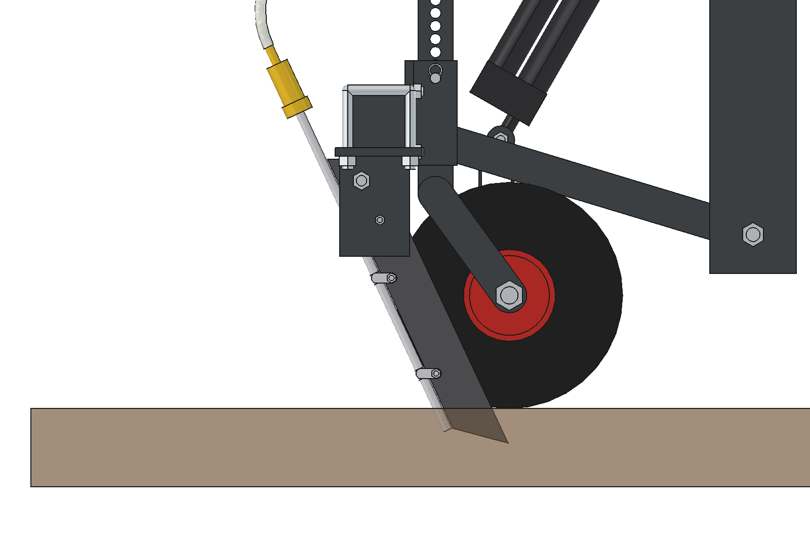
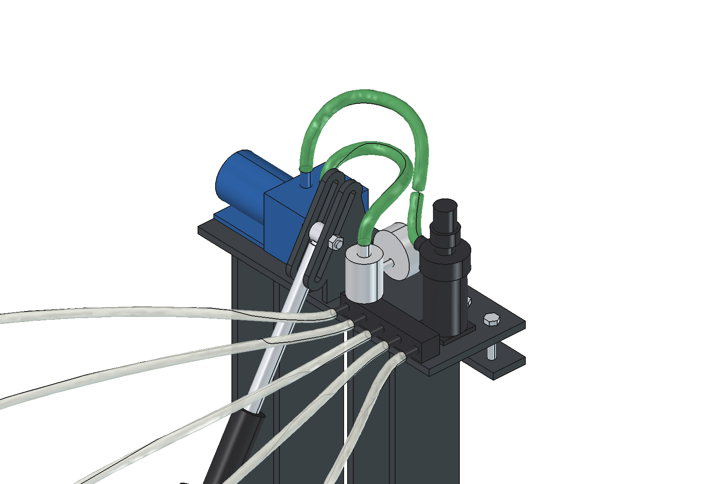

# Simple liquid fertilizer applicator: design rationale

5 October 2026. Model: `Liquid_Fertilizer_Applicator_Simple.FCStd` (FreeCAD 1.1, generated with `build_lfs.py`).
Figures come from the model, `lfs_calc.py` and `lfs_ground.py`. Where something is assumed or estimated, this is stated.

This is the cheap and robust counterpart of the applicator in [`../advanced`](../advanced/RATIONALE.md).
The assignment: simpler and more robust, with cheap and easily available parts. Ground following and
performance may become worse. Robot interface, row spacing (5 × 200 mm) and working depth (40 mm) have stayed the
same, so that the two variants can be compared directly.

---

## 1. What is different from the advanced variant

| Function | Advanced | Simple | What you give up |
| --- | --- | --- | --- |
| Making the slot | Ø 300 disc with depth rings, a knife behind it | one fixed knife: 50 × 10 strip with a ground cutting edge that slopes 25° backwards | no pre-cut sward, more chance of tearing in dry sward |
| Depth | each element follows by itself (depth rings, spring arm, spring leg) | 2 wheelbarrow wheels on the toolbar, adjusting pin every 15 mm | a pit or bump under one row comes through fully |
| Suspension | parallelogram: 4 rods, 8 pins | lift frame with 1 pivot: 2 M16 bolts | the knife angle varies with the floating position (14–34°) |
| Stone protection | arm deflects 60 mm and springs back | M6 shear bolt: knife folds backwards | after a stone a new shear bolt has to go in |
| Lifting | fast actuator (≥ 40 mm/s), lifting approx. 3 s | cheap actuator 1000 N, stroke 200, approx. 25 mm/s | lifting 8 s; the knives are out of the ground after 3.6 s |
| Pump | ground wheel, chain and 5-channel roller pump | 12 V diaphragm pump, fixed pressure regulator 2.0 bar and an orifice plate per row | the dose follows time and not the distance travelled: the robot has to drive at a fixed speed |
| Anti-drip | check valve on the tube | nozzle holder with diaphragm valve (standard spraying part) | – |
| Mass (model) | 107 kg, of which 83 kg moves along | **75 kg, of which 44 kg moves along** | |
| Length behind the robot | 1037 mm, ground contact 805 mm behind the rear axle | **672 mm, knives 427 mm behind the rear axle** | |
| Cost | not calculated | **approx. € 600** in materials and purchased parts (§ 7) | |

Nothing in this variant has to be milled, turned or laser cut.
- All steel is strip, tube or plate from a steel dealer's stock. It is sawn straight and drilled.
- The only shaped work is the slotted hole (drill 2 holes, saw out) and grinding the cutting edge of the knives.
- Welding is limited to 5 simple assemblies (§ 3.7).
- All purchased parts are available at an agricultural or spraying parts shop, a DIY store or a web shop.

## 2. The design in brief

1. **Headstock**: top plate on the robot's rear lower beam, 4 × M10 through the existing holes, with a clamp strip underneath. Four cheeks hang behind the beam down to 155 mm above the ground. Between them are the pivot bolts of the lift frame.
2. **Lift frame**: toolbar 60 × 60 × 4, two arms 40 × 40 × 3 and a cross tube, welded. It rotates about **one axis low to the ground** (z = 200).
3. **5 injection knives** at 200 mm. Each knife is a 50 × 10 strip in a holder of three plates, with an M12 pivot bolt and an M6 shear bolt. The holder is fixed to the toolbar with 2 U-bolts.
4. Behind each knife runs a **stainless steel tube 10 × 1**, fixed with 2 P-clips. The tube lets the liquid flow 25 mm deep into the slot. On top is a nozzle holder with a diaphragm valve and an orifice plate.
5. **2 depth wheels** (wheelbarrow wheel 3.00-4) on both sides of the centre, between rows 1-2 and rows 4-5. The stem slides in a sleeve on the toolbar; an adjusting pin chooses the depth.
6. **Linear actuator** (12 V, 1000–1500 N, stroke 200). The housing is on the cross tube, the rod eye in a slotted hole in the headstock.
   - While working the actuator is fully out and the lift frame floats.
   - Lifting is fully in.
7. **Dosing unit on the headstock** (fixed to the robot): suction filter with camlock to the tank, 12 V diaphragm pump, pressure regulator 2.0 bar with gauge and a manifold with 5 hoses to the knives.

| Characteristic | Value |
| --- | --- |
| Working width | 1.0 m (5 rows × 200 mm) |
| Working depth | 40 mm set (25 / 40 / 55 with the adjusting pin); outflow approx. 25 mm below ground level |
| Dosing | 194 to 1211 l/ha at 0.75 m/s with orifice plates 0.6–1.5 mm; 145 to 1816 l/ha over 0.5–1.0 m/s (§ 3.5); standard 1.0 mm: 538 l/ha |
| Capacity | 0.27 ha/h at 0.75 m/s (theoretical) |
| Ground following | lift frame floats −9 / +11° (depth wheels −43 / +55 mm); knives rigid on the toolbar |
| Lift height | knives 124 mm and depth wheels 143 mm clear of the ground |
| Dimensions | 906 × 672 × 917 mm (w × l × h), within the robot width of 978 mm |
| Mass (model) | 75 kg, of which 44 kg moves along when lifting |
| Current | pump approx. 5 A, actuator approx. 3–5 A at 12 V (not at the same time) |

**Operation.**
- The robot drives off and the actuator goes out. The lift frame drops until a depth wheel touches the ground and the knives are at depth.
- When the robot is at speed and the knives are in the ground, the robot switches the pump on (relay).
- Each row then gets a fixed flow. At a fixed driving speed that is a fixed dose per hectare.
- At the end of the row the pump goes off and the diaphragm valves close; nothing drips afterwards. The robot stops and the actuator lifts.

## 3. Design choices

### 3.1 One fixed knife instead of disc + knife

- **The knife is a 50 × 10 strip**: S355, or Hardox if it has to last longer. It is 390 mm long and the front is ground.
  - The knife stands **25° backwards**: the tip is at the front, the cutting edge runs up towards the rear.
  - Roots and grass slide up along that edge and are cut at an angle. This way the knife cleans itself, like the fixed coulter of an old-fashioned plough.
  - The reaction force actually pushes the knife down.
- **The bottom slopes up 15° towards the rear.** The tip is at the front and pulls the knife into the ground. In § 3.3 it is assumed that the downward force is 30 % of the draft force; measure this in the field trial.
- **The slot is 10 mm wide**, against 3 mm (disc) and 8 mm (knife) for the advanced variant. The tube (Ø 10) runs in the lee behind the knife. The outflow is approx. 25 mm deep, behind the bottom corner of the knife where the slot is still open.
- **Why no spring tine (S-tine)?** An S-tine is cheap and springs back after a stone.
  - But it is 32 mm wide and vibrates, so the slot becomes wide and ragged.
  - A flat knife on its edge gives a narrow, clean cut.
  - Stone protection comes from the shear bolt (§ 3.4) and from the floating lift frame: with a loose stone the whole frame goes up.
- **What you give up:**
  - The knife has to cut the roots itself. In dry, tough sward it can lift or tear the sward, where the disc cut first.
  - Grass can wind around the knife if the cutting edge is blunt. Keep the cutting edge sharp.
  - If it has to be better anyway: put a disc in front of each knife. That has been worked out in [version 2](../simple_v2/RATIONALE.md); or choose the advanced variant.

### 3.2 Depth wheels and a rigid toolbar

- **The knives are fixed to the toolbar.** Two wheelbarrow wheels at x = ±300 hold the toolbar at height. They stand next to the rows and at the same position in the driving direction as the knife tips, so that pitching of the lift frame changes the depth little.
- **Setting the depth**: the stem (40 × 40 × 3 tube) slides in a sleeve (50 × 50 × 4) on the toolbar. An adjusting pin Ø 12 with R-clip goes through holes every 15 mm.
- A wheelbarrow wheel 3.00-4 (Ø 260, axle 20 mm, ball bearings) can be bought everywhere. While working it carries approx. 110 N, far below its load capacity.
- **What you give up**:
  - The lift frame only rotates about the transverse axis and therefore cannot roll. It rests on the higher of the two wheels.
  - A pit or bump under one row therefore ends up entirely in the depth of that row. The average is a few mm shallower than the setting (§ 4).
  - So set the depth in the field.

### 3.3 One pivot, low to the ground: the most important design choice

A lift frame with one pivot is much simpler than a parallelogram, but it has a pitfall. **The draft force of the knives
wants to rotate the frame upwards.**
- The knives pull backwards at 40 mm below ground level.
- If the pivot is high, that force makes a large moment that lifts the rear of the frame.

The first layout had the pivot at 445 mm, just under the robot beam:
- Draft force 5 × 125 N at 485 mm lever arm = **303 Nm upwards**.
- Weight of the lift frame: only **approx. 170 Nm downwards**.
- The knives would be driven out of the ground.

That is why the pivot is now **at 200 mm height**, 240 mm above the knife tip. The cheeks of the headstock hang down to
155 mm above the ground for that. At the estimated draft force of 125 N per knife (see `lfs_calc.SOIL`):

| Moments about the pivot | Normal (125 N/knife) | Heavy sward (250 N/knife) |
| --- | --- | --- |
| Weight of lift frame (44 kg) + suction force of knives, downwards | 213 Nm | 266 Nm |
| Draft force, upwards | 150 Nm | 300 Nm |
| Force on the 2 depth wheels together | 225 N | 0 N: the frame floats up |

- Up to **206 N per knife** the depth wheels stay on the ground.
- For 250 N per knife **9 kg of ballast** on the toolbar is needed, for example a steel strip.
- Or work less deep: the draft force decreases strongly with depth.

Other consequences of the low pivot:
- When lifting the knife tips go almost straight up. They only move 80 mm backwards; with the high pivot that was 200 mm.
- **The knife angle varies**:
  - 25° in the design position;
  - 14–34° over the whole floating range;
  - 19–28° over the bumpy strip (§ 4).
- With a parallelogram the angle stays constant. That is the main thing a second rod would give.
- The pivot is 155 mm above the ground, about as low as the wheel brackets of the robot itself (175 mm). With molehills and ridges up to 100 mm that is no problem; with higher ridges or kerbs it is.

### 3.4 Lifting and floating: one actuator with a slotted hole

- **Actuator**: 12 V (or 24 V), 1000–1500 N, stroke 200 mm, installed length 310 mm, IP65 and internal limit switches. This is a standard size from any web shop.
- **Floating position**: the rod eye runs in a 107 mm slotted hole in two plates on the headstock.
  - While working the actuator is fully out (510 mm). The lift frame then floats freely between −9 and +11°.
  - The control only knows two positions: working = out, lifting = in. No sensor or control is needed.
- **Force**: the lift frame weighs 432 N at 371 mm from the pivot and the actuator's lever arm is 306 mm.
  - With a 1.5 × margin that is **790 N** at the start of the stroke and 690 N at the end.
  - A 1000 N actuator is enough.
- **Speed**: cheap 1000 N actuators reach 10–25 mm/s. Calculated with 25 mm/s:

| Step | Stroke | Time |
| --- | --- | --- |
| free stroke in the slotted hole (nothing lifts yet) | 48 mm | 1.9 s |
| knives out of the ground | 89 mm | 3.6 s |
| fully lifted (knives 124 mm, wheels 143 mm clear) | 200 mm | 8.0 s |

  With the advanced variant lifting takes approx. 3 s. Here the robot stops at the end of the row and waits until the
  knives are out of the ground. It lowers while driving, so that the knives pull into the ground.
- **Lifted** the implement hangs on the robot. There are two wear points: the slotted hole and the pin. The pin is an ordinary M10 bolt and so quickly replaced.

### 3.5 Dosing: diaphragm pump, fixed pressure regulator and orifice plates

There is no ground wheel, chain, sprockets, bearings, torsion spring or multi-channel roller pump any more. Instead:

- **12 V diaphragm pump with internal bypass**, approx. 7 l/min and 4 bar. This is the standard pump of ATV and wheelbarrow sprayers.
  - The bypass prevents the pump from cycling on/off at a small flow.
  - The pump is self-priming and may run dry briefly.
- **Fixed pressure regulator 2.0 bar**, the kind used in drip irrigation. It keeps the pressure after the pump constant, without a return line to the tank and without an adjusting knob. A gauge on it is for checking.
- **Per row a nozzle holder with diaphragm anti-drip valve (0.5 bar) and an orifice plate.** These are standard spraying parts.
  - As long as the pressure is constant, each plate gives the same flow. The distribution over the rows is therefore as even as with a field sprayer.
  - With a blockage only that row drops out, and that is visible when calibrating.

Flow per plate: Q = Cd · A · √(2 Δp / ρ), with Cd = 0.65 (assumed; calibrate), Δp = 2.0 − 0.5 = 1.5 bar
and ρ = 1.2 kg/l. The dose is then Q / (v · 0.2 m).

| Orifice plate | Flow per row | 0.50 m/s | **0.75 m/s** | 1.00 m/s |
| --- | --- | --- | --- | --- |
| 0.6 mm | 0.17 l/min | 291 l/ha | 194 l/ha | 145 l/ha |
| 0.8 mm | 0.31 l/min | 517 l/ha | 344 l/ha | 258 l/ha |
| **1.0 mm** | **0.48 l/min** | 807 l/ha | **538 l/ha** | 404 l/ha |
| 1.2 mm | 0.70 l/min | 1162 l/ha | 775 l/ha | 581 l/ha |
| 1.5 mm | 1.09 l/min | 1816 l/ha | 1211 l/ha | 908 l/ha |

- **The dose follows the driving speed**: driving 10 % faster gives 9 % less per hectare. That is the biggest performance you give up.
  - The robot therefore has to drive at a fixed speed while working. An autonomous robot does that well.
  - Let the robot only switch the pump on above 80 % of the working speed and off when braking.
  - For comparison: with the advanced variant the pump turns with the ground wheel, so braking does not change the dose there.
- **Pressure counts less**: 0.1 bar more gives 3.3 % more dose. The fixed regulator keeps the pressure within approx. 0.1 bar.
- **Low applications are the limit.**
  - 500 l/ha at 0.75 m/s needs a 1.0 mm plate, and that goes well.
  - UAN around 100 l/ha would need 0.4 mm. Such a small hole clogs easily.
  - So dilute with water, or drive 1.0 m/s with 0.6 mm plates (145 l/ha).
  - Use a 50–80 mesh suction filter. Plates smaller than 0.6 mm are not recommended.
- **Calibrating**: stop the robot with the knives lifted and let the pump run for 1 minute. Catch each row in a measuring cup. That gives the flow and the distribution (target ±5 %).
- **Extension to a task map**: put a pressure sensor in the line and control the pump with PWM. Or let the robot adjust the driving speed to the desired dose. Knives, hoses and plates stay the same.

### 3.6 Dosing unit on the headstock

- **Pump, filter, regulator and manifold are on the top plate of the headstock**, fixed to the robot.
  - The suction hose from the tank clicks on top of the filter with a 1" camlock and does not have to move along.
  - Only the 5 thin hoses (8 × 12 mm) to the knives bend along with floating and lifting.
- The lift frame thereby becomes approx. 4 kg lighter and the parts are at working height. They can be reached without crawling under the implement.
- In the first layout the dosing unit was on the arms of the lift frame. When lifting it then swung against the cheeks of the headstock.

### 3.7 Building with standard materials

**Cutting list steel** (S355, saw straight and drill):

| Part | Material | Quantity × length |
| --- | --- | --- |
| Top plate headstock | strip 150 × 10 | 1 × 400 |
| Clamp strip under the robot beam | strip 50 × 10 | 1 × 400 |
| Cheeks headstock | strip 100 × 10 | 4 × 504 |
| Slotted-hole plates headstock | plate 8 mm, approx. 60 × 170 | 2 (drill and saw out slotted hole 10.5 × 107) |
| Toolbar | tube 60 × 60 × 4 | 1 × 900 + 2 end plates |
| Arms | tube 40 × 40 × 3 | 2 × approx. 420 (at an angle to the toolbar) |
| Pivot bushings | tube Ø 30, inner Ø 16.5 | 2 × 60 |
| Cross tube | tube 40 × 40 × 3 | 1 × 160, with 2 eyes strip 8 mm |
| Knife holder (5×) | strip 80 × 10 (base) + 2 × strip 80 × 8 (side plates) | 5 × 100 + 10 × 115 |
| Knife (5×) | strip 50 × 10 | 5 × 390, grind the front |
| Depth wheel (2×) | strip 100 × 10, tube 50 × 50 × 4, tube 40 × 40 × 3, strip 40 × 8 | 2 × 125, 2 × 120, 2 × 230, 6 × approx. 185 |

**Welding**, 5 assemblies:
1. headstock: top plate, cheeks and slotted-hole plates;
2. lift frame: toolbar, arms, bushings, cross tube and eyes;
3. knife holder (5×): base plate and side plates;
4. clamp plate with sleeve (2×);
5. stem with fork (2×).

Everything else is bolted. The knives and depth wheels slide on the toolbar, so a different row spacing only needs
different holes.

## 4. Ground following compared with the advanced variant

`lfs_ground.py` calculates with **the same ground and the same robot attitude** as `../advanced/animate_lfa.py`. The ground has:
- an undulation of ±14 mm;
- an alternating cross slope;
- molehills, pits and a 20 mm cross ridge.

The robot rests with four wheels on the ground level. Then the lift frame drops until the first depth wheel touches the ground.
The advanced variant comes from its own animation code (`ground_advanced_reference.json`). Both were
compared at the same 80 robot positions in working position.

| Working position, 80 positions | Advanced | Simple |
| --- | --- | --- |
| Knife depth, range | 12 to 64 mm | 4 to 60 mm |
| Knife depth, mean / standard deviation | 41 / 8.5 mm | 35 / 8.4 mm |
| Share between 25 and 55 mm | 93 % | 86 % |
| Knife out of the ground | 0 | 0 |
| Floating range used | toolbar −58 / +59 mm | lift frame −5.0 / +5.8° (wheels approx. −24 / +28 mm) |
| Stop reached | 2 times (element) | 0 times (slotted hole) |
| Knife angle | fixed relative to the arm | 19 to 28° |
| Wheel off the ground | ground wheel: 0 times | one of the two depth wheels hangs in 52 of the 80 positions (up to 39 mm) |

What this shows:
- **The spread is practically the same** (standard deviation 8.4 against 8.5 mm). With the advanced variant the spread comes mainly from the pitching of the robot via the spring arms. Here the lift frame follows the ground under the two depth wheels.
- **The average is 6 mm shallower.** The rigid toolbar rests on the highest wheel. So set the depth one hole deeper in the field if needed.
- **Local unevenness under one row comes through fully**:
  - the 26 mm pit under rows 4 and 5: the knives go down to 4–6 mm shallow there;
  - the bump under row 3: the knife goes up to 60 mm deep.
  - With the advanced variant the depth rings absorb that per row.
- **The knives always stay in the ground** and the lift frame did not touch the slotted hole. The floating range is ample for this strip.

In the animation the implement lowers at the start while driving. The robot drives off as soon as the knife tips hang 25 mm above the
ground. At the end the robot stops and the slow actuator lifts in 8 s. The panel at the bottom right shows the
knife depth per row and which depth wheel touches the ground.

## 5. Calculations (summary)

Recalculate with `python lfs_calc.py` (or `import lfs_calc; lfs_calc.report()`). Masses come from
`build_lfs.mass_properties()`.

| Quantity | Value |
| --- | --- |
| Flow orifice plate 1.0 mm at 2.0 bar | 0.48 l/min per row, pump 2.4 l/min |
| Dose at 0.75 m/s | 538 l/ha (500 l/ha: plate 0.96 mm) |
| Sensitivity of dose | speed +10 % gives −9 %; pressure +0.1 bar gives +3.3 % |
| Moments about the pivot (normal) | 213 Nm downwards against 150 Nm upwards due to draft force |
| Load on depth wheels | 2 × 112 N; rolling resistance 18 N |
| Maximum draft force per knife without floating up | 206 N (250 N: 9 kg ballast) |
| Force of the lift frame on the robot (working position) | 394 N downwards and 625 N draft force in the pivot |
| M6 (4.6) shear bolt, double shear, 50 mm below the pivot bolt | breaks at 1.6 kN on the knife tip; bending stress in knife then 116 MPa |
| Floating range / knife angle | −9.1 / +11.0°, wheels −43 / +55 mm; knife angle 14–34° |
| Lifting | 28.6°: knives 124 mm and wheels 143 mm clear; slotted hole 107 mm |
| Actuator | lever arm 306 / 287 mm, needed 790 N (incl. 1.5 × margin), stroke 200 mm, 8 s at 25 mm/s |
| Draft force robot | needed 643 N (normal) / 1250 N (heavy sward); grip with empty tank approx. 1090 N (μ = 0.5) |
| Mass implement / lift frame / one knife / one depth wheel | 75 / 44 / 3.9 / 7.0 kg |

## 6. Weight distribution of the robot

Assumptions the same as the advanced variant: robot 150 kg with the centre of gravity 500 mm in front of the rear axle, and a tank of
150 l (1.2 kg/l).
- While working the robot carries the headstock, the dosing unit and the force in the pivot.
- The draft force acts at 200 mm height and relieves the front axle a little. That is included.
- Lifted everything hangs on the robot.

| Robot | Tank relative to rear axle | Rear axle while working, full / empty | Front axle lifted, full / empty | For comparison: advanced, front axle lifted full / empty |
| --- | --- | --- | --- | --- |
| 150 kg | 300 mm | 2904 / 1667 N | 1021 / **492 N** | 718 / 188 N |
| 150 kg | 450 mm | 2639 / 1667 N | 1286 / **492 N** | 983 / 188 N |
| 200 kg | 450 mm | 2884 / 1913 N | 1531 / 737 N | 1228 / 433 N |
| 250 kg | 450 mm | 3129 / 2158 N | 1777 / 982 N | 1473 / 679 N |

- **Lifted and with an empty tank the front axle carries 2.6 times as much as with the advanced variant** (492 against 188 N). The implement is
  32 kg lighter and hangs almost 400 mm closer to the rear axle. The critical point of the advanced variant
  (steering on the headland with a light front axle) has thereby largely gone; front ballast is probably not needed
  with a 150 kg robot.
- **While working the rear axle is loaded more heavily than with the advanced variant.** The lift frame partly rests on the pivot, and the draft force pulls low on the robot. That helps the grip of the rear wheels.
- **Weigh the robot per axle.** That remains the first thing to confirm; enter the values in `lfs_calc.ROBOT`.

## 7. Bill of materials and cost (indicative)

Prices in euros, excl. VAT, bought individually at a steel dealer, agricultural or spraying parts shop or web shop
(2026 price level, not quoted). Own labour is not included.

| Group | Contents | approx. € |
| --- | --- | --- |
| Steel | strip, tube and plate per the cutting list, approx. 45 kg | 115 |
| U-bolts | 10 × M12 and 4 × M10 for 60 × 60 tube | 45 |
| Bolts | M10, M12, M16, M20, shear bolts M6 (with spares) | 30 |
| Depth wheels | 2 × wheelbarrow wheel 3.00-4 with bearings | 35 |
| Actuator | 12 V, 1000–1500 N, stroke 200, IP65 | 95 |
| Pump | diaphragm pump 12 V with internal bypass, approx. 7 l/min, 4 bar | 70 |
| Suction side | suction filter 50 mesh, camlock 1", suction hose | 40 |
| Pressure | fixed pressure regulator 2.0 bar, gauge | 25 |
| Distribution | manifold 5×, 5 nozzle holders with diaphragm valve, set of orifice plates 0.6–1.5 mm | 75 |
| Hoses and tube | stainless steel tube 10 × 1 (2 m), P-clips, PVC hose 8 × 12 (10 m), hose clamps | 45 |
| Electrics | relay, fuse, cable to the robot | 20 |
| **Total** | | **approx. 595** |

| Mass per group (model) | kg |
| --- | --- |
| Headstock (top plate, clamp strip, 4 cheeks, slotted-hole plates, bolts) | 23.9 |
| Dosing unit (pump, filter, regulator, manifold, hoses) | 3.9 |
| Actuator with pins | 3.2 |
| Lift frame (toolbar, arms, cross tube) | 10.5 |
| 5 × knife with holder, tube and nozzle holder | 19.4 |
| 2 × depth wheel with sleeve and stem | 14.0 |
| Hoses to the knives | 0.3 |
| **Total** | **75.2** |

Keep spares: shear bolts M6, 1 knife, a set of orifice plates and the diaphragms of the nozzle holders.

## 8. Risks and test plan

| Risk | Measure / test |
| --- | --- |
| The knife lifts or tears the sward, especially in a dry spring | **Build one knife first** and pull it at 30–40 mm in wet and dry grassland. Assess the slot and measure the draft force with a spring scale. If it tears too much: sharper cutting edge, less deep, or a disc coulter in front of the knife (§ 3.1). |
| Grass or roots wind around the knife | Keep the cutting edge sharp, do not make the 25° slope steeper; assess in the trial. |
| Draft force higher than estimated (125 N per knife): the lift frame floats up | Above 206 N per knife: ballast on the toolbar (9 kg for 250 N), less deep, or 4 knives. Also watch the grip: with an empty tank it is approx. 1.1 kN. |
| The dose depends on the driving speed | Fixed working speed; pump only on above 80 % of that speed. Calibrate at every refill (measuring cups, 1 minute). |
| Orifice plates clog | Suction filter 50–80 mesh, no plates below 0.6 mm. Flush with water after use at the dock. A blocked row shows up when calibrating. |
| Low applications (UAN around 100 l/ha) | Dilute, or drive 1.0 m/s with 0.6 mm plates. |
| A pit or bump under one row goes through fully in depth (4–60 mm in the simulation) | Accept it or set the depth one hole deeper. With a lot of micro-relief the advanced variant is better. |
| The shear bolt breaks unnoticed; the knife folds backwards and the liquid comes out on top | Visual check at every refill. Optional: a simple switch or tilt sensor per knife. |
| Lifting takes 8 s | The robot stops at the end of the row. After 3.6 s the knives are out of the ground. A faster actuator is possible, but more expensive. |
| Reversing or sharp steering with the knives in the ground | Software interlock: lift first. That also applies to the advanced variant. |
| Wear of slotted hole, pin and pivot bushings | Pins are ordinary bolts; grease nipple on the pivot bushings. |
| Wear of the knives | Strip 50 × 10 is cheap. Regrind, or use Hardox. |
| Corrosion | Stainless steel tubes; pump, manifold and nozzle holders are plastic. Flush. |
| Low ground clearance of the headstock (155 mm) | No problem on grassland. Be careful on ridges or when transporting over a kerb. |

## 9. Model and files

| File | Contents |
| --- | --- |
| `Liquid_Fertilizer_Applicator_Simple.FCStd` | the model in working position (robot reference hidden) |
| `lfs_params.py` | all dimensions, including the robot interface |
| `lfs_kin.py` | kinematics: pivot, slotted hole, floating range, lift angle, knife geometry (pure Python) |
| `lfs_parts.py` | one function per part |
| `build_lfs.py` | model tree, colors, lifting (`build(psi=...)`), interference check, mass, images |
| `lfs_calc.py` | dosing, forces on the lift frame, shear bolt, lifting, axle load, cost |
| `lfs_ground.py` | ground following over the bumpy strip (same ground as the advanced variant) |
| `plot_ground.py` | comparison chart of ground following (`previews/12_ground_following_comparison.png`) |
| `ground_advanced_reference.json` | knife depth per frame of the advanced variant (from `../advanced/animate_lfa.py`) |
| `animate_lfs.py` / `make_gif_lfs.py` | animation behind the robot model and the GIF |
| `run_in_freecad.py` | macro: rebuild in FreeCAD (F6) |

In all positions `build_lfs.check_interference()` gives 0 hits: working position, both limits of the floating range
and lifted, with the robot reference included. In the animation document `animate_lfs.check_fit()` also gives 0 hits
against the real robot model from `agbot design`.
