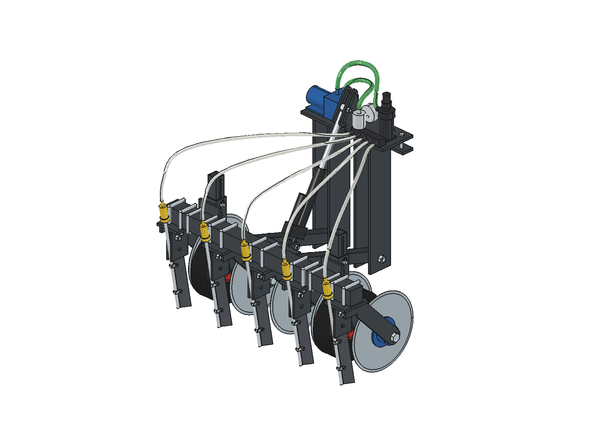

# Simple liquid fertilizer applicator version 2 (disc + knife): rationale

5 October 2026. Model: `Liquid_Fertilizer_Applicator_Simple_v2.FCStd` (FreeCAD 1.1, generated with `build_lfs2.py`).
Figures come from the model, `lfs2_calc.py` and `lfs2_ground.py`. Where something is assumed or estimated, this is stated.

Version 2 is [version 1](../simple/RATIONALE.md) with **a cutting disc in front of the knife in each row**. The knife alone
cannot cut the roots well in dry, tough sward: it lifts or tears the sward. In v2 a flat disc first cuts through
the sward. The knife runs right behind it in the same plane and only opens the cut. That is the same
principle as the [advanced variant](../advanced/RATIONALE.md), but rigid on a floating toolbar, with
standard parts.

Everything else is the same as v1:
- the headstock with the low pivot;
- the lift frame with cross tube, toolbar and arms;
- the actuator with slotted hole;
- the depth wheels;
- the dosing unit on the headstock (diaphragm pump, pressure regulator 2.0 bar, orifice plates).

The rationale for those is in v1 and is not repeated here.

---

## 1. What changes compared with version 1

| | Version 1 (knife only) | **Version 2 (disc + knife)** |
| --- | --- | --- |
| Making the slot | knife cuts by itself, cutting edge 25° backwards | **disc Ø 300 × 4** cuts 45 mm deep, knife at 10° follows 40 mm deep in the cut |
| Gap knife – disc | – | 14 mm; the knife enters the cut 41 mm behind the point where the disc leaves the ground |
| Outflow | approx. 25 mm deep | approx. 27 mm deep |
| Element | 3.9 kg | 9.1 kg (disc 2.1 kg, bearing hub 1.4 kg, disc arm 1.3 kg) |
| Mass implement / lift frame | 75 / 44 kg | 101 / 70 kg |
| Down force | not needed: the knife pulls itself into the ground | **the discs need down force** (estimated 100 N per disc); it comes from the weight of the lift frame (§ 3) |
| Actuator | 1000 N, approx. 25 mm/s: 8 s lifting | **1500 N**, approx. 20 mm/s: 10 s lifting; after 5.1 s discs and knives are out of the ground |
| Lifted, clear of the ground | knives 124 mm | discs 86 mm, knives 177 mm |
| Front axle lifted, empty tank (robot 150 kg) | 492 N | 377 N; with 40 kg ballast 200 N |
| Dimensions (w × l × h) | 906 × 672 × 917 mm | 938 × 639 × 922 mm: the hubs of the outer rows stick out 16 mm beyond the toolbar, still well within the robot width of 978 mm |
| Cost (indicative) | approx. € 595 | **approx. € 915** |

## 2. The element: disc, hub and knife

- **Cutting disc**: a flat, hardened coulter disc Ø 300 × 4 with 4-hole mounting. This is a common part for seeders and disc fertilizer applicators.
  - The centre is 105 mm above the ground, so the disc cuts **45 mm** deep.
  - It cuts the roots and the sward before the knife arrives.
- **Bearing hub**: a hub with flange and two bearings (6204-2RS) on an **M20 axle bolt**.
  - The hub sits on one side of the disc; the disc hangs freely from it.
  - That is less work than a fork on both sides. Moreover a fork does not fit next to the depth wheels.
- **Disc arm**: a 60 × 10 strip, welded at an angle under the base plate of the knife holder.
  - The foot runs over the whole length of the base plate, so there is a long weld.
  - The base plate is 20 mm wider on that side (strip 100 × 10).
- **Hub away from the depth wheel**: the hub and the arm are on the side where the depth wheel is not (`disc_side` in `lfs2_params.py`).
  - Rows 2 and 4 have the hub on the inside, rows 1 and 5 on the outside, row 3 on the right.
  - This keeps room between discs, hubs and depth wheels everywhere.
- **Knife**: the same 50 × 10 strip with M12 pivot bolt and M6 shear bolt as in v1.
  - The knife now stands **10° backwards instead of 25°**. The disc has already cut the roots, so the knife no longer has to cut at an angle; it only opens the cut.
  - A steeper knife can stand closer behind the disc. At the narrowest point the gap is 14 mm; upwards it gets wider.
  - The knife tip is **5 mm less deep** than the disc (40 against 45 mm), just as in the advanced variant. This way the knife runs in the pre-cut slot.
  - The tube sits behind the knife; the outflow is approx. 27 mm deep.
- **Depth wheels**: now stand between disc and knife tip (axle at y = −390). An adjusting pin chooses the depth, as in v1.
  - The wheel position makes little difference for ground following: shifting between y = −350 and −450 changes the standard deviation of the knife depth only from 10.1 to 9.2 mm.
  - The spread comes mainly from the rigid toolbar.
- **Cross tube**: 55 mm further back (y = −420) and centre to centre with the arms.
  - The disc and the disc arm of row 3 run underneath it.
  - The eyes for the actuator housing stick forward to the old pin. The lifting kinematics are therefore the same as v1.

## 3. Down force: the discs have to go in

A knife pulls itself into the ground with its tip. **A disc has to be pressed in with weight.** That is the
main price of version 2.

The moments about the pivot of the lift frame (z = 200) are estimated, see `lfs2_calc.LOADS`:

| Per element | Normal | Heavy sward |
| --- | --- | --- |
| Down force the disc needs for 45 mm | 100 N | 200 N |
| Draft force disc (rolling + cutting) | 30 N | 50 N |
| Draft force knife in the pre-cut slot | 60 N | 125 N |

| Moments about the pivot (5 elements) | Normal | Heavy sward |
| --- | --- | --- |
| Weight of lift frame (70 kg) + suction force of knives, downwards | 276 Nm | 314 Nm |
| Discs pushed upwards | 125 Nm | 250 Nm |
| Draft force of knives and discs | 105 Nm | 206 Nm |
| **Force on the 2 depth wheels together** | **143 N** | **0 N**: the lift frame floats up and the discs do not reach depth |

- **Normally the lift frame itself can deliver up to 137 N per disc.** Without ballast the discs then reach depth and the depth wheels keep ground contact.
- **In hard sward approx. 40–50 kg of ballast is needed.**
  - Use steel plates on the toolbar, fixed with the same U-bolts.
  - 20 kg of ballast gives 192 N per disc, 40 kg gives 246 N.
- **Ballast has a downside.** When lifted it hangs on the robot.
  - With 40 kg of ballast and an empty tank the front axle of a 150 kg robot drops to 200 N. That is just as light as with the advanced variant (188 N).
  - So only put the ballast on the toolbar if the sward demands it, and weigh the robot per axle.
- **Alternative to ballast: two gas springs** between the headstock and the cross tube.
  - While working they press the lift frame down and thus use the weight of the robot.
  - When lifted their force is internal, so the front axle does not get lighter.
  - Disadvantage: the actuator also has to overcome the gas springs and so has to be heavier. This has not been worked out; first measure whether it is needed.
- **Draft force for the robot**:
  - normal 461 N, heavy 875 N;
  - grip with an empty tank approx. 950 N (μ = 0.5).
  - In heavy sward the robot is thus close to its limit.

## 4. Lifting

Lifting works as in v1: working = actuator fully out, lifting = fully in, with a slotted hole for floating.
- The lift frame has become 26 kg heavier. With a 1.5 × margin **1180 N** is needed, so an actuator of **1500 N** (stroke 200).
- Cheap 1500 N actuators reach 10–20 mm/s. Calculated with 20 mm/s:

| Step | Stroke | Time |
| --- | --- | --- |
| free stroke in the slotted hole | 48 mm | 2.4 s |
| discs and knives out of the ground | 102 mm | 5.1 s |
| fully lifted (discs 86 mm, knives 177 mm, wheels 162 mm clear) | 200 mm | 10 s |

The robot stops at the end of the row and waits until the discs and knives are out of the ground. It lowers
while driving.

## 5. Ground following compared

The same strip, the same robot attitude and the same 80 robot positions as for v1 and the advanced variant.
Settings: v1 knife 40 mm; v2 disc 45 and knife 40 mm; advanced disc 40 and knife 35 mm.

| Working position, 80 positions | Advanced | Version 1 | **Version 2** |
| --- | --- | --- | --- |
| Knife depth, range | 12–64 mm | 4–60 mm | 3–60 mm |
| Knife depth, mean / standard deviation | 41 / 8.5 mm | 35 / 8.4 mm | 33 / 9.5 mm |
| Knife depth between 25 and 55 mm | 93 % | 86 % | 82 % |
| Cut of the disc, range / mean | – | – | 10–67 mm / 41 mm |
| Cut between 25 and 55 mm | – | – | 92 % |
| Knife out of the ground | 0 | 0 | 0 |
| Knife deeper than the cut | – | – | 22 of the 400 row positions, at most 12 mm |
| Knife angle | fixed relative to the arm | 19–28° | 4–13° |

What this shows:
- **The cut follows the ground level as well as the knife in v1.** On average it is 41 mm deep at a setting of 45 mm. The toolbar rests on the highest depth wheel, so everything ends up a few mm shallower than set.
- **The knife is 72 mm behind the depth wheels.** Pitching of the lift frame (−5 to +6°) counts for a bit more there, and so the spread of the knife depth is somewhat larger than in v1.
- **Sometimes the knife goes deeper than the cut.** This happens in 5 % of the row positions, by at most 12 mm. At those spots the knife cuts a few mm into undisturbed ground. That costs some extra draft force, but the knife can manage that with its cutting edge.
- **A pit or bump under one row still comes through fully**, as in v1: the knives of rows 4 and 5 go to 3–4 mm shallow at the pit. That is the price of the rigid toolbar. The advanced variant absorbs this per row with depth rings.

In the animation the panel at the bottom right shows per row the knife depth (bar) and the cut of the disc (line).

## 6. Calculations (summary)

Recalculate with `python lfs2_calc.py`.

| Quantity | Value |
| --- | --- |
| Dosing | same as v1: 1.0 mm plate at 2.0 bar gives 538 l/ha at 0.75 m/s |
| Lever arms about the pivot | weight 350 mm, disc 250 mm, knife tip 391 mm (horizontal) / 240 mm (vertical), depth wheel 320 mm |
| Depth wheels (normal) | 2 × 72 N; force in the pivot 135 N downwards and 450 N draft force |
| Maximum down force per disc without ballast | 137 N (with 20 kg ballast 192 N, with 40 kg 246 N) |
| Ballast for heavy sward | 41 kg (wheels just on the ground), 50 kg (wheels 100 N) |
| M6 (4.6) shear bolt | breaks at 1.6 kN on the knife tip; bending stress in the knife then 116 MPa |
| Floating range | −9.1 / +11.0° (depth wheels −50 / +62 mm) |
| Lifting | 28.6°; actuator 1180 N (incl. 1.5 × margin), 10 s at 20 mm/s |
| Axle load robot 150 kg, tank 150 l | working position rear axle full/empty 2836 / 1335 N; lifted front axle full/empty 641 / 377 N |
| Mass implement / lift frame / element / depth wheel | 101 / 70 / 9.1 / 7.0 kg |

| Robot | Tank relative to rear axle | Front axle lifted, full / empty | Empty, with 40 kg ballast | v1, empty | Advanced, empty |
| --- | --- | --- | --- | --- | --- |
| 150 kg | 300 mm | 906 / 377 N | 200 N | 492 N | 188 N |
| 150 kg | 450 mm | 1171 / 377 N | 200 N | 492 N | 188 N |
| 200 kg | 450 mm | 1416 / 622 N | 445 N | 737 N | 433 N |
| 250 kg | 450 mm | 1662 / 867 N | 690 N | 982 N | 679 N |

## 7. Bill of materials and cost (indicative)

Prices in euros excl. VAT, bought individually (2026 price level, not quoted). Compared with v1 the following are added:

| Group | Contents | approx. € |
| --- | --- | --- |
| Discs | 5 flat coulter discs Ø 300 × 4, hardened, 4-hole | 125 |
| Hubs | 5 bearing hubs with 4-hole flange (2 × 6204-2RS), M20 axle bolts, rings | 160 |
| Extra steel | 5 disc arms strip 60 × 10 (approx. 330 mm), wider base plates (approx. 7 kg) | 20 |
| Actuator | 1500 N instead of 1000 N | 15 |
| **Total v2** | v1 (€ 595) + the above | **approx. € 915** |

The rest of the bill of materials and the cutting list are in [v1 § 3.7 and § 7](../simple/RATIONALE.md). Changes to the cutting list:
- base plate of knife holder: strip 100 × 10 × 115 instead of 80 × 10 × 100;
- disc arm: 5 × strip 60 × 10, approx. 330 mm (sloping part + foot);
- cross tube: at y = −420, the eyes 60 mm longer.

Keep spares: as in v1, plus 1 disc and 2 bearings 6204-2RS.

## 8. Risks and test plan (in addition to v1)

| Risk | Measure / test |
| --- | --- |
| The discs do not reach depth (too little down force) | **Build one element first** and measure the down force at 45 mm depth, on wet and dry grassland, with weights or a spring scale. Then choose the ballast (0–50 kg) and check that the front axle does not get too light when lifted. |
| The front axle gets too light with ballast | Ballast only in hard sward; weigh the robot per axle. Alternative: gas springs (§ 3). |
| Grass or roots jam between disc and knife | The gap is 14 mm: narrow enough as a scraper, but assess it in the trial. If necessary move the knife 5 mm forward (`knife_pivot`) or a scraper on the disc arm. |
| The knife runs beside the cut under side load | The disc hangs on one side from the hub. Play in the hub or a bent arm shifts the cut. At every refill check that knife and disc are in one line. |
| Bearing wear in the hubs | Bearings 6204-2RS with dust seal; replace when the disc has play. |
| The disc clogs with mud | A flat, sharp disc usually keeps itself clean. In sticky soil a scraper on the disc arm. |
| Lifting takes 10 s | Robot stops at the end of the row; after 5 s everything is out of the ground. |

The other risks are the same as [v1 § 8](../simple/RATIONALE.md): dose follows the speed, clogging of the
plates, shear bolt, interlock reversing/sharp steering, low ground clearance of the headstock.

## 9. Model and files

| File | Contents |
| --- | --- |
| `Liquid_Fertilizer_Applicator_Simple_v2.FCStd` | the model in working position (robot reference hidden) |
| `lfs2_params.py` | all dimensions; new: disc, hub, disc arm, `disc_side`, `knife_depth` |
| `lfs2_kin.py` | kinematics, plus the gap between knife and disc (`disc_knife_gap`) |
| `lfs2_parts.py` | one function per part; new: `disc`, `disc_hub`, `disc_stub`, `disc_arm` |
| `build_lfs2.py` | model tree, lifting (`build(psi=...)`), interference check, mass, images |
| `lfs2_calc.py` | dosing, forces on the lift frame with discs (`LOADS`), ballast, lifting, axle load, cost |
| `lfs2_ground.py` | ground following: cut of the disc, knife depth, knife deeper than the cut |
| `lfs2_layout.py` | setup study on the small robot: tank 100–300 l, 3, 4 or 6 wheels, 5, 3 or 2 elements; axle loads, traction, stability (§ 10) |
| `plot_ground2.py` | comparison chart (`previews/12_ground_following_comparison.png`) |
| `ground_advanced_reference.json`, `ground_simple_v1_reference.json` | knife depth of the advanced variant and of v1 at the same positions |
| `animate_lfs2.py` / `make_gif_lfs2.py` | animation behind the robot model and the GIF |
| `run_in_freecad.py` | macro: rebuild in FreeCAD (F6) |

`build_lfs2.check_interference()` gives 0 hits in all positions: working position, both limits of the floating range and
lifted, with the robot reference included. `animate_lfs2.check_fit()` gives 0 hits against the real robot model.

## 10. Setup on the small robot: tank and wheels

Question: what does the applicator with a tank of 100 l or more do to the small robot (4 × 8" hub motor, 162 kg), and what is
the best place for the applicator, the tank and possibly 2 extra wheels? Recalculate with `python lfs2_layout.py`.
Everything is estimated, see the list below.

**Weight.** Robot 161.5 kg + applicator 101.4 kg + tank 100 l (11 kg + 120 kg liquid at 1.2 kg/l) = **394 kg, 2.4 × the empty
robot**. A middle axle with 2 extra hub motors adds 44 kg (438 kg). While working the robot carries about 337 kg: the lift frame
rests on the ground.

**What limits the pull.** With this weight the grip is no longer the limit but the motors: 4 × 28 kgf continuous = 112 kgf. The
robot itself takes 27 kgf (rolling resistance 0.08), so 85 kgf net on dry grass remains (80 on wet) against 47 kgf needed in
a normal sward (heavy sward 90 kgf, 105 % of the nominal motor torque). Normal sward is fine on 4 wheels, heavy sward is not.

**Position of the applicator, 4 wheels, tank 100 l** (share of the weight on the front wheels, %; tank position chosen per
variant, 50 kg of ballast on the toolbar only in hard sward):

| Applicator | Tank | Working full / empty | Lifted full / empty / empty + ballast | Max wheel load | Remarks |
| --- | --- | --- | --- | --- | --- |
| Behind (now) | low between the wheels, y +350 | 57 / 41 | 43 / 25 / **14** | 112 kg | wheels never drive over the cut; front axle too light with ballast |
| In front | low, y −350 | 47 / 65 | 64 / 86 / 95 | 127 kg | rear axle nearly unloaded; both axles drive over the cut |
| Between the axles | on top of the frame (z 870) | 51 / 55 | 50 / 52 / 49 | 99 kg | best balance, but see below |

- **Behind** is the only position where, in the same pass, no wheel drives over the slots of the outer rows: the tyres run at
  x = ±375 (325–425) and the outer rows at x = ±400. The weak point is the front axle when lifted, empty and with ballast: 14 % is below the 20 %
  needed to steer. Solutions: no ballast (gas springs, § 3), or **25 kg at the front** (accu or ballast on the front cross beam).
  With the tank as far forward as possible (y +350, the end of the free space under the beams) the front axle carries 25 % lifted and empty.
- **In front** loads the steering axle and unloads the rear: not suitable.
- **Between** balances best, but it needs a new cross beam at y +200 (knives stay ahead of the rear tyre), takes the space
  under the robot so the tank goes on top (higher centre of gravity: side tip 31° instead of 40°), and the rear wheels drive over
  the outer rows. That is only fine with 4 rows (x ±100 and ±300), i.e. 20 % less capacity.

**6 wheels, tank 100 l** (middle axle at y = 0, 2 hub motors of 8"):

| Variant | Working full / empty | Lifted full / empty / + ballast | Net pull dry / wet | Heavy sward dry / wet (70 % rule) | Slip when steering 25° |
| --- | --- | --- | --- | --- | --- |
| Middle axle fixed | 39 / 26 | 27 / **12** / **2** | 138 / 103 kgf | yes / no | **8.8°**, turning circle 1.6 m |
| **Middle axle, down only while working** | 39 / 26 | 44 / 29 / 19 | 138 / 103 kgf | yes / no | 0°, circle 2.1 m |
| Extra axle beside the applicator (y −900) | 53 / 39 | 35 / 16 / 8 | 124 / 88 kgf | yes / no | 0° |
| Extra axle behind the applicator (y −1200) | 53 / 41 | 32 / 12 / 4 | 118 / 88 kgf | no / no | 0° |

- While working the middle axle carries 64 kg per wheel with a full tank and 44 kg when empty. A motor needs 47 kg per wheel to
  deliver its 28 kgf on dry grass, 80 kg on wet grass; so on wet grass the net pull drops from 138 to 103 kgf.
- **Fixed, the middle axle acts as a pivot** when the implement hangs behind the robot: the front axle drops to 12 % (2 % with
  ballast). It also scrubs sideways by 8.8° in every turn. **Lowering it only for working** solves both: lifted, the
  robot is a 4-wheeler again. Small steering corrections in the row (±5°) give only 1.7° of slip.
- An axle beside or behind the applicator carries the least weight, makes the robot longer and shifts the centre of gravity
  back (tipping backwards from 27° to 15–19°). The middle axle is better in every respect.
- With the lift axle the front needs about 10 kg of front weight (instead of 25 kg) for the ballast case.

**Size of the tank** (best position per size, working position full):

| Tank | 4 wheels: total / net pull dry / margin in normal sward | 6 wheels: total / net pull dry / margin | Max wheel load 4 / 6 wheels | Minutes per tank at 538 / 300 / 150 l/ha |
| --- | --- | --- | --- | --- |
| 100 l | 337 kg / 85 / 38 kgf | 381 kg / 138 / 91 kgf | 112 / 122 kg | 41 / 74 / 148 |
| 150 l | 400 kg / 80 / 33 kgf | 444 kg / 133 / 86 kgf | 136 / 146 kg | 62 / 111 / 222 |
| 200 l | 462 kg / 75 / 28 kgf | 506 kg / 128 / 81 kgf | 140 / 151 kg | 83 / 148 / 296 |
| 300 l | 587 kg / 65 / 18 kgf | 631 kg / 118 / 71 kgf | 197 / 208 kg | 124 / 222 / 444 |

- On 4 wheels the margin shrinks by about 10 kgf per 100 l. Within the 70 % rule a tank up to about 280 l is possible in
  normal sward, in heavy sward none.
- On 6 wheels heavy sward works up to about 180 l on dry grass; on wet grass not at any size.
- **Wheel load is the limit, not traction:** 112 kg per wheel at 100 l and 140–150 kg at 200 l (lifted, full). That has to fit
  the 4.00-8 tyre at the pressure chosen for grass (0.8 bar carries much less than the maximum 2.5 bar). Check the load table.
- At 538 l/ha 100 l lasts 41 minutes (0.19 ha). With a normal application of several m³/ha the tank is the limit, not the robot:
  think of a filling station, rather than of a tank above 200 l.

**Best setup (to be confirmed in the field).**
1. Applicator **behind**, as it is now; the tank **low between the wheels, as far forward as possible** (y +250 to +350).
2. For 100–200 l and normal sward 4 wheels suffice. For heavy sward, wet grass or more than 200 l: **middle axle with 2 hub motors,
   lowered only while working** (it can be linked to the lift of the applicator, 1 extra actuator).
3. Avoid ballast on the toolbar (gas springs), or put 10–25 kg at the front.

**Tricycle and fewer elements** (tank 100 l, applicator behind). A tricycle has one steered front wheel at x = 0 and two fixed
rear wheels: one wheel unit with steering stack less (−36 kg; robot 126 kg, or 120 kg with an unpowered front wheel; centre of
gravity moves back to y −20). The tank cannot go further forward than y 0 (the front tyre is in the way). With n elements the
draft, the disc down force, the lift frame (3 elements: 48 kg, 2 elements: 37 kg, instead of 70 kg) and the ballast for hard
sward (50 / 28 / 17 kg) scale along. Capacity: 0.27 / 0.16 / 0.11 ha/h for 5 / 3 / 2 elements.

| Robot | Elements | Total working, full | Net pull dry / wet | Needed normal / heavy | Within 70 % rule normal / heavy | Front share lifted, empty (+ ballast) | Tip angle | Energy |
| --- | --- | --- | --- | --- | --- | --- | --- | --- |
| 4 wheels | 5 | 337 kg | 85 / 80 kgf | 47 / 90 kgf | yes / no | 25 (14) % | 27° | 2.5 kWh/ha |
| 4 wheels | 3 | 331 kg | 86 / 77 kgf | 29 / 54 kgf | yes / yes | 31 (24) % | 32° | 3.1 kWh/ha |
| 4 wheels | 2 | 328 kg | 86 / 75 kgf | 20 / 36 kgf | yes / yes | 35 (30) % | 35° | 3.9 kWh/ha |
| Tricycle, 3 driven | 5 | 302 kg | 60 / 60 kgf | 47 / 90 kgf | no / no | 12 (2) % | 14° | 2.4 kWh/ha |
| Tricycle, 3 driven | 3 | 296 kg | 60 / 60 kgf | 29 / 54 kgf | yes / no | 18 (11) % | 20° | 3.0 kWh/ha |
| Tricycle, 3 driven | 2 | 293 kg | 61 / 61 kgf | 20 / 36 kgf | yes / yes | 22 (16) % | 23° | 3.7 kWh/ha |
| Tricycle, rear 2 driven | 5 | 296 kg | 32 / 32 kgf | 47 / 90 kgf | no / no | 10 (0) % | 12° | 2.4 kWh/ha |
| Tricycle, rear 2 driven | 3 | 290 kg | 33 / 33 kgf | 29 / 54 kgf | no / no | 16 (9) % | 18° | 2.9 kWh/ha |
| Tricycle, rear 2 driven | 2 | 287 kg | 33 / 33 kgf | 20 / 36 kgf | yes / no | 19 (14) % | 21° | 3.6 kWh/ha |

- **The number of elements matters more than the number of wheels.** On 4 wheels, 3 elements already handle heavy sward (54 kgf needed
  against 86 net), which 5 elements do not. 2 elements bring the tricycle with 3 motors there as well.
- **A tricycle has 3 motors:** 84 kgf continuous, 60 kgf net. Normal sward with 3 elements fits, heavy sward only with 2. With
  only the rear wheels driven (56 kgf, 32 net) just 2 elements in normal sward remain.
- **Tipping and steering.** The tip edges of a triangle are diagonal: 20–23° lifted instead of 32–35° with 4 wheels and the
  same elements. The front wheel carries all the front weight (114 kg alone with 3 elements, working, full tank) and, with the tank
  stuck at y 0, is too light when lifted and empty: 18 % (3 elements). That needs 5 kg of front weight without toolbar ballast and
  30 kg with it (the 22 kg accu can go forward). Check tyre and steering stack for the load of one wheel.
- **Fewer elements cost energy per hectare.** The robot's rolling resistance is per metre driven: 2.5, 3.1, 3.9 kWh/ha for 5, 3, 2
  elements on 4 wheels (only the wheels: no pump, no steering motors). On 2.4 kWh that is 0.95, 0.76 and 0.61 ha per charge.
  At 538 l/ha 100 l covers 0.19 ha in all cases, but takes 41, 69 and 103 minutes.
- A tricycle saves a hub motor, a steering unit (stepper + gearbox), a controller and bearings (prices not worked out).
  The reverse tricycle (2 steered wheels in front, 1 at the back) is not calculated.

**Estimated, not measured:** robot mass 161.5 kg and centre of gravity (y +95, z 544); mass of the tank (6 kg + 0.05 kg/l) and
liquid density 1.2 kg/l; mass of the extra axle (44 kg); mass of a wheel unit (hub 8 kg, tyre 3 kg, bracket 8.9 kg) and steering
stack (15.9 kg) for the tricycle, a chassis as heavy as the 4-wheeler; element 9.1 kg, depth wheels 14 kg, toolbar with arms 10.7 kg
at 5 elements (scales with the width); accu to wheel 80 %; μ 0.6 dry / 0.35 wet and rolling resistance 0.08; motor 55 Nm
continuous at a loaded radius of 0.20 m; a rigid frame with equal tyre stiffness on 3 axles; draft 450 N (heavy: 875 N).
**Not modelled:** strength of the frame under the tank, load rating of the tyre, sloshing, slopes, uneven ground (a rigid
3-axle frame unloads one axle on a bump: mount the middle axle on a spring or pivot arm), cost of the extra axle.
