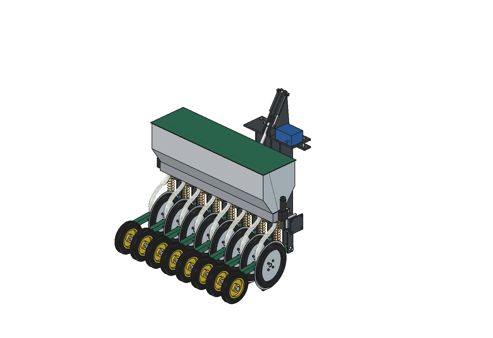

# Overseeder for the Bruut

Two variants of an overseeder that places grass seed and clover **into** an existing sward:
- a disc cuts a shallow 15 mm slot;
- the seed lands at about 12 mm;
- a press wheel closes the slot;
- 8 rows at 125 mm = 1 m per module, which can be coupled wider with flanges;
- every row follows the ground on its own arm, and the depth is set on the disc itself.

| | [Simple](simple/README.md) | [Advanced](advanced/README.md) |
| --- | --- | --- |
| Base | applicator `simple_v2` | advanced applicator `advanced` |
| Suspension | lift frame around a single pivot, actuator in a slotted hole | parallel linkage, the toolbar stays parallel |
| Element | trailing arm, disc angled 7° with the hub on one side, shoe in the lee of the disc, depth ring on one side | fork arm, straight disc supported on both sides, rings on both sides, coulter in the centre of the cut |
| Press wheel | roller arm with torsion spring | fork with torsion spring |
| Seed hopper | 41 + 18 l on the lift frame, gravity | 62 + 17 l on the robot, air (12 V fan) |
| Down force | weight + 2 gas springs in the slotted hole | weight + 2 gas springs in the slotted hole |
| Normal draft force | 335 N | 375 N |
| Cutting depth within ±3 mm (test track) | 94 % | 98 % |
| Front weight needed (robot 150 kg) | approx. 42 kg | approx. 46 kg |
| Materials | approx. € 1675 | approx. € 2280 |

The research both designs build on (WUR, Teagasc, Super-G, Arkansas and machines) is in `inspiration/`. That folder is
not in git.

