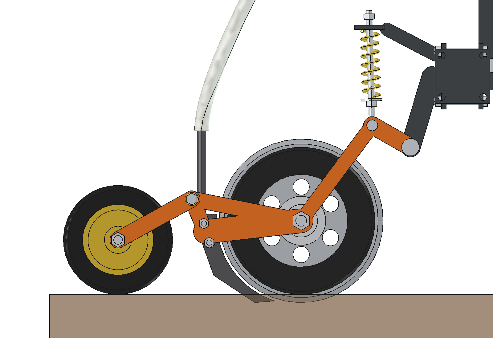
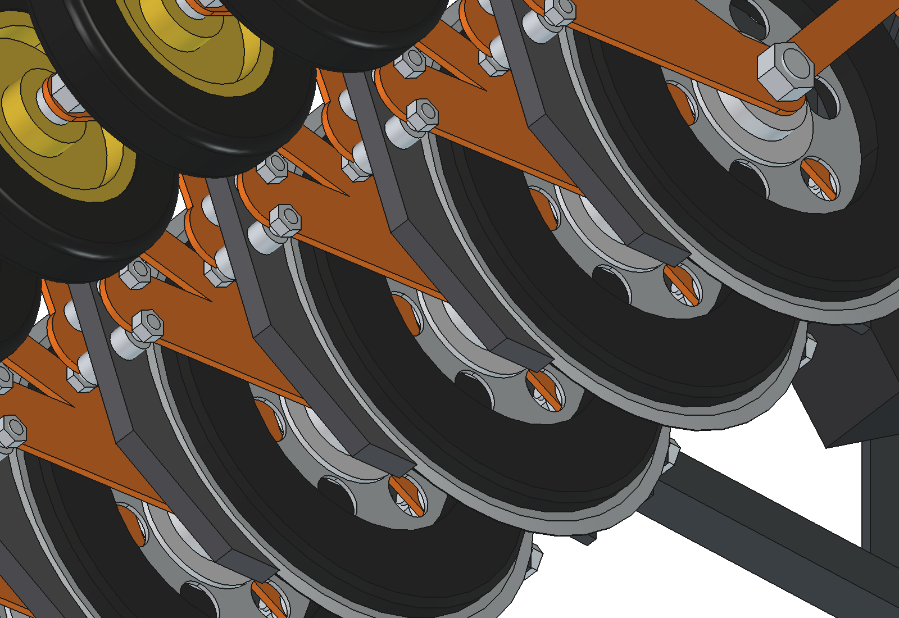
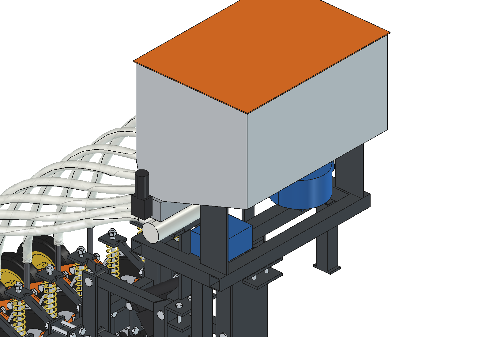
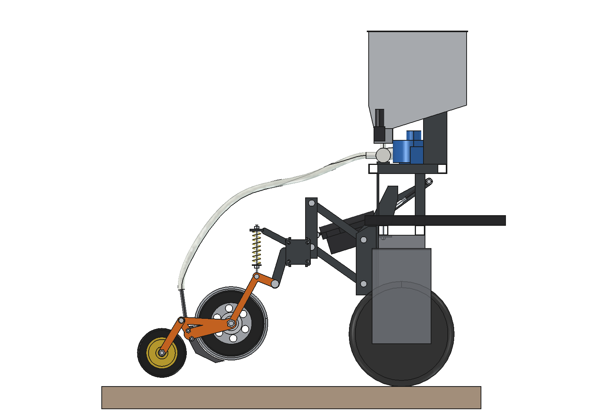

# Overseeder, advanced version: rationale

5 October 2026. Model: `Overseeder_Advanced.FCStd` (FreeCAD 1.1, generated with `build_ova.py`).
Figures come from the model, `ova_calc.py` and `ova_ground.py`. Where something is assumed or estimated, this is stated.

This version builds on the [advanced applicator](../../liquid%20fertilizer%20applicator/advanced/RATIONALE.md).
The [simple version](../simple/RATIONALE.md) builds on the simple applicator version 2. The research and
the requirements are in [../inspiration/README_onderzoek_doorzaaien.md](../inspiration/README_onderzoek_doorzaaien.md) and
in § 1 and § 12 of the simple version; they are not repeated here.

---

## 1. What remains of the advanced applicator

| | Advanced applicator | **Advanced overseeder** |
| --- | --- | --- |
| Mounting headstock, 2 × M10 per side through the hole grid | yes | **same**, rods at x = ±125 (between element 4/5 and 5/6) |
| Parallelogram 260 mm, toolbar stays parallel to the robot | yes | **same** |
| Actuator turned around, rod in a slotted hole: toolbar floats in working position | yes, ±70 mm | **same**; upper pin 6 mm higher (§ 7) |
| Element: one pivot, fork arm, disc Ø 300 × 3 between the fork plates | yes | **same**, fork plates 5 mm, disc 200 mm behind the pivot (was 240) |
| Depth rings on both sides of the disc | Ø 220 → 40 mm | **Ø 270 → 15 mm**, change rings 5–25 mm |
| Behind the disc, in the plane of the disc | knife 8 mm + stainless steel tube | **curved seed coulter 16 mm** with seed tube, tip at 12 mm |
| Spring leg | 140 mm behind the pivot, 133 N | **70 mm behind the pivot, 440 N** (§ 4) |
| Closing the slot | – (room kept) | **press wheel in a fork with torsion spring** |
| Down force | own weight of toolbar | **weight + 2 gas springs in the slotted hole** (robot weight) |
| Dosing | ground wheel with spikes → chain → 5-channel hose pump on the toolbar | **air seeder on the robot**: hopper, 2 cam rollers with motor, 12 V fan, 8 hoses |
| Rows | 5 at 200 mm | **8 at 125 mm** |

Why no ground wheel: the ground wheel of the applicator sits at the back of the toolbar. There every kilogram weighs the most on the
front axle when the robot lifts (§ 8). The robot knows its speed (RTK-GNSS and wheels), so the dosing motors can
follow it without a ground wheel.

## 2. What is better than the simple version

| | Simple | **Advanced** |
| --- | --- | --- |
| Toolbar suspension | rotating frame: the higher the frame floats, the more angled the elements | **parallelogram**: toolbar stays parallel, element geometry does not change with floating height |
| Disc | angled (7°), hub on one side on an angled bush | **straight, supported on both sides** in the fork: no skewed load on the bearing, no side force |
| Depth setting | one ring on the +x side | **rings on both sides**: equal depth left and right of the cut, the sward is held on both sides |
| Seed | boot next to the cut (lee side) | **seed coulter in the centre of the cut**, seed exactly under the press wheel |
| Press wheel | roller arm on one side | **fork on both sides** |
| Seed hopper | 41 + 18 l on the lift frame, 470 mm behind the headstock | **62 + 17 l on the robot**, above the rear axle: almost 1.5 × as much seed, without the robot having to lift it |
| Hoses | gravity, at least 55° slope needed | **air**: any route works, the seed does not get stuck |
| Side force of the discs on the robot | approx. 80 N | **0** |
| Cutting depth within ±3 mm (same strip) | 94 % | **98 %** |

What it costs:
- **More expensive:** approx. € 2280 against € 1675.
- **Fan:** approx. 150 W of extra electrical power.
- **Taller:** the hopper stands 1.45 m high.
- **Slightly more draft force:** 375 against 335 N, because the seed coulter opens the cut to 16 mm.
- **Front weight:** also here approx. 45 kg (§ 8).

## 3. The element

| Part | Design |
| --- | --- |
| Holder | front and rear clamp plate 56 × 8 around the toolbar, 4 M12 bolts, 10 mm plate to the pivot and the spring plate (as the applicator) |
| Arm | 2 laser-cut fork plates 5 mm, pivot pin Ø 20, 100 mm below the toolbar and 270 mm above the ground |
| Disc | flat coulter disc Ø 300 × 3 on a hub between the fork plates, M20 axle supported on both sides |
| Depth rings | 2 × PE-HD Ø 270 / 170 × 15, against the disc; depth = (300 − ring) / 2 = 15 mm. Change rings Ø 290 / 280 / 260 / 250 for 5 / 10 / 20 / 25 mm |
| Seed coulter | 16 mm, welded from 2 plates of wear-resistant steel 3 mm with the seed channel between them. The front follows the disc at 5 mm, the tip sits 3 mm above the bottom of the disc (seed at approx. 12 mm). With 2 M10 bolts between the fork plates |
| Seed tube | stainless steel 16 × 1.5, welded into the coulter, hose 20/26 over it |
| Press wheel | solid rubber Ø 200 × 40 in a fork (2 strips 30 × 5) on 2 shoulder bolts M12, torsion spring approx. 35 N; fork 35° up, 22° down |
| Spring leg | compression spring Ø 35 × 5, c = 4 N/mm, approx. 440 N in working position; adjusting nut = lower stop (arm drops 8°) |
| Mass | element 10.9 kg, of which 8.0 kg rotates with the arm |

- **Coulter directly behind the disc.** A knife or coulter in line behind a disc tilts along with the arm. The further the coulter is behind the disc, the more its depth varies.
  - With the applicator the knife tip is 125 mm behind the centre of the disc. There the knife depth varied from 12 to 64 mm at a fixed disc depth.
  - Here the tip is 49 mm behind the centre, and the front is curved along the disc.
- **Press wheel on a fork.** The wheel stands on its own hinge, so that it closes the slot independently of the depth.
  - The hinge and the axle are chosen so that over the whole stroke (−35° to +22°) the wheel stays at least 7 mm clear of the coulter.

## 4. Down force: weight, gas springs and a shorter spring leg

With a parallelogram the ground carries **the whole weight of the toolbar**. The rods take no vertical force,
unlike the pivot of the lift frame in the simple version. Even so the weight alone is not enough.

| Normal, 8 rows (assumptions as the simple version, coulter 15 N draft force) | Per element |
| --- | --- |
| Weight of toolbar with elements (98.8 kg + half the hoses) | 123 N |
| Push of the gas springs (together 483 N along the slotted hole, × 0.59 leverage) | 36 N |
| **Total on the ground** | **158 N** |
| Disc 15 mm into the sward | 90 N |
| Press wheel | 35 N |
| **On the depth rings** | **33 N** (minimum 20) |

- **Without gas springs** −2 N remains on the rings: the discs just fail to reach their depth.
- **The gas springs** sit next to the slotted-hole plates and push the actuator pin downwards (same principle as in the simple version).
  - The lift frame floats freely between −71 and +71 mm.
  - When lifting the pin is at the bottom of the slotted hole. The gas springs then push against the headstock itself and do not load the actuator.
- **Heavy, dry sward:** with 8 rows 1530 N of gas spring force would be needed. Then the robot gets too light at the back and the draft force is greater than the grip.
  - Then use 4 rows: raise every second element with the adjusting nut, or take it off.
  - Use gas springs of 2 × 330 N and stiffer compression springs (see below). The same rule as for the simple version.
- **Spring leg closer to the pivot.** With the spring leg of the applicator (140 mm behind the pivot, 230 N) the force on the rings varied too much with the arm angle: 7 % of the row positions had too little down force.
  - At 70 mm the spring has to push twice as hard (440 N), but per degree of arm angle the force changes only a quarter as much.
  - Then approx. 1 % remained (table in § 6).
- **What the preload does:** it only determines at which height the toolbar floats (at 442 N in the middle of the slotted hole), not how much down force there is.
  - For heavy sward with 4 rows approx. 740 N is needed. That calls for a stiffer spring (c ≈ 6 N/mm) rather than just more preload.

## 5. Air seeder on the robot

- **Support frame** (40 × 40 × 3 tube) above the rear axle:
  - at the back plates stand on the top plates of the headstock, next to the bolts;
  - at the front tubes stand on the inner rear beam of the robot, with M10 in the existing hole grid.
  - The frame sits above the gas springs and the slotted-hole plates; even when lifted nothing touches.
- **Seed hopper** of aluminium 2 mm, with a sloping bulkhead in two compartments:
  - **62 l grass**: 0.54 ha at 40 kg/ha tetraploid ryegrass;
  - **17 l fine seed**: approx. 2.7 ha white clover at 5 kg/ha.
  - Two support plates carry the funnel.
- **Dosing**: the same metering housing with two cam rollers and two worm-gear motors with encoder as the simple version. The rollers, speeds and calibration are also the same (see the table in [../simple/RATIONALE.md](../simple/RATIONALE.md) § 8).
  - Under each outlet the seed falls into a venturi in the air duct (PVC Ø 60).
- **Fan**: 12 V radial fan (approx. 150 W, assumed) blows through the duct. 8 hoses 20/26 run over the parallelogram to the seed tubes.
  - The seed enters the seed coulter with the air. The air escapes above the ground via the open seed channel behind the coulter.
  - **Trial needed**: is the air speed low enough that the seed does not blow out of the slot? Set the fan speed so low that the seed just does not stay lying in the hose.
- **Hoses between the elements**: each hose runs up 50 mm next to its own element, forward at 830 mm height above headstock and actuator, and then bends to its venturi. They bend along with floating and lifting.

## 6. Ground following

The same bumpy strip, robot attitude and 80 robot positions as for the applicators and the simple version
(`ova_ground.py`):
- the toolbar floats until the ground carries weight + gas springs;
- each arm rotates until the depth rings left and right touch the ground level;
- the press wheel follows in its fork;
- assumed: the rings sink in 0.075 mm per N of extra load.

| Working position, 80 positions × rows | Applicator simple_v2 | Overseeder simple | **Overseeder advanced** |
| --- | --- | --- | --- |
| Deviation from the set cutting depth | −35 to +22 mm | −4 to +7 mm | **−4 to +8 mm** |
| Standard deviation | 8.7 mm | 1.4 mm | **1.3 mm** |
| Within ±3 mm | 44 % | 94 % | **98 %** |
| Within ±5 mm | 59 % | 99.5 % | **98.8 %** |
| Too little down force / arm on the stop | – | 0 / 0 | 7 / 5 of 640 |
| Press wheel off the ground | – | 16 of 640 | 8 of 640 |
| Lift frame or toolbar | – | floats −5 to +7° | floats −57 to +43 mm, never against a stop |

- **Both overseeders hold the depth much better than the rigid toolbar of the applicator.** The difference is in the depth setting on the disc itself and one arm per row.
- **The advanced one stays within ±3 mm more often** (98 against 94 %). That is due to the rings on both sides and the toolbar that stays parallel.
- **The outliers are slightly larger with the advanced one** (a few positions at a molehill, with the arm on the stop).
- **The tip of the coulter** is 49 mm behind the disc and follows the ground level less precisely (0.7–21.6 mm, sd 2.4). The seed falls onto the bottom of the slot that the disc cuts. At those few spots it therefore ends up slightly shallower.

## 7. Lifting and floating

| | Value |
| --- | --- |
| Floating range of toolbar | −71 / +71 mm |
| Lift height | 150 mm (actuator in: 290 mm) |
| Actuator | 24 V, 2500 N, stroke 150, approx. 30 mm/s, IP66 |
| Force needed (1.3 × margin) | 2175 N at the start, 1316 N lifted |
| Time | 1.3 s free stroke, 5.0 s until fully lifted |
| Lifted, clear of the ground | discs 108, coulters 106, press wheels 38 mm |

- **Upper pin 6 mm higher than with the applicator.** In the lowest floating position (−80 mm with the applicator) the rod of the actuator touched the rear beam of the robot.
  - With the pin at z = 706 the floating range is −71 / +71 mm, with 3.7 mm clearance above the beam.
- **Pin along the slotted hole.** In the model the pin now really slides along the slotted hole, not along the axis of the actuator (as the applicator did).
  - That also showed that the gas springs were too short at the top of the slotted hole. They are now 225 mm.
- **Interference check**: working position, lifted, and the extreme floating positions with the elements fully up or down, all with the robot reference included: **0 overlap**.

## 8. Draft force and the balance of the robot

| | Value |
| --- | --- |
| Draft force normal, 8 rows | 375 N |
| Grip (μ = 0.5) while working | 1010 N |
| Heavy sward, 8 rows | 604 N, grip 703 N at 1530 N gas springs: do not do this |
| Heavy sward, 4 rows | 302 N, grip 957 N |
| Front axle lifted, full hopper (25 kg seed) | **31 N** |
| Front axle lifted, + 40 kg front weight | 423 N |
| **Front weight for 25 % on the front axle** | **approx. 46 kg** |

- The toolbar with elements weighs 99 kg and when lifted hangs well over 700 mm behind the rear axle.
- **The hopper on the robot helps**: 32 kg of frame, hopper and fan plus the seed stand almost above the rear axle. On the toolbar they would need approx. 50 kg extra front weight.
- **The elements themselves remain the problem**: 8 × 11 kg at 0.7 m behind the axle. A 150 kg robot (assumed) then needs, as with the simple version, **approx. 45 kg of front weight**.
- **Weigh the robot per axle first.**

## 9. Making it wider with modules

- **What is already on it**:
  - the toolbar has coupling flanges (100 × 100 × 8, 4 × M12);
  - a module is 1000 mm from flange to flange, so the row spacing stays 125 mm across the seam;
  - the elements clamp anywhere on the toolbar.
- **Draft force** (per metre): normal 364 N with 8 rows, 182 N with 4 rows. Normally 2 m with 8 rows/m is possible within the grip, or 3 m with 4 rows/m.
- **Lifting**: the robot cannot lift a second module on the headstock. For 2–3 m each outer module gets its own support wheel (caster wheel with lift actuator). The hopper on the robot can then be larger, with an extra venturi per row.

## 10. Cost (indicative, excl. VAT, 2026 price level)

| Item | € |
| --- | --- |
| Steel: headstock, rods, toolbar, rear frame, fork plates (laser), support frame (approx. 60 kg) | 260 |
| 8 coulter discs Ø 300 × 3 with hub and axle | 300 |
| 16 depth rings PE Ø 270 (+ change sets) | 180 |
| 8 seed coulters with seed tube | 160 |
| 8 press wheels, forks, torsion springs, shoulder bolts | 170 |
| 8 compression springs, spring rods, pins | 90 |
| Bolts, pins, bushings | 110 |
| Actuator 2500 N | 280 |
| 2 gas springs 250 N | 50 |
| Seed hopper aluminium with lid | 170 |
| Metering housing, 2 cam rollers, 2 motors with encoder | 200 |
| Fan, air duct, 8 venturis | 160 |
| Seed hose (14 m) | 60 |
| Controllers, microcontroller, box, cable | 90 |
| **Total** | **approx. 2280** |

## 11. Estimated, not measured

- **Ground forces.** The same assumptions as the simple version: down force per disc 90 / 180 N. The seed coulter takes 15 / 25 N of draft force.
  - Measure this before building with one element.
- **Sinking in of the rings**: 0.075 mm/N.
- **Press wheel**: force 35 N and torsion spring.
- **Fan**: power and air speed; whether the seed stays in the slot.
- **Metering rollers and seed densities**: calibrate.
- **Robot**: 150 kg, centre of gravity 500 mm in front of the rear axle, μ = 0.5.
- **Actuator and gas springs**: values from typical datasheets.

Ground following is calculated quasi-statically. No animation like the applicators' has been made yet.
