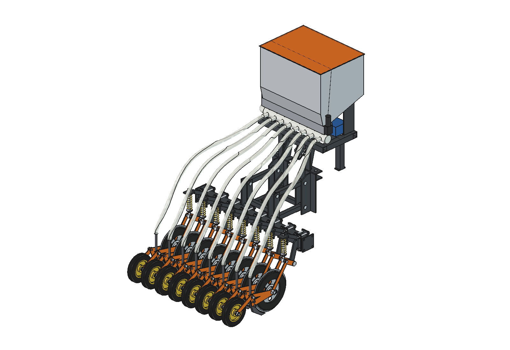
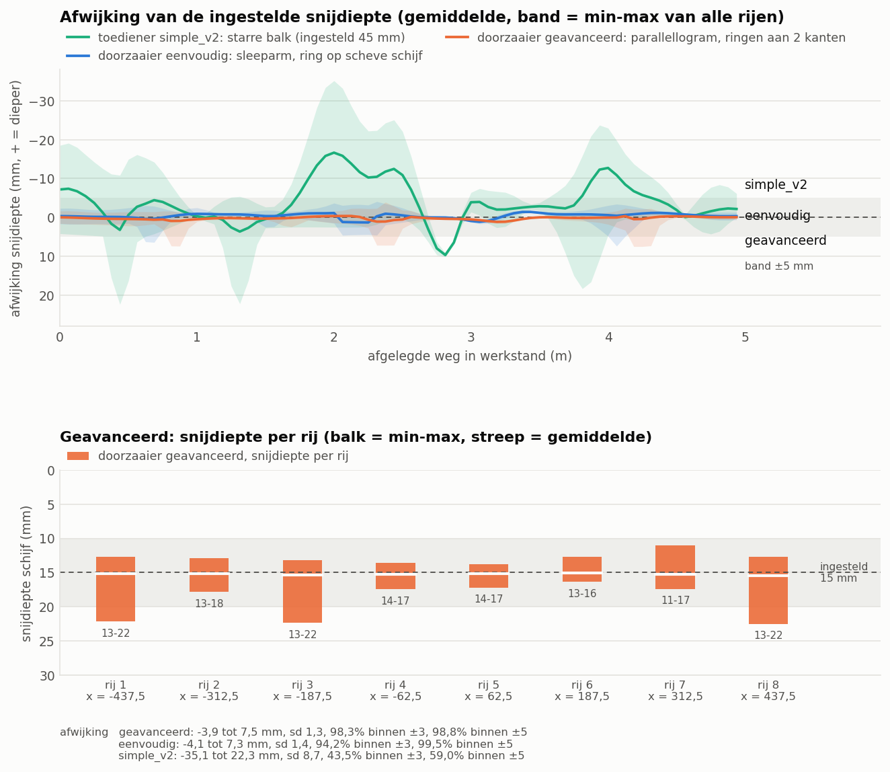

# Overseeder, advanced version: FreeCAD model

Overseeder for the Bruut OpenAgbot, built on the
[advanced applicator](../../liquid%20fertilizer%20applicator/advanced/README.md). Taken over from the applicator:
- the headstock and the parallel linkage;
- the floating toolbar with actuator and slotted hole;
- the fork arms.

Per row:
- a Ø 300 × 3 disc cuts 15 mm deep, with depth rings on both sides;
- a curved seed coulter directly behind the disc places the seed at about 12 mm;
- a press wheel in a fork closes the slot.

In addition:
- 8 rows at 125 mm = 1 m per module, with coupling flanges;
- 2 gas springs in the slotted hole push the floating toolbar down with robot weight;
- the seed hopper (62 + 17 l), the metering and a 12 V fan are on a frame above the rear axle; the air blows the seed through 8 hoses to the coulters;
- draft force approx. 375 N normal;
- cutting depth on the test track 98 % within ±3 mm;
- approx. € 2280 in materials.

Note:
- **approx. 45 kg of front weight on the robot** is needed to lift;
- in hard, dry sward only with 4 rows.

See [RATIONALE.md](RATIONALE.md). The simple version is in [../simple](../simple/README.md).





## Files

| File | Contents |
| --- | --- |
| `Overseeder_Advanced.FCStd` | the model in working position (generated, do not edit by hand) |
| `ova_params.py` | all dimensions, including the robot interface |
| `ova_kin.py` | kinematics: parallel linkage, slotted hole, gas springs, arm, spring leg, fork, coulter, hopper (pure Python) |
| `ova_parts.py` | one function per part, returns a `Part` shape |
| `build_ova.py` | model tree, colors, lifting, interference check, mass, images |
| `ova_calc.py` | dosing, down force and gas springs, draft force, lifting, axle load, module widths, cost (pure Python) |
| `ova_ground.py` | ground following over the bumpy strip; uses the ground and robot attitude of `../simple/ovs_ground.py` |
| `plot_ground_ova.py` | comparison chart: advanced, simple and the rigid toolbar of simple_v2 (matplotlib) |
| `run_in_freecad.py` | macro: open in FreeCAD and run (F6) to rebuild the model |
| `previews/` | images and the chart |

Module names start with `ova_` (simple version: `ovs_`).

## Axes

Same as the robot model and the applicators: x = right, y = driving direction (front = +y), z = up, ground = z 0, mm.
- y = 0 is the centre of the robot's rear lower beam (robot y = implement y − 575).
- Rows at x = −437.5 … +437.5 (step 125).
- Toolbar at (y, z) = (−395, 400).
- Per element: arm pivot (−490, 270), disc centre (−690, 135), press wheel axle (−1025, 100).
- Air seeder: frame at z = 870–910 between y = −60 and 260; hopper up to z = 1450.

## Rebuilding and using

In FreeCAD's Python console (folder in `sys.path`, or via `run_in_freecad.py`):

```python
import build_ova
build_ova.build()                                   # working position, saves the FCStd
build_ova.build_lifted()                            # lifted, with the robot reference
build_ova.build(h=-71, drop=8, chi=22, save_path=None)   # lowest floating position, arms and wheels down
build_ova.check_interference()                      # overlapping parts (must be empty)
build_ova.mass_properties()                         # mass and centres of gravity
build_ova.render_all()                              # images 1 to 12 and save in working position
```

- `h` = height of the toolbar relative to the working position (mm);
- `drop` = arm angle (degrees, + = down; a number or a list per row);
- `chi` = angle of the press wheel fork (degrees, + = down).

Without FreeCAD (any Python 3 with the `../simple` folder next to it; the chart needs matplotlib):

```bash
python ova_calc.py
```

```bash
python ova_ground.py
```

```bash
python plot_ground_ova.py
```

## Model tree

```
overseeder_advanced_1m_8_rows
  headstock_robot_mount          2 headstocks, cheeks, cross tubes, slotted-hole plates (extended for the gas springs)
  air_seeder_on_robot            support frame, air duct with venturis, metering housing, 2 motors, hopper, lid,
                                 support plates, fan, pressure line, control box
  parallel_linkage               4 rods
  lift_actuator_and_gas_springs  actuator, pin in the slotted hole, 2 gas springs
  toolbar_assembly_moves_with_lift   (Placement = movement of the toolbar)
    toolbar, rear frame, pins
    row_unit_1..8                clamp plates, bolts, holder, spring plate, pivot pin, spring leg, spring
      row_unit_N_swing_arm       (Placement = arm angle) fork plates, axle, hub, disc, 2 rings, coulter, bolts
        row_unit_N_press_wheel   (Placement = fork angle) fork, axle, press wheel
  seed_hoses_air                 8 hoses from the venturis to the seed tubes
robot_reference_NOT_PART_OF_DESIGN   (hidden)
```

## Estimated, not measured

- **Ground forces**: as the simple version; the seed coulter takes 15 N of draft force (heavy 25 N).
- **Depth ring**: sinks in 0.075 mm/N.
- **Press wheel**: 35 N.
- **Fan**: 150 W.
- **Metering rollers**: to be calibrated.
- **Robot**: 150 kg, centre of gravity 500 mm in front of the rear axle, μ = 0.5.

See RATIONALE § 11.
