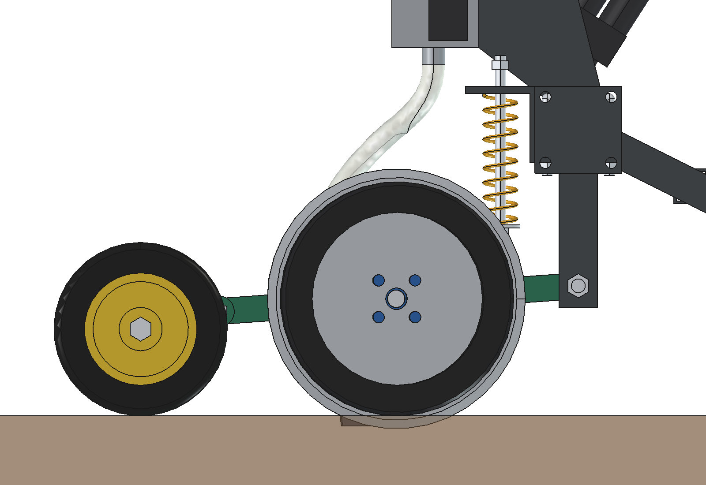
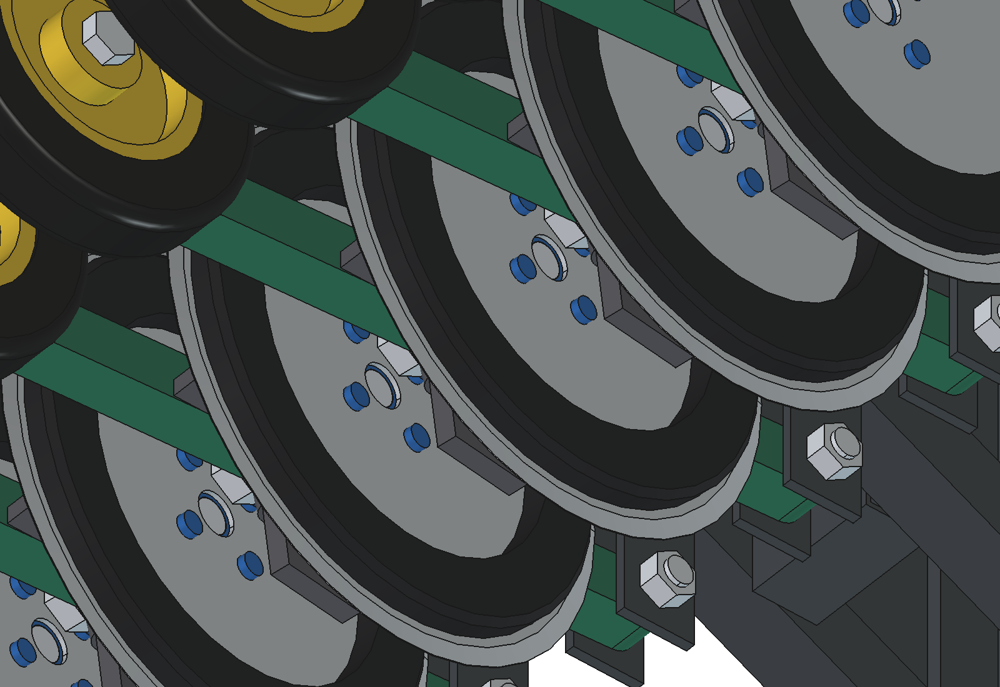
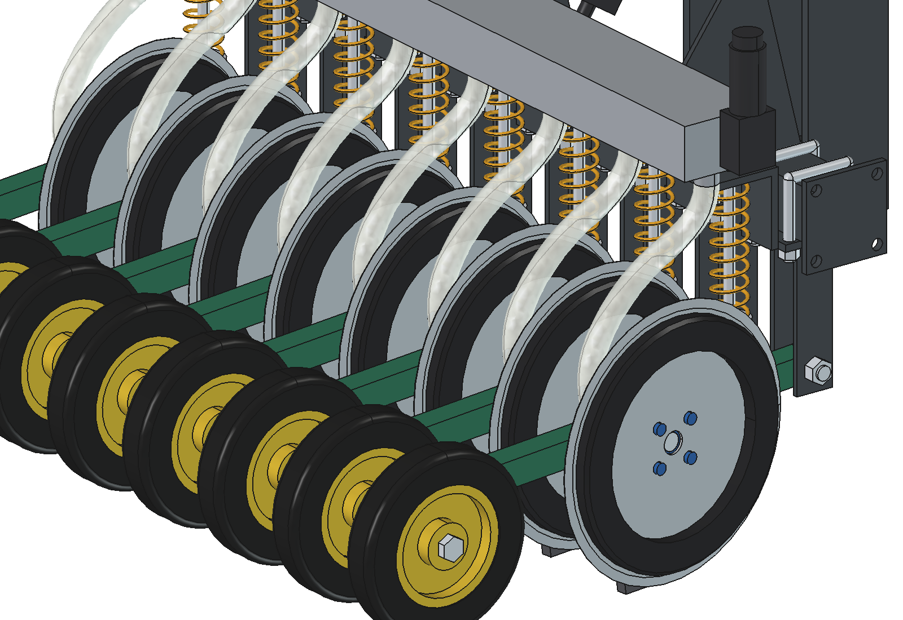
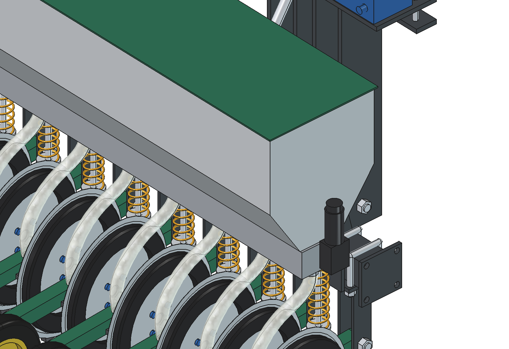
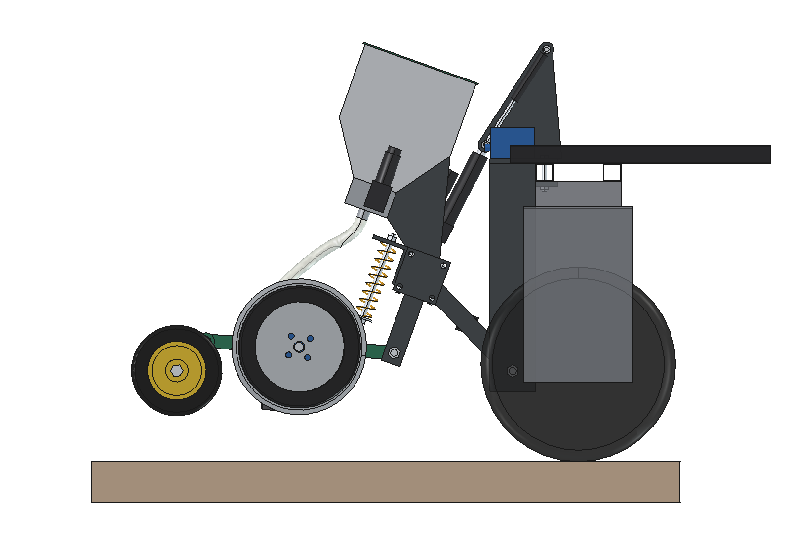

# Overseeder, simple version: rationale

5 October 2026. Model: `Overseeder.FCStd` (FreeCAD 1.1, generated with `build_ovs.py`).
Figures come from the model, `ovs_calc.py` and `ovs_ground.py`. Where something is assumed or estimated, this is stated.
The research this design relies on is in [../inspiration/README_onderzoek_doorzaaien.md](../inspiration/README_onderzoek_doorzaaien.md).
The [advanced version](../advanced/RATIONALE.md) builds on the advanced applicator.

---

## 1. Requirements

From the user:
- place the seed **in** the ground, not scatter it on top;
- **1 m working width**, expandable with modules;
- **ground following**;
- **cut** the sward;
- start from the liquid manure applicator, with a dosing for seed instead of liquid;
- **as little draft force as possible**.

From the research (see the inspiration folder):

| Requirement | Why | Source |
| --- | --- | --- |
| **Closing the slot** is a main function | 418 against 84 seedlings/m² with and without a closed slot | WUR report 1354 |
| Sowing depth **0.5–2 cm**, clover 0.5–1 cm | deeper seed emerges poorly | WUR, Super-G, Arkansas |
| Dosing of **2 kg/ha** (white clover) to **40 kg/ha** (ryegrass), small seed separate | clover seed segregates in a large hopper with grass seed | Teagasc, Super-G |
| Sowing in a slot wins mainly in **drought and thick sward** | broadcasting is just as good in good weather | Virginia Tech, Arkansas, Super-G |
| **Being able to switch rows off** (strip sowing) | clover in strips on 25 % of the field: −75 % cost | Arkansas FSA2159 |
| Dosing linked to **driving speed** | fixed kg/ha at varying speed | Vredo, Evers, Einböck |

What the machine **does not** solve: competition from the old sward and moisture are more important than the machine. Mowing short or
grazing (≤ 4–5 cm), harrowing first and sowing in moist soil at the end of August–September remain necessary (§ 12).

## 2. Working principle: one angled disc per row

| Principle | Seed in the ground | Draft force | Down force needed | Depth | Verdict for a 150 kg robot |
| --- | --- | --- | --- | --- | --- |
| Tine seeder + spreader | no, on top and harrowed in | medium | little | inaccurate | rejected: seed lies on top |
| Double disc (Vredo) | yes | medium | a lot: 2 discs per row | good | too heavy |
| Inverted T (Aitchison) | yes | high: tine 25 mm through the ground | medium | good | too much draft force |
| **One flat disc at 7°, boot in the lee** | **yes** | **low** | **1 disc per row** | **good with depth ring** | **chosen** |

This is how the element works:
- **Cutting.** A thin, flat disc Ø 300 × 3 stands 7° angled to the driving direction and cuts 15 mm deep. One side (+x) pushes the soil a few mm aside. On the other side (−x, the lee side) an open V-slot remains. This is also how the single-disc drills of John Deere (750) and the Moore Unidrill work.
- **Placing the seed.** A narrow seed boot (12 mm) runs in that lee against the disc. The seed falls through the seed tube and the boot onto the bottom of the slot, at approx. 12 mm.
  - The boot does not have to move any soil, so it gives almost no draft force. That is the difference with a knife or an inverted-T tine.
- **Depth.** A PE ring Ø 270 on the +x side of the disc rolls on the ground level, exactly where the cutting happens. Depth = (disc − ring) / 2 = 15 mm.
  - A different depth needs a different ring: Ø 290 / 280 / 270 / 260 / 250 gives 5 / 10 / 15 / 20 / 25 mm.
  - In the first version the press wheel controlled the depth, 265 mm behind the disc. Over bumps and molehills that gave sd 11.5 mm: worse than the rigid toolbar of the applicator. With the ring on the disc it is sd 1.4 mm (§ 7).
- **Closing.** A solid rubber wheel Ø 200 × 40 sits on its own roller arm with a torsion spring (approx. 35 N). The wheel closes the slot and follows the ground level independently of the depth.
- **Ground following per row.** Each element hangs from its own trailing arm. A soft compression spring (4 N/mm, approx. 375 N preload) sits on a spring leg between arm and toolbar.

## 3. What remains of the applicator

The base is the [simple applicator version 2](../../liquid%20fertilizer%20applicator/simple_v2/RATIONALE.md).

| | Applicator simple_v2 | **Overseeder** |
| --- | --- | --- |
| Headstock on the robot beam, pivot (−70, 200), M10 bolts in the hole grid | yes | **same**; arms at x = ±62.5 (between the elements), slotted-hole plates extended lower and higher |
| Lift frame with toolbar 60×60×4 | rigid toolbar, 2 depth wheels | **toolbar with coupling flanges, no depth wheels**: each element follows the ground itself |
| Actuator with slotted hole | 1500 N, stroke 200, lift frame floats on its weight | **3000 N, stroke 150; 2 gas springs push the lift frame down** (§ 5) |
| Cutting | disc Ø 300 × 4, 45 mm deep | disc Ø 300 × 3, **15 mm**, 7° angled |
| In the slot | knife + stainless steel tube, liquid at 27 mm | **seed boot + seed tube, seed at approx. 12 mm** |
| Closing | – | **press wheel per row** |
| Dosing | 12 V diaphragm pump, pressure regulator, orifice plates | **hopper 41 + 18 l, 2 cam rollers, 2 worm-gear motors with encoder** |
| Rows | 5 at 200 mm | **8 at 125 mm** |
| Mass implement / lift frame | 101 / 70 kg | **136 / 104 kg** (empty hopper) |

## 4. The element in dimensions

| Part | Design |
| --- | --- |
| Holder | clamp plate 76 × 8 under the toolbar, 2 U-bolts M12, 2 cheeks 40 × 6 to the pivot, spring tower with anchor plate |
| Trailing arm | tube 30 × 30 × 3, pivot bushing Ø 30 on bolt M16, pivot 150 mm below the toolbar and 150 mm above the ground (low: the draft force pushes the arm little upwards) |
| Disc | flat coulter disc Ø 300 × 3, hardened, on bearing hub (2 × 6203-2RS) and axle bolt M20 through an obliquely cut bush (7°) |
| Depth ring | PE-HD Ø 270 / 200 × 15, 4 bolts M8 through the disc |
| Seed boot | wear-resistant steel 12 mm, welded to the stainless steel seed tube 20 × 1.5; bottom 3 mm above the bottom of the disc |
| Press wheel | solid rubber Ø 200 × 40, roller arm strip 36 × 8 on bolt M12, torsion spring; stroke −40/+30° |
| Spring leg | rod M12 with eye, compression spring wire 4 / Ø 41 / 12 coils (approx. 4 N/mm), adjusting nut under the plate, lock nut above the anchor plate (arm drops max. 12°) |
| Seed hose | PVC spiral hose 20/26 from the outlet to the seed tube, at least 55° slope |
| Mass | element 9.5 kg, of which the trailing arm with everything that rotates with it 6.7 kg |

The hub, the arm and the boot are all on the lee side (−x). The +x side, where the soil goes aside, is free.
All 8 elements face the same way. Together the discs give approx. 80 N of side force towards −x (assumed: 0.4 × the
draft force of the disc). The robot steers that away. Whoever does not want that can mirror the elements on a second module.

## 5. Down force: weight alone is not enough

This is the most important lesson of the design. A disc has to be pressed into the sward. Estimated (see `ovs_calc.LOADS`):

| Per element | Normal (moist, grazed short) | Heavy (dry, dense sward) |
| --- | --- | --- |
| Disc 15 mm into the sward | 90 N | 180 N |
| Press wheel (torsion spring) | 35 N | 35 N |
| Minimum on the depth ring (otherwise the disc does not reach depth) | 20 N | 20 N |
| Draft force disc / boot | 25 / 8 N | 45 / 15 N |

- **The lift frame weighs 104 kg (with 20 kg of seed 124 kg), but the headstock carries part of it.** The centre of gravity is 435 mm behind the pivot; the discs and wheels are 470–765 mm behind it.
  - With the weight alone each disc holds **26 N**; 90 N is needed.
  - Without help 89 kg of ballast would have to go on the toolbar. The robot would then also have to lift that (§ 9).
- **Solution: use robot weight with 2 gas springs.** The gas springs (together 750–1000 N, approx. 870 N in working position) sit next to the slotted-hole plates of the headstock. They push the rod eye of the actuator downwards, and via the actuator the lift frame.
  - The lift frame keeps floating freely in the slotted hole (−8 to +9°). The pushing force is almost constant.
  - When lifting the actuator pulls the eye to the bottom of the slotted hole. Then the gas springs push against the headstock itself. The actuator does not have to overcome them.
  - With the gas springs each disc holds **105 N** with an empty hopper.
- **Two settings, each with its own task:**
  - the **gas springs** determine how much down force there is: 2 × 400 N normal, 2 × 650 N for heavy sward with 4 rows;
  - the **preload of the compression springs** only determines at which height the lift frame floats: 310 N empty hopper, 365 N full hopper; 5.8 mm nut = 10 N on the ring.

| Normal, 8 rows, gas springs 870 N | Empty hopper | Full hopper (20 kg) |
| --- | --- | --- |
| On the depth ring per element | 33 N | 54 N |
| Force per element on the ground (disc + ring + wheel) | 158 N | 179 N |
| What the implement pulls on the robot (upwards) | 249 N | 217 N |

| Gas springs (full hopper) | 0 | 400 N | 800 N | 1000 N | 1300 N |
| --- | --- | --- | --- | --- | --- |
| Normal 8 rows: force on the ring | −17 N (disc not at depth) | 15 N | 48 N | 64 N | 89 N |
| Normal 8 rows: draft force / grip | 292 / 1003 N | 304 / 941 | 330 / 811 | 343 / 745 | 363 / 647 |

Heavy sward with 8 rows needs 1840 N of gas spring force. Then the implement pulls 830 N off the robot and the grip is
smaller than the draft force (§ 6). **In heavy sward therefore with 4 rows**: raise every second element with the adjusting nut, or
take it off. Then 2 × 370 N is enough.

## 6. Draft force

| | Applicator simple_v2 | **Overseeder 8 rows** | **Overseeder 4 rows** |
| --- | --- | --- | --- |
| Normal | 461 N | **335 N** | 154 N |
| Heavy | 875 N | 540 N | **278 N** |
| Robot grip (μ = 0.5) | approx. 950 N | 788 N (984 N with 40 kg front weight) | 764 N (heavy) |

What keeps the draft force low:
- **Shallow.** 15 mm instead of 40–45 mm. This is also the sowing depth from the research.
- **One thin disc per row**, no second disc, no knife or tine. The boot runs in the lee of the disc.
- **Low pivot of the trailing arm** (150 mm above the ground). The draft force pushes the arm little upwards, so less down force is needed.
- **Switching rows off**: 4 rows at 250 mm halves the draft force. For clover that fits strip sowing: clover spreads by itself (Arkansas).
- **Harrowing in a separate pass.** A harrow in front of the discs (like the Evers Grass Profi) quickly costs 200–400 N extra at 1 m. With a separate pass the overseeder stays within the grip of the robot.

## 7. Ground following

The same bumpy strip as for the applicators: undulating ground, molehills, pits and a ridge. Also the same 80
robot positions and the same robot attitude on four wheels. Calculated with `ovs_ground.py`:
- each arm rotates until the depth ring touches the ground level;
- the wheel follows the ground level on its roller arm;
- the lift frame floats until the ground forces equal weight + gas springs.
- Assumed: the ring sinks in 0.075 mm per N of extra load.

| Working position, 80 positions × rows | Applicator simple_v2 (rigid toolbar) | **Overseeder** |
| --- | --- | --- |
| Deviation from the set cutting depth | −35 to +22 mm | **−4 to +7 mm** |
| Standard deviation | 8.7 mm | **1.4 mm** |
| Within ±5 mm | 59 % | **99.5 %** |
| Cutting depth (set 15 mm) | – | 10.9–22.3 mm, mean 14.6 |
| Disc out of the ground / too little down force | – | 0 / 0 |
| Lift frame | – | floats at all 80 positions (−5.4 to +6.7°), never against a stop |
| Press wheel off the ground | – | 16 of the 640 (2.5 %), behind molehills |

- Where the depth still deviates, that is due to varying force on the ring. That force varies with the arm angle: approx. 7 N per 10 mm of spring travel, from 4 to 157 N on this strip.
  - A softer spring or an air spring per row makes this even flatter.
- The press wheel mainly loses contact behind molehills. Harrowing beforehand removes those (§ 12).
- The difference with the applicator comes from the **depth setting on the disc itself** and the **arm per row**. With the applicator 5 discs hang on one rigid toolbar with depth wheels next to them.

## 8. Dosing

Seed hopper of aluminium 2 mm, with a sloping bulkhead in two compartments:
- **front 41 l grass**;
- **rear 18 l fine seed** (clover, herbs).

Each compartment has its own cam roller with helical grooves (continuous flow, no clumps) and 8 outlets at the
row spacing. Both rollers run in the same metering housing and fall into the same outlet per row.

Two 12 V worm-gear motors with encoder (70 rpm unloaded) drive the rollers. The speed follows the driving speed of
the robot (GNSS/wheels), so the dose in kg/ha stays the same. Clover and grass can be set separately. At the
end of the row the dosing stops.

| Seed (bulk density, assumed) | Roller | kg/ha → rpm at 0.75 m/s |
| --- | --- | --- |
| English ryegrass tetraploid (0.35 kg/l) | grass, 2.0 cm³/rev/outlet | 15 → 12; 25 → 20; 40 → 32 |
| English ryegrass diploid (0.40 kg/l) | grass | 15 → 11; 25 → 18; 40 → 28 |
| White clover (0.78 kg/l) | fine, 0.15 cm³/rev/outlet | 3 → 14; 5 → 24; 6 → 29 |
| Red clover (0.78 kg/l) | fine | 10 → 48; 12 → 58; 13 → 63 (motor limit) |
| Chicory / ribwort plantain (0.5 kg/l) | fine | 2 → 15; 4 → 30; 6 → 45 |

- **Red clover at 13 kg/ha** needs 63 rpm at 0.75 m/s, just above the controlled limit of 60. Then drive a bit slower (0.7 m/s), or use a fine roller with larger grooves.
- **Full hopper**: 0.36 ha at 40 kg/ha ryegrass, 0.58 ha at 25 kg/ha. The fine compartment is good for approx. 2.8 ha of white clover at 5 kg/ha.
- **Capacity**: 0.27 ha/h theoretical at 0.75 m/s.
- **Calibrating**: the cm³ per revolution and the densities are design values. Do a catch test per seed: let the motor run 50 revolutions, catch per outlet, weigh, and enter the g/rev in the controller.

## 9. Lifting and the balance of the robot

| | Value |
| --- | --- |
| Actuator | 12 V, 3000 N, stroke 150 (installed 265 / out 415), approx. 12 mm/s (assumed) |
| Force needed (1.5 × margin, full hopper) | 2450 N |
| Lift angle | 19.7° |
| Free stroke in the slotted hole | 44 mm, 3.7 s |
| Discs and boots out of the ground | after 84 mm, 7.0 s |
| Fully lifted | 12.5 s; discs 104 mm, press wheels 101 mm clear |

**The front axle gets too light.** Lifted, the lift frame hangs almost 0.5 m behind the rear axle. With the assumption of the
applicators (robot 150 kg, centre of gravity 500 mm in front of the rear axle):

| Front axle lifted | N |
| --- | --- |
| Full hopper | **59** |
| Empty hopper | 136 |
| Full hopper + **40 kg front weight** | **451** |

- **Approx. 40 kg of front weight is needed** for 25 % of the weight on the front axle.
  - Use for example steel plates on the front beam, or a tank of water at the front.
  - The front weight also gives more grip while working: 984 instead of 788 N.
- **Weigh the real robot per axle first.** The 150 kg and the centre of gravity are an assumption. A heavier robot needs less or no front weight.
- The discs are already 3 mm, the hopper is aluminium. Making it lighter without giving up down force is almost impossible: the down force now actually comes from the robot via the gas springs.

## 10. Making it wider with modules

One module is 1000 mm from flange to flange and contains:
- 8 elements at 125 mm;
- its own seed hopper with dosing and two motors;
- one connector to the controller.

Coupling:
- The toolbar has a 100 × 100 × 8 flange with 4 M12 holes on both sides.
- Two modules bolted together keep the 125 mm row spacing across the seam: row 8 at +437.5, row 1 of the next at +562.5.
- Each element is fixed to the toolbar with two U-bolts. Shifting or switching off rows therefore works without welding.

What the Bruut can handle (draft force in N; grip approx. 790 N, with front weight approx. 980 N):

| Width | 8 rows/m normal | 8 rows/m heavy | 4 rows/m normal | 4 rows/m heavy |
| --- | --- | --- | --- | --- |
| 1 m | 308 | 524 | 154 | 262 |
| 2 m | 616 | 1048 | 308 | 524 |
| 3 m | 924 | 1572 | 462 | 786 |

- **Draft force.** Normally 2 m with 8 rows/m is possible, or 3 m with 4 rows/m.
- **Lifting.** This is the real limit. Already at 1 m front weight is needed. A second or third module (each approx. 95 kg with seed) cannot be lifted by the robot on the headstock.
- **What is needed for 2–3 m** (not worked out):
  - each extra module gets its own support wheel at the back (caster wheel with its own lift actuator), so that the implement is half carried instead of hanging on the headstock;
  - the outer modules hinge about an axis in the driving direction on the flanges, so that they follow the ground transversely;
  - a diagonal drawbar to the headstock takes up their draft force.
- **Swarm as an alternative.** Two or three robots each with a 1 m module. That suits a field robot and needs no other implement.

## 11. Cost (indicative, excl. VAT, 2026 price level)

| Item | € |
| --- | --- |
| Steel (approx. 40 kg) | 120 |
| 8 coulter discs Ø 300 × 3 | 170 |
| 8 bearing hubs with axle bolts M20 | 200 |
| 8 press wheels, roller arms, torsion springs | 150 |
| 8 + 16 depth rings PE (3 sizes) | 120 |
| 8 compression springs, spring rods | 70 |
| 8 seed boots + seed tubes | 90 |
| U-bolts and bolts | 75 |
| Seed hose | 30 |
| Seed hopper aluminium with lid | 190 |
| Metering housing, 2 cam rollers, bearings | 130 |
| 2 worm-gear motors with encoder | 70 |
| Motor controllers, microcontroller, box, cable | 70 |
| Actuator 3000 N | 130 |
| Gas springs 2 × 400 N (+ set 650 N) | 60 |
| **Total** | **approx. 1675** |

For comparison: a Moore Unidrill costs € 34,500 new (Nieuwe Oogst, 2022), but is 3 m wide and needs a tractor.

## 12. In the field: what the research says about the method

1. **Mow or graze short to 4–5 cm** right before sowing. This gave 2 × as many seedlings (WUR).
2. **Harrow in a separate pass**, for ≥ 40 % open ground and to level molehills (Super-G, WUR).
3. **Sow at the end of August–September** in moist soil, soil ≥ 6 °C. If it is dry, wait for rain. Gas springs of 2 × 650 N are an emergency measure.
4. **Depth**: grass 10–15 mm (ring Ø 270–280), clover 5–10 mm (ring Ø 280–290).
5. **No nitrogen or slurry** around sowing. That helps the old sward, not the seedlings.
6. **Inoculate clover** or use coated seed. pH ≥ 6.
7. **Mow or graze early** as soon as the old sward is 20–30 cm. Watch out for mice.

## 13. Estimated, not measured

- **Ground forces** (`ovs_calc.LOADS`): the down force a disc needs (90 / 180 N), the draft force of disc and boot, the side force and the rolling resistance. This is the biggest uncertainty.
  - Measure it before you build: one disc with ring on a small beam, weights on it, press it into the sward on a moist and a dry day. Then pull it with a spring scale.
- **Sinking in of the depth ring**: 0.075 mm/N.
- **Press wheel**: force 35 N and torsion spring.
- **Metering rollers**: cm³ per revolution and bulk densities of the seed (calibrate).
- **Motor and actuator**: speed, velocity and force from typical datasheets.
- **Robot**: 150 kg, centre of gravity 500 mm in front of the rear axle, μ = 0.5. This is the assumption of the applicators.
- **Boot in the slot**: whether the seed really falls on the bottom of the slot, and how far the slot collapses before the wheel arrives, depends on moisture and soil type. Try it on a piece of track and dig it up.

Ground following is calculated quasi-statically, as with the applicators. Dynamics (bouncing of the disc, damping of
the gas springs) are not included. No animation like the applicators' has been made yet.
