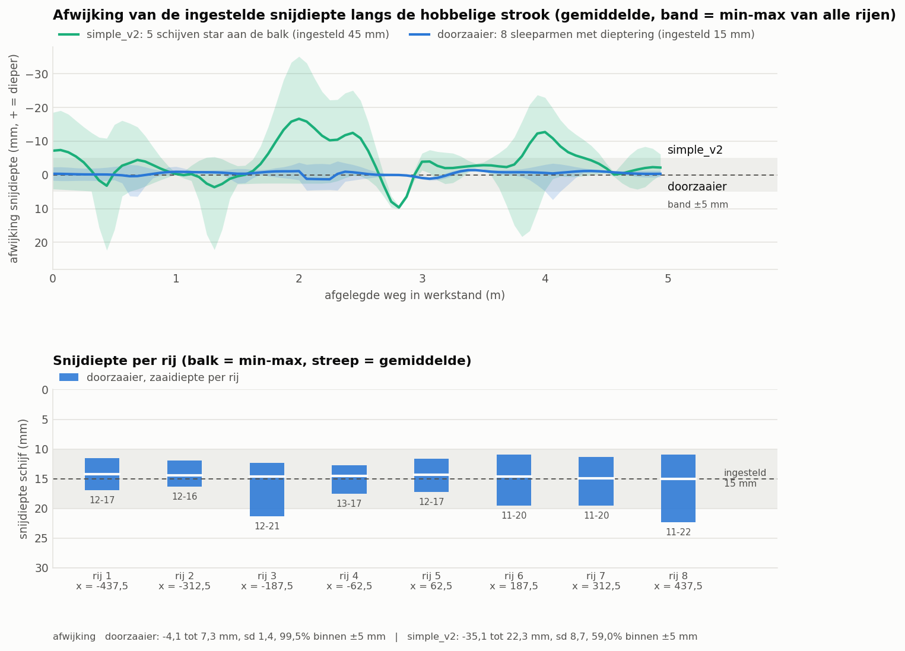

# Overseeder, simple version: FreeCAD model

Overseeder for the Bruut OpenAgbot, built on the headstock and lift frame of the
[simple applicator version 2](../../liquid%20fertilizer%20applicator/simple_v2/README.md).

One element per row:
- a thin Ø 300 × 3 disc stands at a 7° angle and cuts a 15 mm V-slot;
- a seed boot in the lee of the disc places the seed at about 12 mm **in** the soil;
- a depth ring on the disc holds the depth;
- a press wheel on a spring-loaded arm closes the slot.

In addition:
- 8 rows at 125 mm = 1 m per module; modules can be coupled side by side with flanges;
- every row follows the ground on its own trailing arm and spring leg;
- 2 gas springs push the floating lift frame down with robot weight;
- a seed hopper with a compartment for grass (41 l) and one for fine seed (18 l), each with its own cam roller and a motor that follows the driving speed;
- draft force approx. 335 N normal, against 461 N for the applicator;
- approx. € 1675 in materials.

Note:
- **approx. 40 kg of front weight on the robot** is needed to lift the machine with a full hopper;
- in hard, dry sward only with 4 rows (every second element raised).

See [RATIONALE.md](RATIONALE.md).




## Files

| File | Contents |
| --- | --- |
| `Overseeder.FCStd` | the model in working position (generated, do not edit by hand) |
| `ovs_params.py` | all dimensions, including the robot interface |
| `ovs_kin.py` | kinematics: lift frame, slotted hole, gas springs, trailing arm, spring leg, roller arm, disc, hopper (pure Python) |
| `ovs_parts.py` | one function per part, returns a `Part` shape |
| `build_ovs.py` | model tree, colors, lifting, interference check, mass, images |
| `ovs_calc.py` | dosing, down force and gas springs, draft force, lifting, axle load, module widths, cost (pure Python) |
| `ovs_ground.py` | ground following over the bumpy strip of the applicators (pure Python) |
| `plot_ground_ovs.py` | comparison chart with simple_v2 (matplotlib) |
| `run_in_freecad.py` | macro: open in FreeCAD and run (F6) to rebuild the model |
| `previews/` | images and the chart |

The module names start with `ovs_`. This way they can be loaded in the same FreeCAD session as the applicators
(`lfs_`, `lfs2_`, `lfa_`). `ovs_ground.py` reads the strip and the 80 robot positions from
`../../liquid fertilizer applicator/simple_v2/` for the comparison. The research is in `../inspiration/`.

## Axes

Same as the robot model and the applicators: x = right, y = driving direction (front = +y), z = up, ground = z 0, mm.
- y = 0 is the centre of the robot's rear lower beam (robot y = implement y − 575).
- Rows at x = −437.5 … +437.5 (step 125).
- Lift frame pivot at (y, z) = (−70, 200); toolbar at (−330, 330).
- Per element: trailing arm pivot (−330, 150), disc centre (−540, 135), press wheel axle (−835, 100).
- The disc is rotated 7° about z through its centre: the front points towards −x.

## Rebuilding and using

In FreeCAD's Python console (folder in `sys.path`, or via `run_in_freecad.py`):

```python
import build_ovs, ovs_kin, ovs_params as P
build_ovs.build()                                   # working position, saves the FCStd
build_ovs.build(psi=ovs_kin.lift_angle(), phi=-P.u_stop_deg, chi=P.pw_link_range[0],
                save_path=None, show_robot=True)    # lifted, with the robot reference
build_ovs.check_interference()                      # overlapping parts (must be empty)
build_ovs.mass_properties()                         # mass and centres of gravity
build_ovs.render_all()                              # images 1 to 12 and save in working position
```

`psi` = lift angle of the lift frame, `phi` = angle of the trailing arms (a number or a list per row), `chi` = angle of
the roller arms. All in degrees, + = up.

Without FreeCAD (any Python 3; `plot_ground_ovs.py` needs matplotlib, which is also in FreeCAD's Python):

```bash
python ovs_calc.py
```

```bash
python ovs_ground.py
```

```bash
python plot_ground_ovs.py
```

## Model tree

```
overseeder_1m_8_rows
  headstock_robot_mount          headstock (fixed): top plate, clamp strip, 4 cheeks, slotted-hole plates, bolts, control box
  lift_actuator                  3000 N actuator + 2 gas springs next to the slotted hole
  swing_frame_moves_with_lift    (Placement = rotation about the pivot bolts)
    toolbar_with_coupling_flanges, frame_arms, cross_tube, actuator_lugs_on_toolbar
    seed_hopper_and_metering     hopper, lid, support plates, metering housing, 2 motors
    row_unit_1..8                holder, U-bolts, spring leg, spring, seed hose
      row_arm_N                  (Placement = arm angle) arm, disc, hub, depth ring, seed boot
        press_arm_N              (Placement = roller arm angle) roller arm, axle, press wheel
robot_reference_NOT_PART_OF_DESIGN   (hidden; rear beams, upper beams, rear wheels)
```

## Estimated, not measured

- **Ground forces per disc**: down force 90 N (heavy 180 N), disc draft force 25 N and boot 8 N. Measure this before building (see RATIONALE § 13).
- **Depth ring**: sinks in 0.075 mm/N.
- **Press wheel**: 35 N.
- **Metering rollers**: cm³ per revolution and seed densities (calibrate with a catch test).
- **Robot**: 150 kg, centre of gravity 500 mm in front of the rear axle, μ = 0.5.
- **Actuator, motors and gas springs**: values from typical datasheets.

No animation like the applicators' has been made yet; the ground following is shown in the chart.
